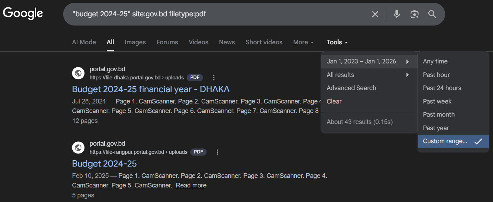
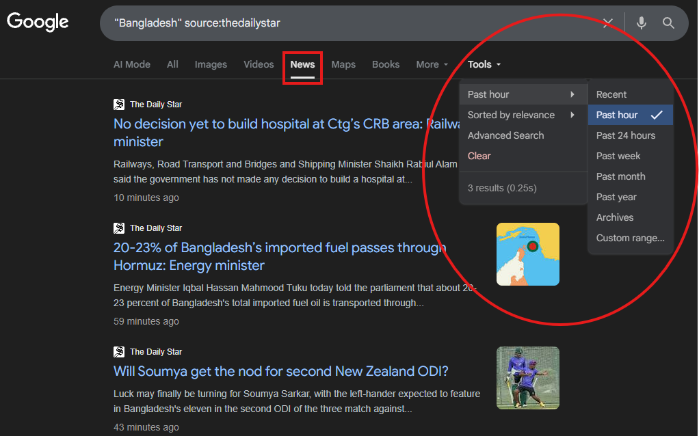
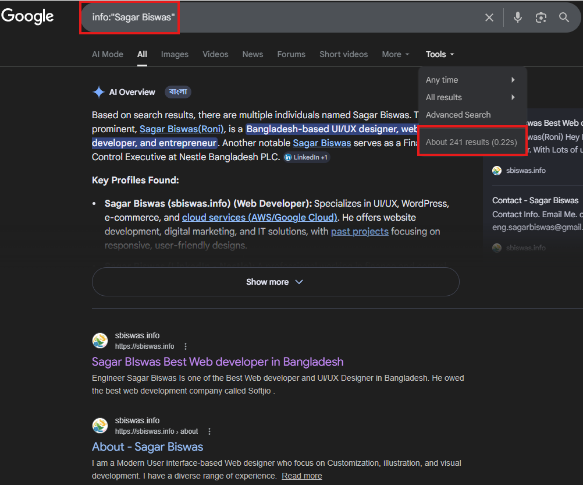
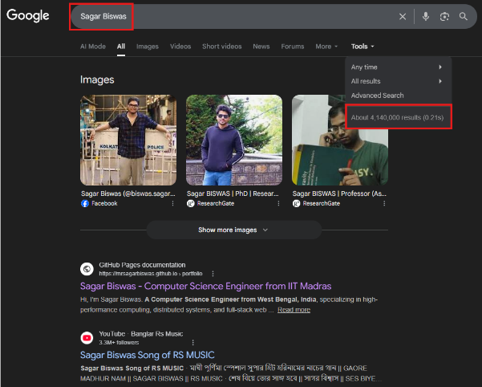
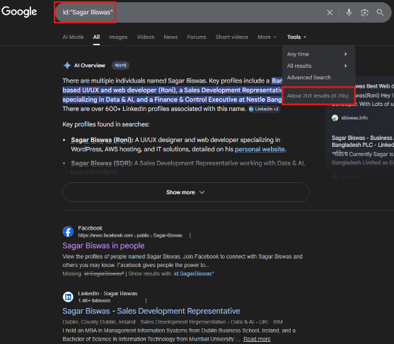
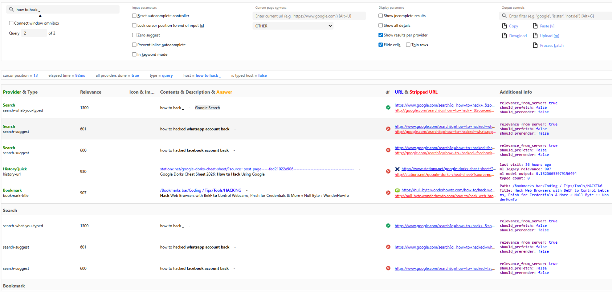

**GOOGLE DORKS**

_The Complete Handbook for Beginners_

+-----------------------------------------------------------------------+
| \*Master the Art of Advanced Web Searching\* |
| |
| site: │ intitle: │ inurl: │ filetype: │ intext: │ before: │ after: |
| |
| ─────────────────────────────── |
| |
| OSINT • Ethical Hacking • Security Research • Bug Bounty • Academic |
| Study |
+=======================================================================+

Version 2.0 --- Expanded & Publish-Ready Edition

Original notebook by **SagarBiswas-MultiHAT**

github.com/SagarBiswas-MultiHAT

_For Educational Use Only • Permission First, Always • Stay Ethical_

**Google Dorks: The Complete Handbook for Beginners**

Version 2.0 --- Expanded Edition

© 2025 SagarBiswas-MultiHAT. All rights reserved.

This handbook is an expanded, restructured, and significantly enhanced
edition based on the original \"Google Dorks: A Beginner\'s Notebook\"
(v1.0.0) authored by Sagar Biswas. The original work is available at
github.com/SagarBiswas-MultiHAT.

Permission is granted to share and distribute this handbook for
non-commercial educational purposes, provided that credit is attributed
to the original author and this notice is preserved.

**DISCLAIMER**

This handbook is provided strictly for educational purposes. All
techniques described herein are intended to be used only on systems you
own or have explicit written permission to test. Neither the author nor
any distributor of this handbook accepts any liability for unlawful,
unethical, or harmful use of the information contained within.

The techniques described in this handbook are publicly documented.
Understanding them is the first step toward building and maintaining
secure systems. With knowledge comes responsibility.

**Published:** 2026

**Original notebook:**
<https://github.com/SagarBiswas-MultiHAT/Cybersecurity-Notebooks/blob/main/Google_Dorks_A_Beginners_Notebook-v1.0.0.pdf>

**Bug Bounty Reference:**
<https://taksec.github.io/google-dorks-bug-bounty/>

**Wayback Machine:** <https://web.archive.org>

**Google Search Help:**
<https://support.google.com/websearch/answer/2466433>

**\
Table of Contents**

**Preface**

**Chapter 1: Introduction to Google Dorks**

> 1.1 What Is a Google Dork?
>
> 1.2 The Origin: Google Hacking
>
> 1.3 How Google Indexing Works
>
> 1.4 Who Uses Google Dorks and Why
>
> 1.5 The Golden Principle

**Chapter 2: The 10 Essential Operators**

> 2.1 site: \-- Restricting Results to a Domain
>
> 2.2 intitle: \-- Searching in Page Titles
>
> 2.3 inurl: \-- Searching in URLs
>
> 2.4 filetype: \-- Filtering by Document Format
>
> 2.5 ext: \-- Filtering by File Extension
>
> 2.6 cache: \-- Viewing Cached Page Versions
>
> 2.7 related: \-- Finding Similar Websites
>
> 2.8 info: \-- Getting Information About a Domain
>
> 2.9 intext: \-- Searching in Page Body Content
>
> 2.10 allintitle: \-- Multiple Words in Titles
>
> Chapter 2 Quick Reference

**Chapter 3: Advanced Search Operators**

> 3.1 Boolean Operators (OR, AND, Minus)
>
> 3.2 Phrase and Wildcard Operators
>
> 3.3 The .. Numeric Range Operator
>
> 3.4 location: \-- Geographic Filtering
>
> 3.5 site: with Subdomains and TLD Wildcards
>
> 3.6 inanchor: and allinanchor: \-- Anchor Text
>
> 3.7 before: and after: \-- Date-Based Filtering
>
> 3.8 The AROUND(X) Proximity Operator
>
> Chapter 3 Quick Reference

**Chapter 4: Special Operators, Google Tools, and the Calculator**

> 4.1 Quick-Lookup Operators
>
> define: --- Definitions
>
> stocks: --- Financial Data
>
> movie: --- Film Information
>
> source: --- Google News by Outlet
>
> weather: --- Weather Conditions
>
> map: --- Geographic Maps
>
> 4.2 allinurl: and allintext:
>
> 4.3 Grouping and Modifier Symbols ( ( ) + \_ )
>
> 4.4 Google as a Built-in Calculator
>
> Basic Arithmetic
>
> Powers, Roots, and Logarithms
>
> Scientific and Trigonometric Functions
>
> Combinatorics and Combinational Math
>
> Unit and Currency Conversion
>
> Language Translation
>
> Timer, Dice, and Random Number Tools
>
> Graphing Mathematical Functions
>
> Chapter 4 Quick Reference

**Chapter 5: Combining Operators for Power Searches**

> 5.1 The Query-Building Mindset
>
> 5.2 Worked Examples by Use Case
>
> 5.3 Multi-Dimensional Query Design Framework
>
> 5.4 Practice Exercises
>
> 5.5 Examples of Complex Google Dorks

**Chapter 6: Real-World Applications**

> 6.1 Ethical Hacking and Penetration Testing
>
> 6.2 OSINT Research
>
> 6.3 Competitive and SEO Analysis
>
> 6.4 Academic and Data Research
>
> 6.5 Bug Bounty Hunting
>
> 6.6 Google Dorks That Every Hacker Should Know
>
> 6.7 Examples of Creepy Dorks

**Chapter 7: Defending Against Google Dorks**

> 7.1 Auditing Your Own Website
>
> 7.2 Configuring robots.txt
>
> 7.3 Password-Protecting Sensitive Directories
>
> 7.4 Using Google Search Console
>
> 7.5 Keeping Software Updated
>
> 7.6 Enabling Two-Factor Authentication
>
> 7.7 Monitoring Your Digital Footprint
>
> 7.8 Securing Cloud Storage
>
> 7.9 Regular Encrypted Backups
>
> 7.10 Team Education
>
> 7.11 Defence-in-Depth Checklist

**Chapter 8: Legal and Ethical Guidelines**

> 8.1 What Is Allowed
>
> 8.2 What Is Not Allowed
>
> 8.3 The Responsible Disclosure Process
>
> 8.4 Legal Context by Jurisdiction
>
> 8.5 The Researcher\'s Code

**Appendix A: Master Operator Cheat Sheet**

**Appendix B: Glossary of Key Terms**

**Appendix C: Practice Exercise Answer Key**

**Appendix D: Further Resources and Tools**

**Appendix E: About the Author**

# Preface

There is an old saying among security researchers: the
[most]{.underline} p[owerful hackin]{.underline}g [tool in the
world]{.underline} is a search engine. That might sound like an
exaggeration, until you actually try it.

This handbook grew out of a beginner\'s notebook designed to demystify
one of the most underused skills in digital research: Google Dorking.
The original notebook laid excellent groundwork. This expanded edition
takes that foundation and builds a complete, professional reference that
any curious person, student, or aspiring security professional can pick
up and use immediately.

Google Dorks are not hacking in the Hollywood sense. There are no
dramatic countdowns or ski masks. Instead, they are precise, logical
queries that take advantage of how Google indexes the internet. By
adding a few extra characters to your search, you can narrow millions of
results down to exactly the document, file, or web page you need.
Researchers call this OSINT: Open-Source Intelligence, meaning
intelligence gathered entirely from publicly available sources.

What makes Google Dorks worth mastering? [Three]{.underline} things:
they cost nothing, they require no special software, and they work right
now in the browser you already have open. The gap between a beginner and
an expert in this field is not technology. It is knowledge of which
operators to use and how to combine them.

## How to Use This Handbook

This handbook is organized as a progressive journey. If you are
completely new to the subject, begin at Chapter 1 and work forward. Each
chapter builds on the previous one. If you already have experience with
some operators, use the Table of Contents to jump directly to what you
need.

Every operator and technique is accompanied by real, working examples.
[O]{.underline}p[en Goo]{.underline}g[le in a se]{.underline}p[arate tab
and tr]{.underline}y [each exam]{.underline}p[le as]{.underline} y[ou
read.]{.underline} Search operators behave differently depending on the
query, and hands-on practice is irreplaceable.

## Who This Handbook Is For

- Students who want to find research materials faster and more
  precisely.

- Bug Hunters and penetration testers who want to discover exposed
  assets, sensitive files, and misconfigured servers using advanced
  Google Dorking techniques.

- Security enthusiasts who want to understand reconnaissance techniques
  used by professionals.

- Web developers and system administrators who want to audit their own
  digital footprint.

- Journalists and investigators who need to locate public records and
  datasets efficiently.

- Anyone who wants to go beyond the default search bar and think like a
  researcher.

## A Note on Ethics

> **IMPORTANT:** Every technique in this handbook must be used ethically
> and lawfully. Searching for publicly indexed information is legal.
> Accessing systems or data without explicit permission is not,
> regardless of how you found them. Chapter 7 covers the legal and
> ethical framework in full. Please read it. It is the most important
> chapter in this handbook.

\*\*CHAPTER 1\*\*

**Introduction to Google Dorks**

<em>What they are, where they came from, and why they matter</em>

# Chapter 1: Introduction to Google Dorks

> **Chapter Overview:** This chapter introduces the concept of Google
> Dorking from the ground up. You will learn what Google Dorks are, how
> the indexing process makes them possible, who uses them
> professionally, and the foundational ethical principle that governs
> their use.

## 1.1 What Is a Google Dork?

A Google Dork is a search query that uses **one or more** special
operators to instruct Google to return a very specific subset of its
index. [The word \"dork\" is borrowed from hacker culture, where it
means a clever, unconventional techni]{.underline}q[ue that produces
surprisin]{.underline}g[l]{.underline}y p[recise results]{.underline}.

At its simplest, a Google Dork looks like this:

> site:wikipedia.org \"artificial intelligence\"

That query instructs Google to search [only within]{.underline} the
domain wikipedia.org for the exact phrase \"artificial intelligence.\"
The result is a tightly filtered list [from one trusted
source]{.underline}, not the entire web. A dork is simply a more
intentional search.

The operators themselves are documented by Google, but the vast majority
of people never discover them. The gap between what Google can do and
what most users ask it to do is precisely where these techniques become
powerful.

## 1.2 The Origin: Google Hacking

The concept of using search engines to surface sensitive information was
first systematically documented [b]{.underline}y [securit]{.underline}y
[researcher Johnn]{.underline}y [Lon]{.underline}g[. In
2004]{.underline}, he published the **Google Hacking Database (GHDB)**,
a growing collection of search queries that could locate accidentally
exposed configuration files, login pages, surveillance camera feeds, and
other materials never intended to be public.

Long\'s core insight was simple: it is not that Google is doing anything
wrong. [It is that website owners sometimes for]{.underline}g[et that if
a file sits on a]{.underline} p[ublicl]{.underline}y [accessible server
and Goo]{.underline}g[le has crawled it,
**an**]{.underline}**y[one]{.underline}** [in the world can **find** it
with the ri]{.underline}g[ht]{.underline} q[uer]{.underline}y. The
search engine is just a mirror reflecting what is already out there.

Today, the GHDB contains [thousands of verified dorks]{.underline} and
is maintained at <https://www.exploit-db.com/google-hacking-database>
Google Dorking has become a standard component of the OSINT toolkit used
by security professionals, journalists, data researchers, and academics
worldwide.

## 1.3 How Google Indexing Works

To understand why Google Dorks are so effective, you need to understand
how search engines process the web. The process has three stages:
crawling, indexing, and serving.

**How a Web Page Becomes a Search Result**

> **\[ A Web Page Goes Live on a Public Server \]**

▼

> \[ Googlebot Crawls the Page and Downloads Its Content \]

▼

> \[ Google Analyses: Text, File Type, URLs, Titles, Metadata \]

▼

> \[ Content Is Stored in Google\'s Searchable Index \]

▼

> **\[ Your Google Dork Filters That Index with Precision \]**

▼

> **\[ Targeted Results Are Returned to You \]**

**Crawling:** Googlebot, Google\'s automated web crawler, follows links
from page to page across the internet. [When it finds a new URL, it
downloads the pa]{.underline}g[e\'s content and sends it back to
Goo]{.underline}g[le\'s servers]{.underline}.

**Indexing:** Google\'s servers analyse the downloaded content,
extracting text, reading metadata, identifying file types, cataloguing
titles and headings, and storing everything in a giant searchable
database [called the index]{.underline}.

**Serving:** When you type a query, Google searches its stored index and
returns the most relevant results. [Search o]{.underline}p[erators
modif]{.underline}y how Google searches its own index, acting as
precise, stackable filters.

> **NOTE:** Google does not search the live web when you type a query.
> It searches its stored copy of the web. [This means files that were
>
> > publicl]{.underline}y [accessible when Goo]{.underline}g[lebot visited
> >
> > > > ma]{.underline}y [still appear in search results even if the file has
> > > >
> > > > > > > > since been]{.underline} **moved or deleted** [from the original
> > > > > > > > > > > > > > > > server]{.underline}.

## 1.4 Who Uses Google Dorks and Why

---

| Role                 | How They Use Google Dorks                                                                         |
| :------------------- | :------------------------------------------------------------------------------------------------ |
| Security Researchers | Finding exposed files, admin panels, and vulnerabilities on authorised test systems               |
| Journalists          | Locating government documents, public records, and source materials for investigative reporting   |
| Students             | Finding academic papers, datasets, and study materials in specific formats such as PDF or CSV     |
| Marketers            | Analysing competitor websites, finding indexed landing pages, and auditing SEO performance        |
| Data Scientists      | Locating public datasets, CSV files, and research databases for analysis                          |
| Investigators        | Gathering publicly available intelligence on organisations or persons of public interest          |
| System Admins        | Auditing their own infrastructure to discover what Google has indexed about their organisation    |
| Bug Bounty Hunters   | Mapping attack surfaces and finding accidentally exposed assets within authorised programme scope |

---

## 1.5 The Golden Principle

> **IMPORTANT:** GOLDEN PRINCIPLE: Just because something is findable
> does not mean it is legal to access, copy, or use.
>
> Google Dorks surface publicly indexed information. That information
> may include files that were accidentally exposed by their owners.
> Finding them is not the same as having permission to use them. Chapter
> 7 covers this distinction in full. Please read it before applying any
> technique in this handbook.

## A Note on Accuracy

All operators described in this handbook are verified against current
Google search behaviour. Where two operators have become unreliable,
such as cache:(e.g., cache:example.com, related:en.wikipedia.org), this
handbook says so clearly and provides a tested alternative. The
techniques in [Chapters 5 and 6 reflect real-world security and OSINT
practice]{.underline} as of the publication date.

## ⭐ Key Takeaways

- **✓** Google Dorks are advanced search queries using special operators
  to filter Google\'s index with precision.

- **✓** Google\'s index is a stored snapshot of the web. [Files
  ex]{.underline}p[osed durin]{.underline}g [crawlin]{.underline}g
  [ma]{.underline}y **remain findable** [even after
  deletion.]{.underline}

- **✓** Dorking is used across many professional fields: security,
  journalism, research, marketing, and data science.

- **✓** The golden principle: findable is not the same as accessible or
  legally usable.

\*\*CHAPTER 2\*\*

**The 10 Essential Operators**

_Your core toolkit for precise, powerful web searching_

# Chapter 2: The 10 Essential Operators

> **Chapter Overview:** This chapter covers the ten most important
> Google Dork operators. Each operator is explained with its syntax,
> real-world examples, professional use cases, and a clear explanation
> of when to use it. Master these ten before moving on to advanced
> combinations in Chapter 3.

Google offers a small set of search operators that do the heavy lifting
in most research scenarios. You could spend a career in OSINT or
security research and find that these ten cover the vast majority of
what you need. The key is to know not just what each operator does, but
when and why to reach for it.

> **TIP:** Operators must be written with no spaces around the colon. Write ***site:wikipedia.org***, not *site: wikipedia.org* or *site :wikipedia.org*. The latter two are treated as plain text searches and the operator is completely ignored by Google.

## 2.1 site: \-- Restricting Results to a Specific Domain

The site: operator is the workhorse of Google Dorking. [It tells
Goo]{.underline}g[le to return results onl]{.underline}y [from a
s]{.underline}p[ecific website, subdomain, or to]{.underline}p[-level
domain]{.underline}. It is one of the most powerful operators because it
effectively turns any large website into your own private search engine.

**Syntax:** site:domain.com \"optional search term\"

> **Beginner Examples**
>
> site:wikipedia.org \"artificial intelligence\"
>
> =\> Only Wikipedia pages about artificial intelligence
>
> site:who.int \"malaria vaccine\"
>
> =\> Only WHO pages mentioning malaria vaccine
>
> site:docs.python.org \"for loop\"
>
> =\> Only Python official documentation mentioning \"for loop\"
>
> **Intermediate Examples**
>
> site:.gov \"climate change report\" filetype:pdf
>
> =\> PDFs about climate change from any government domain
>
> site:.edu \"machine learning\" after:2023-01-01
>
> =\> Academic content on machine learning published since 2023
>
> site:\*.microsoft.com \"security advisory\"
>
> =\> Security advisories across all Microsoft subdomains
>
> **Bangladesh-Specific Examples**
>
> site:gov.bd filetype:pdf \"annual report\"
>
> =\> Bangladeshi government annual reports in PDF format
>
> site:.bd \"tender notice\" filetype:pdf
>
> =\> Tender notices from any .bd domain
>
> site:brac.net \"research\" filetype:pdf
>
> =\> Research documents from BRAC

**Pro Tip:** Use site: with a top-level domain extension such as
site:.bd to search all websites on Bangladesh\'s national domain,
site:.edu for educational institutions worldwide, or site:.gov for
government sources in the United States.

**When to use it:** When you trust a specific source; when a large
website has a poor internal search function; when auditing what Google
has indexed from your own domain.

## 2.2 intitle: \-- Searching in Page Titles

Every web page has an HTML [title ta]{.underline}g, the [text visible
in]{.underline} y[our browser tab]{.underline} and at the top of each
Google result. [The intitle: o]{.underline}p[erator filters results to
onl]{.underline}y [those pa]{.underline}g[es where your
ke]{.underline}y[word a]{.underline}pp[ears in that title]{.underline},
[cuttin]{.underline}g [throu]{.underline}g[h pa]{.underline}g[es that
merel]{.underline}y [mention a to]{.underline}p[ic in
passin]{.underline}g.

**Syntax:** intitle:\"keyword phrase\"

> **Examples**
>
> intitle:\"getting started\" site:docs.github.com
>
> =\> GitHub docs pages specifically titled \"Getting Started\"
>
> intitle:\"annual report\" site:tesla.com
>
> =\> Tesla pages specifically about annual reports
>
> intitle:\"scholarship deadline\" site:.edu
>
> =\> University pages where scholarship deadlines are the primary
> subject
>
> intitle:\"index of\" site:yourdomain.com
>
> =\> Directory listings on your domain (should return zero results)
>
> intitle:\"budget 2024-2025\" site:gov.bd
>
> =\> Bangladeshi government budget pages for 2024-2025

**Why page titles matter:** Web developers title pages to reflect the
main topic. A page titled \"Getting Started with Docker\" is almost
certainly an introductory Docker tutorial. A page that merely mentions
Docker in passing would rarely have that in its title. intitle: exploits
this convention to cut noise dramatically.

**When to use it:** When you [want]{.underline} p[a]{.underline}g[es
specificall]{.underline}y [about a to]{.underline}p[ic]{.underline}
rather than pages that mention it in passing; for structured content
such as reports, guides, policies, or tutorials.

## 2.3 inurl: \-- Searching in URLs

URLs are not arbitrary strings. Well-designed websites follow
predictable URL patterns: /blog/ for articles, /careers/ for job
listings, /api/ for developer documentation, /admin/ for administration
panels. [The inurl: o]{.underline}p[erator filters results
b]{.underline}y [these patterns, makin]{.underline}g [it both a research
tool and a securit]{.underline}y [audit tool]{.underline}.

**Syntax:** inurl:keyword

> **Research Examples**
>
> inurl:blog site:openai.com
>
> =\> Only OpenAI blog posts
>
> inurl:careers \"data scientist\" site:microsoft.com
>
> =\> Microsoft career pages for data scientists
>
> inurl:press-release site:un.org
>
> =\> UN press releases directly
>
> **Security Audit Examples (own domain only)**
>
> inurl:admin site:yourdomain.com
>
> =\> Admin pages indexed from your domain
>
> inurl:login site:yourdomain.com
>
> =\> Login pages visible in Google\'s index
>
> inurl:dashboard site:yourdomain.com
>
> =\> Any dashboard pages that have been indexed

**When to use it:** When URLs reveal page type; when navigating large
sites faster than menus; when auditing your own site for unexpectedly
indexed sections.

## 2.4 filetype: \-- Filtering by Document Format

Google indexes not just HTML pages but also PDFs, Word documents, Excel
spreadsheets, PowerPoint presentations, CSV files, and much more. [The
filet]{.underline}y[pe: operator filters results to documents of a
s]{.underline}p[ecific format, makin]{.underline}g [it
indis]{.underline}p[ensable when]{.underline} y[ou need a downloadable
resource in a]{.underline} p[articular format]{.underline}.

**Syntax:** filetype:extension \"search term\"

> **Research Examples**
>
> filetype:pdf \"machine learning\" site:.edu
>
> =\> Academic machine learning PDFs from universities
>
> filetype:pptx \"cybersecurity awareness\" site:.gov
>
> =\> Government cybersecurity awareness presentations
>
> filetype:xlsx \"population data\" site:worldbank.org
>
> =\> World Bank population data in Excel format
>
> filetype:csv \"road accident\" site:gov.bd
>
> =\> Road accident data from Bangladeshi government sources

---

**Extension** **File Type** **Best Used For**

---

pdf PDF Document Reports, papers, manuals

xlsx/xls Excel Spreadsheet Datasets, budgets, tables

docx/doc Word Document Templates, policies,
contracts

pptx/ppt PowerPoint Slides, training
materials

csv Comma-Separated Values Raw data for analysis

sql SQL Script Database schemas, scripts

txt Plain Text Config files, logs, notes

---

## 2.5 ext: \-- Filtering by File Extension

The ext: operator behaves similarly to filetype: but is especially
powerful for web-native file types that are not traditional documents.
[Securit]{.underline}y [researchers use ext: to find
potentiall]{.underline}y [dan]{.underline}g[erous file
t]{.underline}y[pes inadvertentl]{.underline}y [indexed on web
servers.]{.underline}

**Syntax:** ext:extension keyword

> **Examples**
>
> ext:csv \"population data\" site:worldbank.org
>
> =\> World Bank CSV population datasets
>
> ext:sql site:github.com \"CREATE TABLE\"
>
> =\> SQL files on GitHub containing table definitions
>
> _\# SECURITY AUDIT (own site only):_
>
> ext:env site:yourdomain.com
>
> =\> Check for exposed .env files (should return ZERO results)
>
> ext:log site:yourdomain.com
>
> =\> Check for exposed log files (should return ZERO results)
>
> ext:bak site:yourdomain.com
>
> =\> Check for exposed backup files (should return ZERO results)
>
> **CRITICAL:** If ext:env, ext:sql, ext:log, or ext:bak returns any
> results for your own domain, those files are publicly accessible and
> almost certainly contain sensitive information. Take the following
> steps immediately:\
> \
> (1) Remove the files from your web root.\
> (2) Rotate all exposed credentials.\
> (3) Submit a removal request in Google Search Console.\
> (4) Add server rules to block these types.

## 2.6 cache: \-- Viewing Cached Page Versions

[Goo]{.underline}g[le periodically saves copies of web]{.underline}
p[a]{.underline}g[es as Goo]{.underline}g[lebot visits them. The cache:
operator was historically used to view these saved copies]{.underline}.
In practice, Google has dramatically reduced the reliability of public
cache links, and the operator now frequently returns no results even for
major websites.

**Syntax:** cache:url.com

> **Current Reality**
>
> cache:wikipedia.org =\> Often returns: \"did not match any documents\"
>
> cache:who.int/news =\> Often returns: \"did not match any documents\"
>
> _\# Result: Google cache links are no longer reliably available._
>
> _\# Use the Wayback Machine instead (see below)._

### The Reliable Alternative: The Wayback Machine

For guaranteed archived snapshots, use the Internet Archive\'s Wayback
Machine at web.archive.org. [It has archived hundreds of billions
of]{.underline} p[a]{.underline}g[es and allows]{.underline} y[ou to
view an]{.underline}y [saved sna]{.underline}p[shot of almost
an]{.underline}y p[ublic URL.]{.underline} Understanding the URL
structure lets you navigate it precisely.

> **Wayback Machine URL Patterns**
>
> _\# View all saved snapshots (calendar view):_
>
> https://web.archive.org/web/\*/https://www.example.com/page
>
> _\# View a specific snapshot by date (YYYYMMDD format):_
>
> https://web.archive.org/web/20231015/https://www.who.int/news
>
> =\> WHO news as it appeared on 15 October 2023
>
> _\# Save the current live page to the archive right now:_
>
> https://web.archive.org/save/https://www.example.com/page

---

**URL Part** **What It Means**

---

web.archive.org The Internet Archive host

/web/ The Wayback Machine web-capture service

\* Wildcard: show all available snapshots in a
calendar view

20231015 Specific timestamp in YYYYMMDD format (15
October 2023)

/https://\... The original URL you want to inspect

---

### Why a Page May Not Be Cached

If a cached copy is unavailable, one of **three**
[thin]{.underline}g[s]{.underline} is usually true:

1.  The page is new and not yet crawled by Google.

2.  The site owner has set a meta tag to block archiving. Or,

3.  The page was removed from Google\'s index entirely.

To check whether a page blocks caching, [view the pa]{.underline}g[e
source and look for]{.underline}:

> \<meta name=\"robots\" content=\"noarchive\"\> (blocks Google cache)
>
> \<meta name=\"internetarchive\" content=\"noarchive\"\> (blocks
> Wayback Machine)

## 2.7 related: \-- Finding Similar Websites

The [related: operator was historicall]{.underline}y [used to discover
websites that were topicall]{.underline}y[, structurall]{.underline}y[,
or audience-wise **similar to** a given domain]{.underline}. It was
especially useful for competitive research, finding alternatives to
popular services, and mapping a content category comprehensively.

**Syntax:** related:domain.com

> **Examples**
>
> related:wikipedia.org =\> No reliable similarity results
>
> related:unsplash.com =\> Inconsistent or unrelated matches
>
> related:stackoverflow.com =\> Often ignored or replaced with normal
> search results

However, Google officially **deprecated** the related**:** operator in
2023, and it no longer returns reliable or consistent results. In many
cases, queries now return irrelevant results or no useful data at all.

### The Reliable Alternative: SimilarSites

For discovering alternative or competitor websites, use
**SimilarSites**. It is specifically designed to recommend websites
similar to a target domain based on category relevance, user behavior
patterns, and web relationships.

**Website:** <https://www.similarsites.com/>

**SimilarSites URL Pattern:**
[https://www.similarsites.com/site/{targetDomain}](https://www.similarsites.com/site/%7btargetDomain%7d)

> **Examples**
>
> https://www.similarsites.com/site/wikipedia.org =\> No reliable
> similarity results
>
> https://www.similarsites.com/site/unsplash.com =\> Free image sites
> like Pexels, Pixabay, or Freepik
>
> https://www.similarsites.com/site/stackoverflow.com =\> Coding Q&A
> sites like Stack Exchange or Dev.to
>
> https://www.similarsites.com/site/coursera.org =\> Other online
> learning platforms
>
> https://www.similarsites.com/site/prothomalo.com =\> Other major
> Bangladeshi news portals

### When to use it:

1.  Find alternatives to a website

2.  Discover competitors in a niche

3.  Research industry leaders

4.  Build outreach target lists

5.  Explore websites using similar business models

6.  Expand OSINT target surface research

### Extra Tools:

A. Find Ownership Clues:

    1.  <https://www.whois.com/>

    2.  <https://lookup.icann.org/en>

B. Find Shared Technology Footprints: <https://builtwith.com/>

## 2.8 info: \-- Getting Information About a Domain

The [info: operator asks Google for a summary panel about a specific
domain]{.underline}. It is most useful for a **quick overview** of how
Google perceives a site and to check whether your own domain is properly
indexed.

**Syntax:** info:url.com

> **Examples**
>
> info:openai.com =\> Google\'s stored data about OpenAI\'s website
>
> info:bbc.com =\> Cached link, related sites, pages referencing BBC
>
> info:yourdomain.com =\> Quick check of how Google sees your own site
> info:reservexbd.com =\> similar sites (if any), and pages linking to
> ReserveXBD; help centre page, etc.

## 2.9 intext: \-- Searching in Page Body Content

While **intitle:** [targets the page title]{.underline}, **intext:**
[searches within the main body content of the page]{.underline}. This is
the most granular text-based operator because it goes directly to the
paragraph-level content, bypassing titles, headings, and structural
elements.

**Syntax:** intext:\"exact phrase\"

> **Examples**
>
> intext:\"return policy\" site:amazon.com
>
> =\> Amazon pages that explicitly mention return policy in their body
> text
>
> intext:\"scholarship deadline\" site:mit.edu
>
> =\> MIT pages with scholarship deadline information in the body
>
> intext:\"admission requirements\" site:du.ac.bd
>
> =\> Dhaka University pages with admission requirements in body text
>
> _\# SECURITY AUDIT (own site only):_
>
> intext:\"DB_PASSWORD\" ext:env site:yourdomain.com
>
> =\> Environment files containing database password variables

**intext: vs intitle::** Use intitle: when you want pages whose primary
topic is your keyword. Use intext: when you need pages that contain a
specific phrase somewhere in their content, even if the page is mainly
about something else.

## 2.10 allintitle: \-- Matching Multiple Words in Titles

The **allintitle:** operator is the [multi-keyword version]{.underline}
of **intitle:**. It requires all of the specified words to appear in the
page title. This produces tighter, more focused results than intitle:
and eliminates most irrelevant pages.

**Syntax:** allintitle:word1 word2 word3

> **Examples**
>
> allintitle:python tutorial beginners 2024
>
> =\> Pages with Python, Tutorial, Beginners, AND 2024 all in the title
>
> allintitle:cybersecurity best practices checklist
>
> =\> Highly focused checklist pages only
>
> allintitle:machine learning interview questions answers
>
> =\> ML interview prep resources
>
> allintitle:SSC result 2024 Bangladesh
>
> =\> Bangladesh SSC result pages from 2024

**When to use it:** When broad searches are producing too much noise and
you need laser-focused results.

## Chapter 2 Quick Reference

---

**Operator** **Purpose** **Example**

---

site: Restrict to a domain site:wikipedia.org AI

intitle: Keyword in page title intitle:\"login page\"

inurl: Keyword in URL inurl:admin
site:example.com

filetype: Filter by document filetype:pdf report
format

ext: Filter by file ext:xlsx finance data
extension

cache: View cached page cache:example.com
(unreliable)

related: Find similar websites related:spotify.com

info: Get Google info about a info:github.com
domain

intext: Phrase in body content intext:\"terms of
service\"

allintitle: All words must appear allintitle:python
in title tutorial

---

## ⭐ Key Takeaways

- **✓** site: is the most versatile operator, usable for research,
  auditing, and competitor analysis.

- **✓** intitle: and allintitle: cut noise by targeting pages where a
  topic is the main focus.

- **✓** filetype: and ext: are essential for finding downloadable
  resources and identifying security risks.

- **✓** cache: is largely unreliable; use the Wayback Machine
  (web.archive.org) instead.

- **✓** intext: searches body content and is ideal for finding specific
  phrases buried in longer documents.

\*\*\
\
CHAPTER 3\*\*

**Advanced Search Operators**

_Boolean logic, wildcards, date filters, and anchor text_

# Chapter 3: Advanced Search Operators

> **Chapter Overview:** Chapter 3 covers the second layer of Google Dork
> power: Boolean operators (OR, AND, minus), exact phrase matching,
> wildcards, numeric ranges, date filters, location targeting, and
> anchor text operators. Mastering these transforms your searches from
> good to surgical.

## 3.1 Boolean Operators

Boolean operators come from formal logic. They let you define
relationships between search terms: [either this OR that, both this AND
that, or this but NOT that]{.underline}. Google supports three Boolean
operators, each serving a distinct purpose.

### OR \-- Return Results Containing Either Term

The OR operator, which **must be** written in uppercase, or replaced
with the pipe symbol \|, tells Google to accept results containing
either term, not just results containing both. This is useful when a
concept has multiple names or when you want to search across related
topics at the same time.

**Syntax:** term1 OR term2 or equivalently: term1 \| term2

> **Examples**
>
> Python OR Java tutorial
>
> =\> Tutorials on Python, Java, or both
>
> machine learning \| deep learning site:arxiv.org
>
> =\> ArXiv papers on machine learning or deep learning
>
> \"cyber attack\" OR \"data breach\" site:.gov after:2024-01-01
>
> =\> Recent government reports on either topic
>
> filetype:csv OR filetype:xlsx \"population 2024\" site:worldbank.org
>
> =\> World Bank data in either spreadsheet format
>
> bKash OR Nagad \"digital payment\" site:.bd
>
> =\> Bangladeshi sites mentioning either mobile payment provider
>
> **TIP:** OR must be written in uppercase. [Lowercase \"or\" is treated
>
> > as a re]{.underline}g[ular search word]{.underline}. The pipe symbol
> > \| is an exact equivalent: Python \| Java tutorial

### AND \-- Require Both Terms

[AND is Goo]{.underline}g[le\'s default behaviour: when you
t]{.underline}y[pe two words separated b]{.underline}y [a
s]{.underline}p[ace, Goo]{.underline}g[le alread]{.underline}y [looks
for pa]{.underline}g[es containin]{.underline}g [both]{.underline}. You
mainly use the explicit AND keyword for clarity in long, complex queries
where its presence makes the logic easier to read and verify.

**Syntax:** term1 AND term2

> **Examples**
>
> machine learning AND healthcare
>
> =\> Pages discussing both topics (same as: machine learning
> healthcare)
>
> site:.bd AND filetype:pdf AND \"budget report\"
>
> =\> Explicit AND for clarity in a compound query

### - (Minus) \-- Exclude a Specific Term

[The minus si]{.underline}g[n placed immediatel]{.underline}y [before a
word excludes all results containin]{.underline}g [that
word]{.underline}. It is the most practically useful Boolean operator
for day-to-day searching because it removes the noise that clutters
otherwise good results.

**Syntax:** search term -excluded (no space between - and the word)

> **Examples**
>
> Python tutorial -video
>
> =\> Python tutorials, excluding video content
>
> Jaguar -car
>
> =\> Information about the animal, not the car brand
>
> site:medium.com \"machine learning\" -tutorial -beginner
>
> =\> Medium ML articles, excluding tutorials and beginner content
>
> \"data science\" -site:youtube.com -site:udemy.com
>
> =\> Data science resources excluding those two platforms
>
> site:github.com \"wifi deauth\" -tutorial -fork
>
> =\> GitHub projects about wifi deauth, excluding tutorials and forks

## 3.2 Phrase and Wildcard Operators

### \" \" \-- Exact Phrase Matching

Quotation marks instruct Google [to find the words in
exactl]{.underline}y [that order, side b]{.underline}y
[side]{.underline}. **Without quotes**, Google [may return
pa]{.underline}g[es where the words appear
se]{.underline}p[aratel]{.underline}y[, in different orders, or far
a]{.underline}p[art in the document]{.underline}. [This
makes]{.underline} q[uotes essential whenever]{.underline} y[ou are
searching for a **s**]{.underline}**p[ecific]{.underline}** [error
messa]{.underline}g[e, title,]{.underline} q[uote, or technical
strin]{.underline}g.

> **Examples**
>
> \"to be or not to be\"
>
> =\> Finds that exact phrase
>
> \"error 404 not found\"
>
> =\> Exact error message search (very useful for debugging)
>
> \"machine learning tutorial\"
>
> =\> Pages where these three words appear consecutively
>
> Without quotes: machine learning tutorial
>
> =\> Pages with the words anywhere, in any order
>
> \"admission circular 2024\" site:.bd
>
> =\> Exact phrase from Bangladeshi websites

### \* \-- Wildcard Placeholder

The asterisk [acts as a placeholder for an]{.underline}y
[sin]{.underline}g[le word or]{.underline} p[hrase]{.underline}. Google
fills in the blank and returns results for all possible words that fit
in that position. Particularly useful when you cannot remember an exact
word in a phrase, or when you want to find all variations of a sentence
structure.

> **Examples**
>
> \"Python is \* programming language\"
>
> =\> Matches: \"Python is a powerful programming language\"
>
> =\> Matches: \"Python is an interpreted programming language\"
>
> =\> Matches: \"Python is a general-purpose high-level computer
> programming language\"
>
> \"best \* for beginners\"
>
> =\> Matches: \"best laptop for beginners\"
>
> =\> Matches: \"best book for beginners\"
>
> \"Bangladesh won the \* match\"
>
> =\> Finds sports reports with different match types
>
> \*\# Multiple \*\*
>
> \"Elon Mask \* \*\"
>
> =\> Exactly **2** word groups; Example Matches: \"Elon Mask \*\*buys
> Twitter\*\*\"
>
> \"Elon Mask \* \* \*\"
>
> =\> Exactly **3** word groups; Example Matches: \"Elon Mask \*\*buys
> Twitter for\*\*\"

## 3.3 The .. Numeric Range Operator

The .. operator (two periods between numbers) was historically used to
tell Google to return results containing any number within a specific
range. It was commonly applied to prices, years, population figures, and
other numeric values.

**Syntax:** term min..max

> **Examples**
>
> laptop \$500..\$1000
>
> =\> Laptops priced between \$500 and \$1,000
>
> smartphones 2020..2023
>
> =\> Smartphones released between 2020 and 2023
>
> \"best movies\" 1990..2000
>
> =\> Best movie lists from the 1990s
>
> \"population\" 1000000..5000000 Bangladesh filetype:csv
>
> =\> Bangladesh population datasets in the 1-5 million range
>
> \"laptop review\" 2023..2025 \$800..\$1200
>
> =\> Recent laptop reviews in the \$800-\$1,200 price range

### Current Reality (Important)

In modern Google Search, the .. operator is **inconsistently applied and
often ignored**. Results may:

- Include numbers **outside the specified range**

- Ignore one or both bounds entirely

- Prioritize **semantic relevance over numeric filtering**

- Break when combined with symbols like \$

> **Examples of unreliable behavior:**
>
> laptop \$500..\$1000
>
> =\> Often ignores price range or shows unrelated results
>
> smartphones 2020..2023
>
> =\> May include results outside this range
>
> \"laptop review\" 2023..2025 800..1200
>
> =\> Typically ignores one or more constraints

**\# Result:** The .. operator is no longer reliable for precise
filtering.

It may still work [occasionall]{.underline}y [for sim]{.underline}p[le
numeric contexts]{.underline}, but should not be trusted for accurate or
repeatable results.

### Why It No Longer Works Well

1.  Google now relies heavily on [AI-based intent matchin]{.underline}g,
    not strict operators

2.  Numeric values are often treated as [context, not
    filters]{.underline}

3.  Complex queries cause Google to [drop constraints
    silentl]{.underline}y

4.  Currency symbols (\$, €, etc.) further reduce reliability

### The Reliable Alternatives (Use Plain Keywords)

> **Instead of forcing ranges, describe intent clearly:**
>
> best laptops under 1000 USD
>
> smartphones released after 2020
>
> best movies of the 1990s
>
> Instead of: \"laptop review\" 2023..2025 800..1200 Use: laptop reviews
> 2024 under 1200

## 3.4 location: \-- Geographic Filtering

The **location:** [o]{.underline}p[erator filters news and local results
by]{.underline} g[eo]{.underline}g[raphic location]{.underline}. It
works best for news searches and local event listings. For general
informational queries, simply including the location name in your query
tends to be more reliable.

**Syntax:** location:City \"search term\"

> **Examples**
>
> location:Dhaka \"startup event\"
>
> =\> Startup events in Dhaka (works best in Google News context)
>
> location:Barisal \"Sagar Biswas\"
>
> =\> News or web pages mentioning a person named Sagar Biswas that
> Google associates with Barisal, Bangladesh.
>
> location:india \"Terrorist attack\" after:2024-01-01
>
> =\> News articles about terrorist attacks, foiled plots, or
> terror‑related arrests in India after Jan 1, 2024 (e.g., Red Fort
> blast case, radical module busts)
>
> location:London \"tech conference\" after:2024-01-01
>
> =\> Recent London tech conference coverage
>
> _\# For general searches, just include the location in the query:_
>
> \"software job\" Dhaka Bangladesh site:.bd
>
> =\> More reliable for non-news general searches

## 3.5 site: with Subdomains and TLD Wildcards

The **site:** operator extends beyond simple domain searches. You [can
tar]{.underline}g[et s]{.underline}p[ecific subdomains]{.underline},
[search across entire or]{.underline}g[anisations]{.underline}, or
[swee]{.underline}p [a whole country domain for s]{.underline}p[ecific
content]{.underline}.

> **Advanced site: targeting**
>
> site:support.google.com \"password reset\"
>
> =\> Only Google\'s Support subdomain
>
> site:\*.gov \"climate data\" filetype:pdf
>
> =\> PDFs on climate data from any government domain
>
> site:\*.microsoft.com \"privacy policy\"
>
> =\> Privacy pages across all Microsoft subdomains
>
> site:\*.bd \"annual report\" filetype:pdf
>
> =\> Annual report PDFs from any .bd domain
>
> site:\*.edu.bd \"admission\" filetype:pdf
>
> =\> Admission documents from Bangladeshi educational institutions

## 3.6 inanchor: and allinanchor: \-- Anchor Text Search

[When websites link to other pa]{.underline}g[es]{.underline},
[the]{.underline} **clickable text of those links** [is called anchor
text]{.underline}. The **inanchor:** operator finds pages that other
websites link to using a specific phrase as the anchor text. This
reveals which pages on the web are considered authoritative references
for specific terms, making it a powerful SEO and OSINT tool.

### inanchor: \-- Single Phrase in Anchor Text

**Syntax:** inanchor:\"keyword phrase\"

> **Examples**
>
> inanchor:\"ethical hacking course\"
>
> =\> Pages that others link to using that exact phrase
>
> inanchor:\"cybersecurity tools\" site:github.com
>
> =\> GitHub repos that others link to using \"cybersecurity tools\"
>
> inanchor:\"SSC result\" site:.bd
>
> =\> Bangladeshi pages that others link to as \"SSC result\" sources

### Q: How does the inanchor: operator work, and [what exactl]{.underline}y [a]{.underline}pp[ears in the search results when usin]{.underline}g [it]{.underline}?

**Yes,** the search results list will **only** [show those
web]{.underline} p[a]{.underline}g[es or links that have been referenced
or linked to b]{.underline}y [other sites using inanchor:\"text1\" as
the anchor text1]{.underline}.

**Example** of Search Results:

**Query:** inanchor:\"SSC Result 2025\"

Pages that will appear:

- dhakaeducationboard.gov.bd

- mymensingheducationboard.gov.bd

- educationboardresults.gov.bd

**Why do they appear?**\
Because [other blo]{.underline}g[s or news]{.underline} p[ortals
have]{.underline} **linked** [to these sites using the
code]{.underline} \<a href=\"\...\"\>SSC Result 2025\</a\>.

**Pages that will NOT appear:**

- The article page on students.bd ([where the link was
  placed]{.underline}) will **not** appear, [unless that
  pa]{.underline}g[e itself has also been linked to b]{.underline}y
  [another site using the]{.underline} **same** anchor text1.

### allinanchor: \-- All Words in Anchor Text

allinanchor: requires **all specified words** [to appear in the anchor
text of links pointing to the results]{.underline}. More **restrictive**
than inanchor:, and p[roduces the ti]{.underline}g[htest]{.underline}
p[ossible results]{.underline}.

**Syntax:** allinanchor: keyword1 keyword2 keyword3

> **Examples**
>
> allinanchor: cybersecurity training free
>
> =\> Pages linked with all three words in anchor text
>
> allinanchor: bug bounty guide 2024
>
> =\> Bug bounty guide pages linked with all four words

---

**Use Case** **Operator Approach** **What You Learn**

---

SEO Research inanchor:\"your brand\" How others describe your site
when linking to it

Competitor allinanchor: competitor Which competitor pages attract
Analysis product feature the most backlinks

OSINT inanchor:\"leaked Pages commonly cited as sources
Investigation document\" for specific information

---

## 3.7 before: and after: \-- Date-Based Filtering

The before: and after: operators filter search results [b]{.underline}y
p[ublication date, allowin]{.underline}g [you to restrict results to a
specific time window]{.underline}. This is invaluable for finding
current information, researching how a topic evolved over time, or
limiting academic searches to a specific publication period.

**Syntax:**

> search term after:YYYY-MM-DD
>
> search term before:YYYY-MM-DD
>
> search term after:YYYY-MM-DD before:YYYY-MM-DD (combined window)
>
> **Examples**
>
> \"COVID-19\" after:2021-01-01 before:2022-01-01 site:.gov filetype:pdf
>
> =\> Government COVID-19 PDFs from 2021 only
>
> \"AI trends\" after:2024-01-01 site:arxiv.org filetype:pdf
>
> =\> Recent AI research from ArXiv
>
> \"Bangladesh flood\" after:2024-06-01 site:bbc.com OR site:reuters.com
>
> =\> Recent international coverage of Bangladesh flooding
>
> \"budget 2024-25\" site:gov.bd after:2024-01-01 filetype:pdf
>
> =\> Bangladesh budget documents published in 2024
>
> **TIP:** Google\'s search interface also has a built-in time filter.
> After any search, click \"Tools\" below the search bar, then use the
> \"Any time\" dropdown to filter by past hour, day, week, month, year,
> or a custom date range. This achieves the same result **without** the
> operators.

{width="7.268055555555556in"
height="2.982638888888889in"}

## 3.8 The AROUND(X) Proximity Operator

The AROUND(X) operator tells Google: \"I want pages where the first term
and the second term appear very close to each other; separated by a
**maximum** of X words.\"

In a **regular search**, Google will return a page even [if the two
words appear anywhere on the page, no matter how far apart]{.underline}.
Using **AROUND(X)** [forces a tighter contextual relevance, because
Google will only show results where the two words sit side by side (or
nearly so) within the same passage or sentence]{.underline}. This is
useful when you want two concepts to be related, not just present
somewhere on the same page.

**Syntax:** term1 AROUND(X) term2

> **Examples**
>
> Apple AROUND(3) innovation
>
> =\> Pages where \"Apple\" and \"innovation\" appear within 3 words of
> each other
>
> Search for:
>
> Apple **drives continuous** innovation
>
> Apple **is known for** innovation
>
> NOT: Apple released a new phone. Innovation is key to their strategy.
>
> \"machine learning\" AROUND(5) \"healthcare\"
>
> =\> Pages where both phrases appear close together in context
>
> \"Bangladesh\" AROUND(4) \"economic growth\"
>
> =\> Pages discussing economic growth in close proximity to Bangladesh

## Chapter 3 Quick Reference

---

**Operator** **Purpose** **Example**

---

OR or \| Either term (or both) Python OR Java tutorial

AND Both terms required ML AND healthcare
(default)

\- Exclude a term recipe -meat

\" \" Exact phrase match \"artificial intelligence\"

\* Wildcard placeholder \"best \* for data
science\"

.. Numeric range laptop \$300..\$800

location: Filter by geography location:Dhaka startup
(news)

inanchor: Phrase in link anchor inanchor:\"learn more\"
text

allinanchor: All words in link allinanchor:python tutorial
anchor text

before: Content before a date news before:2023-01-01

after: Content after a date article after:2024-01-01

AROUND(X) Two terms within X Apple AROUND(3) innovation
words of each other

---

## ⭐ Key Takeaways

- **✓** OR and the pipe symbol \| expand results to cover multiple
  terms; AND ([default]{.underline}) narrows them.

- **✓** The minus sign - is one of the most practical operators: [it
  removes noise]{.underline} from any query.

- **✓ Quotation marks** [force exact phrase matching, essential for
  error messa]{.underline}g[es, titles, and technical
  strin]{.underline}g[s.]{.underline}

- **✓** The wildcard \* [fills in unknown words]{.underline}, [perfect
  for variations of a phrase]{.underline}.

- **✓** before: and after: restrict results to a time window, critical
  for recency and historical research.

- **✓** AROUND(X) finds conceptually related content where two terms
  appear close together in context.

\*\*\
\
CHAPTER 4\*\*

**Special Operators**

\*ONLY FOR DEEP DIVE (OTHERWISE SKIP THE CHAPTER)\*

_Quick-lookup operators, price search, grouping symbols, and Google\'s
hidden math engine_

# Chapter 4: Special Operators, Google Tools, and the Built-in Calculator

> **Chapter Overview:** Not every useful Google operator is about
> filtering web results. This chapter covers a second category:
> operators that trigger Google\'s own knowledge tools \-- definitions,
> stock quotes, weather, maps, movie data, and news sources. It also
> covers the allinurl:/allintext: multi-word operators, grouping
> symbols, and finally Google\'s surprisingly powerful built-in
> calculator, unit converter, graphing engine, and language translation
> shortcut.

## 4.1 Quick-Lookup Operators

The operators in this section do not filter a conventional list of web
results. [Instead, they trigger a dedicated Google knowledge panel
that]{.underline} **answers the query** [directly at the top of the
results page.]{.underline} They are fast-access shortcuts to structured
data that Google maintains in its Knowledge Graph.

### define: \-- Word and Phrase Definitions

The **define:** [operator returns a **dictionary-style** definition
panel for any word or phrase]{.underline}, including etymology,
pronunciation, synonyms, and example sentences. This is distinctly more
useful than a plain search, which returns a mixed list of dictionary
websites.

**Syntax:** define:word or define:\"multi-word phrase\"

> **Examples**
>
> define:privacy
>
> =\> Google Knowledge Panel: definition, etymology, synonyms, usage
> examples
>
> =\> Compare to a plain search on privacy \-- notice how much richer
> the panel is
>
> define:\"open source\"
>
> =\> Definition of the phrase, not just the individual words
>
> define:phishing
>
> =\> Cybersecurity context definition with usage examples
>
> define:reconnaissance
>
> =\> Military and cybersecurity dual-context definition

**When to use it:** When you [need a definition]{.underline}
q[uickl]{.underline}y [without clickin]{.underline}g
[throu]{.underline}g[h to a dictionar]{.underline}y [site]{.underline};
when [researchin]{.underline}g [technical or
le]{.underline}g[al]{.underline} terminology.

### stocks: \-- Financial Market Data

The **stocks:** operator returns [a real-time financial panel for any
publicly traded stock ticker symbol]{.underline}. The panel includes
[the current share]{.underline} p[rice, dail]{.underline}y
[chan]{.underline}g[e, a]{.underline} p[rice chart, and links to further
analysis]{.underline}. You **must use** the **ticker symbol**, [not the
company\'s full name]{.underline}.

**Syntax:** stocks:TICKER

> **Examples**
>
> stocks:META =\> Real-time data for Meta Platforms (Facebook)
>
> stocks:GOOG =\> Alphabet / Google
>
> stocks:MSFT =\> Microsoft
>
> stocks:AMZN =\> Amazon
>
> stocks:TSLA =\> Tesla
>
> stocks:gm =\> General Motors
>
> stocks:pfizer =\> Pfizer Inc.
>
> _\# Note: ticker symbols are case-insensitive for this operator_

**When to use it:** For a quick price check without visiting a financial
site; when monitoring multiple stocks during research.

### movie: \-- Film Information

The **movie:** operator [returns a rich information panel for
an]{.underline}y [film, includin]{.underline}g [its release date,
director, cast, runtime,]{.underline} g[enre, ratin]{.underline}g[s, and
showtimes]{.underline}. Compared to a plain search, the operator
reliably surfaces structured film data rather than a mixed list of
review sites.

**Syntax:** movie:\"film title\"

> **Examples**
>
> movie:\"phantom of the opera\"
>
> =\> Structured panel with cast, director, ratings, synopsis
>
> =\> Compare to: \"phantom of the opera\" (plain search \-- mixed
> results)
>
> movie:\"The Social Network\"
>
> movie:\"Inception\" 2010
>
> =\> Adding the year disambiguates films with the same title

**When to use it:** Quickly retrieving film details, cast, and ratings
without visiting IMDb or similar sites.

### source: \-- Google News by Outlet

The source: operator [filters Google News results to a specific news
outlet]{.underline}. It is [onl]{.underline}y [effective within the
Goo]{.underline}g[le News context]{.underline}
([news.google.com]{.underline}) [or when combined with news-related
searches]{.underline}. This allows you to read coverage from a single
trusted outlet without navigating to that outlet\'s website.

**Syntax:** topic source:outlet

> **Examples**
>
> \"interest rates\" source:reuters
>
> =\> Reuters articles about interest rates
>
> \"Bangladesh\" source:bbc
>
> \"artificial intelligence\" source:nytimes
>
> \"cybersecurity\" source:theguardian
>
> \"startup\" source:techcrunch
>
> _\# MultiTopics_
>
> _\# OR_
>
> \"startup\" **OR** \"funding\" source:techcrunch
>
> =\> TechCrunch reports that mention either the words \"startup\" or
> \"funding\". \"Bangladesh\" OR \"Dhaka\" source:thedailystar
>
> =\> The Daily Star\'s news that mention Bangladesh or Dhaka.
>
> _\# AND_
>
> \"startup\" **AND** \"funding\" source:techcrunch
>
> \"startup**\" \"**funding\" source:techcrunch

{width="7.268055555555556in"
height="4.5368055555555555in"}

**When to use it:** When researching how a specific outlet covers a
topic; when verifying whether a major outlet has reported on a specific
news.

### weather: \-- Weather Conditions

The weather: operator [returns a live weather]{.underline} p[anel for
any city, town, or]{.underline} g[eo]{.underline}g[raphic
location]{.underline}. [The]{.underline} p[anel includes current
temperature]{.underline}, [conditions]{.underline},
[humidity]{.underline}, [wind speed]{.underline}, [and a multi-day
forecast]{.underline}. It is **faster and cleaner than** visiting a
dedicated weather site **for a quick check.**

**Syntax:** weather:location

> **Examples**
>
> weather:london
>
> weather:Dhaka
>
> weather:\"New York City\"
>
> weather:Tokyo
>
> _\# For ambiguous locations, add the country:_
>
> weather:Springfield United States

### map: \-- Geographic Maps

The map: operator triggers a Google Maps panel embedded directly in the
search results page, showing the specified location. This provides
instant geographic context without opening a separate application.

**Syntax:** map:\"location\"

> **Examples**
>
> map:\"new york\"
>
> map:\"Dhaka Bangladesh\"
>
> map:\"London UK\"
>
> map:\"Silicon Valley\"
>
> _\# paste Geolocation in the search engine. Get the locationName.
> weather:"locationName"_
>
> 40.713851, -74.005811
>
> _\# 40.713851, -74.005811 ≈ 58 Chambers St rm 320, New York, NY 10007,
> United States_
>
> _weather:\"New York, NY 10007, United States\"_

### id: \-- Page Identifier (Experimental)

The id: operator is an undocumented and largely unsupported Google
operator. In some historical contexts it was used to look up pages by a
specific internal identifier. Its behaviour is inconsistent and it is
rarely reliable in current Google search. It is included here for
completeness as it appears in some OSINT references, but it should not
be relied upon in practice.

**Syntax:** id:identifier

> **NOTE:** id: is not an officially documented Google operator and its
> behaviour is inconsistent.
>
> Do not rely on it for professional research. It is listed here for
> awareness only.

**\
But** Google now treats "id" (possibly shorthand for "info") as a search
term instead of a dork.

{width="3.876388888888889in"
height="3.2215277777777778in"}{width="3.995833333333333in"
height="3.2083333333333335in"}

{width="4.895833333333333in"
height="4.295959098862642in"}

## 4.2 allinurl: and allintext: \-- Multi-Word Versions

### allinurl: \-- All Words Must Appear in the URL

The allinurl: operator is the multi-keyword version of inurl:. It
requires all of the words you specify to appear in the URL of the result
page. This is equivalent to writing multiple separate inurl: operators
for each word, but is more concise. Unlike inurl:, you cannot mix
allinurl: with other operators in the same query.

**Syntax:** allinurl: word1 word2 word3

> **Examples**
>
> allinurl:healthy eating
>
> =\> Words(healthy, eating) treated as **AND tokens**
>
> allinurl:admin login dashboard
>
> =\> URLs containing all three words
>
> allinurl:api v2 users
>
> =\> API URLs with versioning and a users endpoint
>
> _\# Key limitation: allinurl: cannot be combined with site: or other
> operators_
>
> _\# Use multiple inurl: instead when you need to combine with other
> operators:_
>
> inurl:healthy inurl:eating site:gov.uk

### allinurl: Query Equivalence Table

+-------------------+--------------------+------------------------------------------+
| **Query | **Equivalent to ** | **Explanation & Parser Behavior** |
| Variation** | | |
| | **allinurl:healthy | |
| | eating?** | |
+===================+:==================:+==========================================+
| allinurl: healthy | ✅ Yes | **Tolerated syntax.** Google\'s parser |
| eating | | trims the space after the colon. |
| | | Functionally identical to the base |
| | | query, though strict syntax omits the |
| | | space. |
+-------------------+--------------------+------------------------------------------+
| allinurl:healthy | ✅ **Yes (Base | **Correct strict syntax.** No space |
| eating | Case)** | between colon and first term. This is |
| | | the canonical form per Google |
| | | documentation. |
+-------------------+--------------------+------------------------------------------+
| inurl:healthy | ✅ Yes | Functionally identical. This is the |
| inurl:eating | | recommended workaround if you need to |
| | | combine with site: or filetype:. |
+-------------------+--------------------+------------------------------------------+
| inurl:healthy AND | ✅ Yes | Explicit AND is redundant but valid. |
| inurl:eating | | Google\'s default logic is AND, so |
| | | results are identical to the line above. |
+-------------------+--------------------+------------------------------------------+
| allinurl: | ❌ No | **Broken Syntax.** allinurl: treats |
| \"healthy\" AND | | quotes and AND as **literal |
| \"eating\" | | characters**. [It searches |
| | | for \"healthy\", AND, and \"eating\" in |
| | | the URL]{.underline}. This fails and |
| | | falls back to a standard text search. |
+-------------------+--------------------+------------------------------------------+
| allinurl: | ❌ No | **Broken |
| \"healthy | | Syntax.** allinurl: does **not** support |
| eating\" | | phrase grouping. [It treats the quotes |
| | | as literal characters and searches |
| | | for \"healthy and eating\" in the |
| | | URL]{.underline}. This fails and falls |
| | | back to a standard text search. |
+-------------------+--------------------+------------------------------------------+

**\*\*
🔐 Security Practitioner\'s Note(**The \"Failing Silently\" Trap\*\*)

As demonstrated in the table above, allinurl: \"admin\" AND
\"login\" does **not** throw an error. It simply [stops filtering by
URL]{.underline}. For OSINT investigators and penetration testers, this
is dangerous: you think you are looking at admin login pages, but you
are actually looking at blog posts and news articles. [Always verify the
green URL text in your results to ensure your operator is
active]{.underline}.

**Syntax Precision:** While both allinurl:healthy eating (no space)
and allinurl: healthy eating (with space) work in practice,
the **canonical form** omits the space. This aligns with Google\'s
official documentation and instils good habits for other command-line
tools that do not forgive errant spaces.

### allintext: \-- All Words Must Appear in Body Text

The allintext: operator is the multi-keyword version of intext:. It
requires all of the specified words to appear in the main body content
of the page. Like allinurl:, it cannot be mixed with other operators,
which is its primary limitation compared to using multiple intext:
operators.

**Syntax:** allintext: word1 word2 word3

> **Examples**
>
> allintext: sql injection vulnerability disclosure
>
> =\> Pages where all four words appear in the body text
>
> allintext: machine learning python tutorial
>
> =\> Pages discussing all three concepts in body content
>
> _\# Equivalent using intext: (but allows adding site: and other
> operators):_
>
> intext:machine intext:learning intext:python intext:tutorial
> site:github.com

Critical Operational Note (**Same as allinurl:**)

The allintext: operator is **exclusive/greedy**. It applies
to *all* subsequent search terms and [cannot be reliably
combined]{.underline} with other operators (e.g., site:, intitle:).

**Example of Failure:**\
allintext:healthy eating site:gov → **Unreliable.** The parser may
ignore the site: filter or apply allintext: to the word site and gov.

**Correct OSINT Workaround:**\
intext:healthy intext:eating site:gov → **Reliable.** This restricts
both terms to the body text while properly respecting the domain filter.

**allinurl: / allintext: VS multiple inurl:/intext:**

---

**Feature** **allinurl: / **Multiple
allintext:** inurl:/intext:**

---

All words required Yes Yes

Can combine with No Yes
site:

Can combine with No Yes
filetype:

Syntax conciseness More concise More flexible

Best used when Simple standalone Compound
query multi-operator query

---

**4.3 Grouping and Modifier Symbols**

**( ) \-- Logical Grouping**

Parentheses **group** [multi]{.underline}p[le o]{.underline}p[erators or
terms]{.underline} **into a** [logical unit]{.underline}, just as they
do in mathematics and programming. This is essential when combining OR
with AND, or when applying a modifier to a set of alternatives. Without
parentheses, [Goo]{.underline}g[le evaluates o]{.underline}p[erators
from]{.underline} **left to right**, which may not produce the logic you
intend.

**Syntax:** (term1 OR term2) AND term3

> **Examples**
>
> (Python OR JavaScript) tutorial site:github.com
>
> =\> GitHub tutorials on EITHER Python OR JavaScript
>
> =\> Without parentheses: Python OR (JavaScript tutorial
> site:github.com)
>
> =\> \-- which is NOT the same query
>
> site:example.com (filetype:env OR filetype:sql OR filetype:bak)
>
> =\> Group multiple filetype alternatives under one site: filter
>
> (\"machine learning\" OR \"deep learning\") site:arxiv.org
> after:2024-01-01 filetype:pdf
>
> =\> ArXiv PDFs mentioning either ML or DL phrase, published in 2024
>
> (\"data breach\" OR \"security incident\") site:.gov (filetype:pdf OR
> filetype:docx)
>
> =\> Government documents on either topic in either format
>
> (site:client.com OR site:subsidiary.net OR site:clientdev.com)
> (filetype:env OR filetype:sql OR filetype:bak OR filetype:config OR
> filetype:yml) after:2025-01-01
>
> =\> Searches across **three distinct domains simultaneously** for any
> of **five high-risk file extensions** that were indexed by
> Google **within the current year**.

### + \-- Force Inclusion of a Term

In older versions of Google Search, [certain short or common words like
*\"a\"*, *\"the\"*, *\"in\"*, *\"is\"* were automaticall]{.underline}y
[i]{.underline}g[nored when processin]{.underline}g [a]{.underline}
q[uery]{.underline}. Google called these **stop words**. [The + operator
was a way to tell Google: *\"No, don\'t skip this word; I actually need
it in the results.\"*]{.underline}

**Example:** If you searched for what is XSS, Google might silently drop
_\"what\"_ and _\"is\"_ and just search for XSS. Prepending a + like
+what +is XSS forced Google to include those words literally.

**Why it no longer matters:** Google officially removed this behaviour
in **2011**. Their search engine became smart enough that it no longer
arbitrarily drops words from queries; so, the problem the + operator
solved essentially stopped existing.

**The modern equivalent:** If you genuinely need to force exact
inclusion of a specific term today, wrap it in **double quotes**. Quotes
lock the word into the search as-is, with no interpretation or
substitution.

> **Historical vs modern approach**
>
> _\# Old approach (deprecated in 2011, no longer reliable):_
>
> +security +audit Bangladesh
>
> _\# Modern equivalent (reliable):_
>
> \"security\" \"audit\" Bangladesh
>
> _\# Or even more precisely:_
>
> \"security audit\" Bangladesh
>
> **NOTE:** The + operator is no longer officially supported by Google.
> Listing it here for completeness
>
> as it still appears in older OSINT guides. If you see + in a dork from
> an older source,
>
> replace it with quotes around the forced term for reliable results.

### \_ \-- Google Autocomplete Wildcard

The underscore symbol is the wildcard for Google\'s **Autocomplete**
(search suggestion) system, not for search results. [When]{.underline}
y[ou t]{.underline}y[pe a quer]{.underline}y [containin]{.underline}g
[\_ without]{.underline} q[uotes, Goo]{.underline}g[le\'s
su]{.underline}gg[estion dro]{.underline}p[down will offer]{.underline}
p[redicted com]{.underline}p[letions for the blank]{.underline}. This is
different from the \* operator, which works in actual search results.

**Syntax:** term \_ otherterm

> **Examples**
>
> Michael \_ singer
>
> =\> Google autocomplete suggests: Michael Jackson singer, Michael
> Buble singer, etc.
>
> =\> Useful when you remember part of a phrase but not a specific word
>
> \"Michael \_\" singer
>
> =\> Inside quotes, \_ is treated LITERALLY - searches for the
> underscore character
>
> =\> Use \* inside quotes instead for wildcard behaviour in results
>
> best \_ framework for web development
>
> =\> Autocomplete shows popular framework names to complete the phrase

### How Google Autocomplete Works

Google Autocomplete predictions are generated by algorithms that analyze
real user data to predict and complete search queries. The process is
driven by:

- [Popularity:]{.underline} The overall search volume for a phrase is
  the strongest signal.

- [Relevance:]{.underline} Predictions are filtered by the user\'s
  language and location to provide locally useful suggestions.

- [Personalization:]{.underline} A user\'s own search history (when
  logged in) can influence the predictions.

- [Trending Topics:]{.underline} A \"freshness layer\" can temporarily
  boost new and rapidly rising search terms.

**Operational Distinction for OSINT:**

- [Underscore]{.underline} (**\_**) : An **Autocomplete hint**. It\'s
  not a search operator but a placeholder used to probe Google\'s
  prediction engine and discover popular related keywords. Use it to see
  what the world is asking.

- [Asterisk]{.underline} (**\***) : A **Search wildcard**. It\'s a
  search operator used within a query to find web pages containing a
  specific phrase where one or more words are unknown. Use it to find
  information.

  ***

  **Symbol** **Works In** **Purpose**

  ***

  \* (asterisk) Search RESULTS Search wildcard. *\"Find pages with
  any word in this spot.\"*

  **\_** Search AUTOCOMPLETE Autocomplete hint. *\"Show me what
  (underscore) people type here.\"*

  ***

### OSINT Investigative Workflow: Exploiting Google Autocomplete

This section details operational techniques for leveraging Google
Autocomplete as an intelligence-gathering tool. The underscore (\_) is
a **prompt engineering trick**, not a search operator. [It
ex]{.underline}p[loits the]{.underline} p[rediction en]{.underline}g[ine
to surface collective user behavior and re]{.underline}g[ional
trends]{.underline}.

**1. Keyword & Content Discovery**

[Objective:]{.underline} Uncover the most common questions, phrases, and
long-tail keywords **associated with** a topic.

**Technique:** Use the underscore (\_) as a placeholder within a partial
phrase to force Google\'s prediction engine to suggest the most popular
completions.

[Operational Example:]{.underline}

- Query: how to \_

- Query: best \_ for OSINT

- Query: is \_ legal in Bangladesh

**Intelligence Value:** [The su]{.underline}gg[estions]{.underline}
p[rovide a direct, unfiltered view of what the public is
activel]{.underline}y [searchin]{.underline}g [for]{.underline}. This is
invaluable for shaping social engineering pretexts, identifying
knowledge gaps, and mapping a target\'s digital footprint based on
common concerns.

**2. Localized Intelligence Gathering**

[Objective:]{.underline} [Identif]{.underline}y
[re]{.underline}g[ion-s]{.underline}p[ecific services, news events, or
cultural concerns by alterin]{.underline}g [the]{.underline}
p[erceived]{.underline} g[eo]{.underline}g[ra]{.underline}p[hic
ori]{.underline}g[in of the]{.underline} q[uer]{.underline}y.

**Technique:** Combine the use of a VPN (Virtual Private Network) with
Google Autocomplete. Connect to an exit node in the target country or
city. Execute the same underscore-based queries and observe the delta
(difference) in the autocomplete suggestions.

[Operational Example:]{.underline}

- Without VPN (BD Location): ATM card stuck in \_  → *\"bangladesh
  bank\"*

- With VPN (US Location): ATM card stuck in \_  → *\"chase atm\"*

**Intelligence Value:** Reveals location-specific infrastructure (e.g.,
\"Chase\" vs. \"Dutch-Bangla Bank\"), local slang, or regional crises
that are invisible from a global or non-local search context.

**3. Trend & Reputation Analysis**

[Objective:]{.underline} Detect [early warnin]{.underline}g
[si]{.underline}g[nals of a develo]{.underline}p[in]{.underline}g [news
stor]{.underline}y, [securit]{.underline}y [incident, or shift
in]{.underline} p[ublic sentiment re]{.underline}g[ardin]{.underline}g
[a]{.underline} p[erson, brand, or entit]{.underline}y.

**Technique:** Establish a baseline of Autocomplete suggestions for a
target name or product. Monitor this baseline regularly (manually or via
automated tools). Note the appearance of negative qualifiers or
incident-related keywords.

[Operational Example:]{.underline}

- Baseline Query: CompanyName \_

- Normal Suggestion: CompanyName careers

- Incident Indicator Suggestion: CompanyName data breach or CompanyName
  lawsuit

More: \[Politician Name\] \_, \[CEO Name\] \_, iPhone \_, Ukraine \_,
LastPass \_, MOVEit \_, Bangladesh Bank \_,

**Intelligence Value:** Autocomplete acts as a real-time barometer of
public interest. A sudden, sustained appearance of a negative term in
the top 3 suggestions often precedes widespread media coverage, offering
a window of opportunity for proactive investigation.

**Pro Tip:** Forcing [Long-Tail Phrase]{.underline} Discovery

- \_ = \"Fill in one word.\"

- \_ \_ = \"Fill in roughly two words.\"

- \_ \_ \_ = \"Fill in multiple words (long-tail discovery).\"

To surface full-sentence queries (e.g., scandals, rumors, or specific
incidents) rather than just single keywords, use **three
underscores** or **three asterisks**.

- [Query:]{.underline} Target Name \_ \_ \_

- [Example:]{.underline} Elon Musk \_ \_ \_→ Reveals: Elon Musk \*buys
  twitter for\* or Elon Musk \*net worth 2024\*.

- [Example:]{.underline} Boeing \_ \_ \_→ Reveals: Boeing door plug
  blowout (January 2024, hours before global media saturation)

**Limitation:** Google does not enforce strict word boundaries. The
number of underscores serves as a **hint** to the ranking algorithm to
prefer longer phrase completions, but it is not a precise word counter.

**4. De-Personalization Protocol**

[Objective:]{.underline} Obtain \"vanilla\" search suggestions [that
re]{.underline}p[resent the a]{.underline}gg[re]{.underline}g[ate
behavior of the]{.underline} g[eo]{.underline}g[raphic
re]{.underline}g[ion]{.underline}, stripped of personal search history
bias.

**Technique:** Always [combine]{.underline} the following
[three]{.underline} elements when using Autocomplete for unbiased OSINT
research:

1.  Private Browsing Mode: (Incognito/Private Window) -- Clears local
    cookies and session data.

2.  VPN Connection: Masks true IP address and replaces it with target
    location.

3.  Logout State: Ensure you are **not** signed into a Google Account.

[Conse]{.underline}q[uence of
I]{.underline}g[norin]{.underline}g[:]{.underline} Failure to
de-personalize results in an **echo chamber** where Google shows you
what *you* usually click on, rather than what the *world* is searching
for.

**5. Technical Validation: The chrome://omnibox/ Debugger**

**Overview**

The browser omnibox debugger [is a built-in, often-overlooked
dia]{.underline}g[nostic interface that ex]{.underline}p[oses the
internal mechanics of autocom]{.underline}p[lete
su]{.underline}gg[estion ranking]{.underline}. While end-users [see a
clean dro]{.underline}p[down of su]{.underline}gg[estions,
investi]{.underline}g[ators usin]{.underline}g [this tool see the raw
al]{.underline}g[orithmic data behind ever]{.underline}y
[entr]{.underline}y[;]{.underline} p[rovider source, confidence scores,
destination URLs, and rankin]{.underline}g [metadata that are invisible
in normal browsin]{.underline}g.

**Access points:**

- Chrome: chrome://omnibox/

- Edge: edge://omnibox/

- Brave: brave://omnibox/

**Interface Anatomy**

When you load the debugger, you are presented with two zones: the
**control panel** at the top and the **results table** below.

{width="8.211805555555555in"
height="4.490795056867891in"}

\*\*\*\*

**\
Control Panel: Input Parameters**

---

Control Purpose Investigator Use

---

[Text field]{.underline} Where you type the Input your seed keyword exactly
partial query as a user might type it

[Connect window Mirrors real browser Enable for authentic results
omnibox]{.underline} omnibox state reflecting actual profile
history

[Lock cursor to end of Keeps cursor at end Prevents mid-word cursor drift
input]{.underline} during live testing

[Zero suggest]{.underline} Shows suggestions with Reveals browser\'s \"cold
empty input start\" assumptions about the
user

[Prevent inline Disables Critical; always enable to
autocomplete]{.underline} first-suggestion prevent the first result from
pre-fill biasing the query

[In keyword Activates site-search Useful for scoping to specific
mode]{.underline} shortcuts engine behaviors

---

**\
Control Panel: Display Parameters**

---

Control Purpose

---

[Show incomplete Shows results still loading; useful for
results]{.underline} timing analysis

[Show all Expands every metadata field per row
details]{.underline}

[Show results per Groups by provider type (most useful for
provider]{.underline} comparative work)

[Elide Truncates long URLs for readability
cells]{.underline}

[Thin rows]{.underline} Compacts the table for scanning many results

---

**The Results Table: Field-by-Field Breakdown**

This is the core intelligence layer. Each row is one suggestion
candidate.

**Provider & Type**: Tells you _where_ the suggestion originated:

- [search-what-you-typed:]{.underline} A literal echo of your input,
  formatted as a search query. Always present. Relevance is typically 1300.

- [search-suggest:]{.underline} Suggestions fetched in real time from
  Google/Bing\'s autocomplete API. This is crowd-sourced query volume
  made visible.

- [HistoryQuick / history-url]{.underline}: A URL the _current browser
  profile_ has visited recently. Relevance score factors in recency and
  visit frequency.

- [Bookmark / bookmark-title:]{.underline} A saved bookmark from the
  profile\'s bookmarks bar or folder structure. The path is shown
  verbatim in the Content column.

- [search-history:]{.underline} A query the _current user_ has
  personally typed before.

**Relevance Score**: The numerical weight assigned by Chrome\'s ranking
algorithm. Higher = shown first. Key thresholds to understand:

---

Score Range Signal

---

1400--1500 Near-certain to appear as top
suggestion

1200--1399 Strong; typically appears in top 3

900--1199 Moderate; appears if few higher-ranked
results exist

600--899 Weak; appears only when top slots are
sparse

\< 600 Marginal; often suppressed

---

Scores are not additive; each provider calculates independently and
Chrome selects the highest-scoring non-duplicate candidates to display.

**Icon & Image column:**

This column is deceptively simple in appearance but carries real
investigative signal. It renders the **favicon** (the small site icon)
for any HistoryQuick, Bookmark, or URL-type suggestion. What to read
from it:

---

Control Investigator Use

---

favicon Browser has a cached favicon --- confirms the profile
present genuinely visited this origin. Persists even after
history is cleared (stored in Favicons SQLite DB).

favicon absent URL exists in history/bookmarks but favicon was never
cached or fetch failed. May indicate incognito visit,
proxy interception, or domain change.

favicon red flag Icon doesn\'t match the domain in the URL
mismatch column. Possible redirect chain, phishing URL, or
manually edited bookmark.

bookmark icon Custom favicon saved at bookmark-creation time. If it
age differs from the live site\'s current icon, it
timestamps when the bookmark was created relative to
site rebrand history.ss

search engine Reveals the profile\'s configured default search engine.
logo Unexpected logo = non-default engine or a hijacked
search provider.

---

**\
Contents & Description & Answer Column:** This is the richest
human-readable column. It contains three distinct data layers, all
displayed in the same cell:

Bold highlighting shows engine\'s confidence boundary: how to hack**ed
whatsapp account back**

Plain = your input  ·  Bold = predicted completion  ·  Longer bold =
higher engine confidence

+-------------+--------------------------------------------------------+
| Control | Investigator Use |
+=============+========================================================+
| Contents | The suggestion string. Bold suffix = autocomplete |
| | prediction. Length of bold portion indicates |
| | specificity of the engine\'s confidence. |
+-------------+--------------------------------------------------------+
| Description | Shown after separator. For search: engine name. For |
| | history/bookmarks: the page title as stored at time of |
| | visit/save; not the current live title. Reveals |
| | historical page content even if the page has since |
| | changed or been deleted. |
+-------------+--------------------------------------------------------+
| Answer | Direct structured answer from Google Knowledge Graph. |
| (orange) | Presence means the query topic has a canonical |
| | structured data entry. |
| | |
| | Calculator, unit conversion, dictionary, entity, |
| | knowledge, weather, time/timezone |
+-------------+--------------------------------------------------------+
| Answer | If a search-suggest row shows an orange Answer but |
| divergence | search-what-you-typed does not; the Answer only |
| | triggers on a specific canonical phrasing. Test |
| | variations to find the exact phrase that unlocks the |
| | structured result. |
+-------------+--------------------------------------------------------+
| Stale title | If Description text differs from the live page title, |
| signal | the page was modified after the profile\'s last visit. |
| | Useful for detecting deleted, edited, or taken-down |
| | content. |
+-------------+--------------------------------------------------------+

**\
df column (Default/Filter)**: The green checkmark (✓) indicates this
entry is selected as a default navigation candidate. The red X (✗) means
it is filtered or deprioritized. A bookmark or history entry flagged
with X will not appear in the real omnibox dropdown despite having a
high relevance score.

**URL & Stripped URL**: The full destination URL is shown alongside a
normalized \"stripped\" version (without UTM parameters, source tags,
etc.). Discrepancies between the two reveal tracking parameters appended
by referral sources --- useful for understanding _how_ a URL was shared
or reached.

**Additional Info**: This column is the richest metadata layer:

- [relevance]{.underline}**\_**[from]{.underline}**\_**[server:]{.underline}
  true/false --- If true, the score came from Google\'s autocomplete API
  server, meaning it reflects real-world search volume. If false, it was
  calculated locally by Chrome\'s own algorithm.

- [should**\_**prefetch:]{.underline} true/false: Whether Chrome would
  proactively load this URL in the background. true indicates extremely
  high user intent confidence.

- [should**\_**prerender:]{.underline} true/false: Even more aggressive
  than prefetch; Chrome renders the full page in the background.

- [last visit:]{.underline} Exact time since last visit for history
  entries (e.g., \"36 hours ago\").

- [ml legacy relevance:]{.underline} A secondary ML-model score running
  alongside the traditional algorithm, used for A/B testing Chrome\'s
  ranking models. Compare this to the primary relevance to identify
  algorithm disagreements.

- [ml model output:]{.underline} Raw probability output from the ML
  model (0.0--1.0). Values above 0.15 indicate the ML model has
  meaningful confidence in this suggestion.

- [typed count:]{.underline} How many times the user manually typed this
  URL directly. 0 means it was reached via link click or redirect, not
  direct intent.

### Investigative Workflow

**Step 1: Baseline capture.** Disable \"Connect window omnibox.\" Type
your seed query. This reflects a neutral profile with no personal
history contamination. Document the search-suggest entries and their
scores.

**Step 2: Profile-aware capture.** Enable \"Connect window omnibox.\"
Re-run the same query. Any new HistoryQuick, history-url,
search-history, or Bookmark entries that appear now are attributable to
the specific browser profile\'s past behavior.

**Step 3: Score differential analysis.** Compare relevance_from_server:
true entries (global signal) against history-url entries (local signal).
A history URL outranking a server suggestion indicates the profile has
visited that destination with abnormal frequency.

**Step 4: Bookmark path extraction.** When a Bookmark row appears, the
\"Contents & Description\" column shows the full folder path (e.g.,
/Bookmarks bar/Coding/Tips/Tools/HACKING). This is the exact folder
structure inside the user\'s bookmarks manager; it reveals
organizational intent and topic categorization.

**Step 5: ML model disagreement flagging.** If ml legacy relevance
significantly exceeds the primary relevance score, the ML model believes
this suggestion has higher merit than the traditional algorithm
assigned. Flag these entries; they indicate suggestions that may soon
move up in ranking or represent emerging query patterns.

### Advanced Tricks

**Trick 1: Trailing space disambiguation.** Type how to hack (with a
trailing space). This forces the engine to treat the input as a complete
phrase seeking next-word predictions, rather than matching mid-word. The
suggestion set will shift, revealing what words users most commonly
append after a phrase.

**Trick 2: Query 1 vs Query 2 toggle.** The debugger shows \"Query X of
Y\" at the top left. Chrome often fires two sequential autocomplete
requests; one fast local lookup and one network call. Click the arrow to
toggle between them. The second query typically has fresher server-side
data. Discrepancies reveal the lag between local cache and live API
responses.

**Trick 3: Zero-input profiling.** Clear the text field entirely and
observe results with \"Zero suggest\" enabled. This reveals the
browser\'s predictions about what the user _might_ want to search before
they type anything; based purely on time-of-day, recent history, and
geographic signals. This is the highest-confidence profile fingerprint
available through this tool.

**Trick 4: typed count: 0 filtering.** Any history-url entry with typed
count: 0 was not directly navigated to by the user; they arrived via a
link, redirect, or embedded resource load. This helps distinguish
deliberate visits from passive/incidental page loads.

**Trick 5: Prefetch/prerender as intent indicators.** Filter for rows
where should_prefetch: true or should_prerender: true. Chrome only
enables these for queries and URLs it predicts with very high confidence
the user will actually navigate to. These entries represent the
browser\'s highest-conviction predictions about user intent.

**Trick 6: Process Batch mode.** The \"Process Batch\" button (top right
of the interface) accepts a list of query strings and runs them
sequentially. Use this to batch-test dozens of keyword seeds and export
comparative relevance tables without manually re-running each one.4.4
Google as a Built-in Calculator

## 4.4 Google as a Built-in Calculator

Google\'s search bar is [also a full scientific calculator, unit
converter, currenc]{.underline}y [converter,
lan]{.underline}g[ua]{.underline}g[e translator, timer, random
number]{.underline} g[enerator, and]{.underline}
g[ra]{.underline}p[hin]{.underline}g [tool]{.underline}. None of these
require a dedicated operator prefix. You simply type the expression and
Google computes the answer at the top of the results page.

### Basic Arithmetic

> **Arithmetic Operations**
>
> 3 + 20 =\> 23 (addition)
>
> 3 - 20 =\> -17 (subtraction)
>
> 3 \* 20 =\> 60 (multiplication)
>
> 3 / 20 =\> 0.15 (division)
>
> 10 % 3 =\> 1 (modulo / remainder)
>
> 33% of 20 =\> 6.6 (percentage of a value)

### Powers, Roots, and Logarithms

> **Examples**
>
> 3\^2 =\> 9 (3 raised to the power of 2)
>
> 3\*\*2 =\> 9 (alternative power syntax)
>
> 2\^10 =\> 1024 (2 to the power of 10)
>
> sqrt(144) =\> 12 (square root)
>
> sqrt(3) =\> 1.73205080757
>
> log(1000) =\> 3 (base-10 logarithm)
>
> ln(e) =\> 1 (natural logarithm)

### Scientific and Trigonometric Functions

> **Examples**
>
> sin(pi/6) =\> 0.5
>
> sin 30 degrees =\> 0.5 (natural language form also works)
>
> cos(0) =\> 1
>
> tan(45 degrees) =\> 1
>
> e\^2 =\> 7.38905609893
>
> pi =\> 3.14159265359
>
> i\^2 =\> -1 (imaginary unit squared)
>
> abs(-42) =\> 42 (absolute value)

### Color Picker & Color Code Conversion

> **Examples**
>
> color picker =\> Interactive color picker tool
>
> rgb(66, 133, 244) =\> Converts to hex
>
> #4285F4 =\> Shows the color and its RGB breakdown
>
> rgb to hex =\> Launches the color picker conversion tool

### Color Picker & Color Code Conversion

> **Examples**
>
> what is the volume of a cylinder with radius 4cm and height 8cm
>
> a\^2+b\^2=c\^2 calc a=4 b=7 c=?

### Combinatorics

Google\'s search bar acts as a calculator for the mathematical
function **\"N choose R\"** (written as N choose R). This calculates the
number of possible **combinations** (where order does NOT matter) when
selecting R items from a larger set of N items. Formula: C(n, r) = n! ÷
\[ r! × (n − r)! \]

### Why This Matters for OSINT / Investigation

Although it sounds academic, this function is directly useful for:

- [Password Strength Estimation:]{.underline} Calculate the total search
  space for a brute-force attack (e.g., 26 choose 4 for any 4-letter
  lowercase-only password from the alphabet).

- [Lottery / Draw Analysis:]{.underline} Verify the total number of
  possible outcomes in a randomized draw (e.g., 49 choose 6 for a
  standard lottery).

- [Network Mapping:]{.underline} Calculate the maximum number of
  one-to-one connections between devices in a small network (e.g., 10
  choose 2 = 45 possible unique device pairs).

**Key Distinction (Combinations vs. Permutations):**

---

**Scenario** **Does Order **Can repeat?\*\* **Google Query **Result**
Matter?** / Formula\*\*

---

**Lottery **No** {3,7,12} = **No** each 49 choose 6 13,983,816
Ticket** (Pick {12,7,3} number drawn  
 6 numbers) once

**ATM PIN** (4 **Yes** (1234 ≠ Yes (e.g., 1111) Not supported 10,000
digits) 4321) by choose. Use  
 10\^4

---

### How to Visualize the Lottery Ticket: Lexicographic Order

All **49 choose 6** = **13,983,816** combinations can be listed in
lexicographic (dictionary) order; [smallest numbers first]{.underline}.
Each combination is a strictly [increasing sequence: every number must
be larger than the one before it]{.underline}.

The very **first** combination is 1, 2, 3, 4, 5, 6 (the six **smallest**
possible numbers). The very **last** combination is 44, 45, 46, 47, 48,
49 (the six **largest** possible numbers).

**Understanding the Block Structure**

To see how the list grows, fix the first 4 numbers as 1, 2, 3, 4 and
vary only the 5th and 6th. [The 5th number must be greater than 4, and
the 6th must be greater than the 5th.]{.underline}

**Important pattern:** Each time the 5th number increases by 1, its
minimum forces the 6th number\'s minimum up by 1 too; so, [each
successive block has exactly one fewer combination than the previous
block]{.underline}.

---

Block (5th 6th number Count Cumulative
number) ranges End

---

1 5 6 → 49 49 − 6 + 1 **44**
= **44**

2 6 7 → 49 49 − 7 + 1 44 + 43 =
= **43** **87**

3 7 8 → 49 49 − 8 + 1 87 + 42 =
= **42** **129**

4 8 9 → 49 49 − 9 + 1 129 + 41 =
= **41** **170**

5 9 10 → 49 49 − 10 + 1 170 + 40 =
= **40** **210**

... ... ... ... ...

3rd 46 47 → 49 49 − 47 + 1 **987**
Last = **3**

2nd 47 48 → 49 49 − 48 + 1 987 + 2 =
Last = **2** **989**

Last 48 49 → 49 49 − 49 + 1 989 + 1 =
= **1** **990**

---

**The Combination List**

---

\# Combination 135 1, 2, 3, 4, 8, 14

---

1 1, 2, 3, 4, 43 1, 2, 3, 4, 5, **48** ... ... (6th increases by
5, **6** 1 each row)
(Block 1  
 start)

2 1, 2, 3, 4, 44 1, 2, 3, 4, 5, **49** 170 1, 2, 3, 4, 8, **49**
5, **7** ← Block 1 ends (5th=5 ← Block 4 ends (5th=8
exhausted) exhausted)

3 1, 2, 3, 4, 45 1, 2, 3, 4, **6**, 7← 171 1, 2, 3, 4, **9**, 10
5, **8** Block 2 starts ← Block 5 starts

4 1, 2, 3, 4, 46 1, 2, 3, 4, 6, 8 172 1, 2, 3, 4, 9, **11**
5, **9**

5 1, 2, 3, 4, 47 1, 2, 3, 4, 6, **9** 173 1, 2, 3, 4, 9, **12**
5, **10**

6 1, 2, 3, 4, 48 1, 2, 3, 4, 6, **10** 174 1, 2, 3, 4, 9, **13**
5, **11**

7 1, 2, 3, 4, 49 1, 2, 3, 4, 6, **11** 175 1, 2, 3, 4, 9, **14**
5, **12**

8 1, 2, 3, 4, ... ... (6th increases by ... ... (6th increases by
5, **13** 1 each row) 1 each row)

9 1, 2, 3, 4, 87 1, 2, 3, 4, 6, **49** 210 1, 2, 3, 4, 9, **49**
5, **14** ← Block 2 ends (5th=6 ← Block 5 ends (5th=9
exhausted) exhausted)

10 1, 2, 3, 4, 88 1, 2, 3, 4, **7**, 8 ← ... ... (first 4 stay as
5, **15** Block 3 starts 1,2,3,4; pattern
continues)

11 1, 2, 3, 4, 89 1, 2, 3, 4, 7, 9  
 5, **16**

12 1, 2, 3, 4, 90 1, 2, 3, 4, 7, **10**  
 5, **17**

13 1, 2, 3, 4, 91 1, 2, 3, 4, 7, **11**  
 5, **18**

14 1, 2, 3, 4, 92 1, 2, 3, 4, 7, **12**  
 5, **19**

15 1, 2, 3, 4, ... ... (6th increases by  
 5, **20** 1 each row)

16 1, 2, 3, 4, 129 1, 2, 3, 4, 7, **49**  
 5, **21** ← Block 3 ends (5th=7  
 exhausted)

17 1, 2, 3, 4, 130 1, 2, 3, 4, **8**, 9 ←  
 5, **22** Block 4 starts

18 1, 2, 3, 4, 131 1, 2, 3, 4, 8, **10**  
 5, **23** ⚠️ Common error: NOT  
 \"8,9,9\" --- numbers  
 must be strictly  
 increasing

19 1, 2, 3, 4, 132 1, 2, 3, 4, 8, **11**  
 5, **24**

20 1, 2, 3, 4, 133 1, 2, 3, 4, 8, **12**  
 5, **25**

... ... 134 1, 2, 3, 4, 8, **13**

---

**\*\*
The **Last 20 Combinations** of the Full List (# 13,983,797 → \#
13,983,816)**:\*\*

These are generated by working backwards from the largest possible
combination. The rule is: start with the largest possible numbers, then
step backwards one position at a time.

---

Rank \# Combination Rank \# Combination

---

20^th^ 13,983,797 **42**, 43, 44, 10^th^ 13,983,807 42, 44, 45,
Last 46, 48, 49 Last **47**, 48, 49

19^th^ 13,983,798 42, 43, 44, 9^th^ Last 13,983,808 42, 44, **46**,
Last **47**, 48, 49 47, 48, 49

18^th^ 13,983,799 42, 43, 45, 46, 8^th^ Last 13,983,809 42, **45**, 46,
Last 47, **48** 47, 48, 49

17^th^ 13,983,800 42, 43, 45, 46, 7^th^ Last 13,983,810 43, 44, 45, 46,
Last 47, **49** 47, **48**

16^th^ 13,983,801 42, 43, 45, 46, 6^th^ Last 13,983,811 43, 44, 45, 46,
Last **48**, 49 47, **49**

15^th^ 13,983,802 42, 43, 45, 5^th^ Last 13,983,812 43, 44, 45, 46,
Last **47**, 48, 49 **48**, 49

14^th^ 13,983,803 42, 43, **46**, 4^th^ Last 13,983,813 43, 44, 45,
Last 47, 48, 49 **47**, 48, 49

13^th^ 13,983,804 42, 44, 45, 46, 3^rd^ Last 13,983,814 43, 44, **46**,
Last 47, **48** 47, 48, 49

12^th^ 13,983,805 42, 44, 45, 46, 2^nd^ Last 13,983,815 43, **45**, 46,
Last 47, **49** 47, 48, 49

11^th^ 13,983,806 42, 44, 45, 46, **Last** **13,983,816** **44, 45, 46,
Last **48**, 49 47, 48, 49**

---

**\
Why 49? Why Not 40 or 50?**

The choice of 49 is a carefully balanced business and psychological
decision; large enough to make the jackpot enormous, small enough to
allow regular smaller prizes, and with a practical design bonus.

---

Pool Size (N) Formula Jackpot Odds Assessment

---

30 30 choose 6 1 in 593,775 Too easy. Jackpot never
accumulates.

40 40 choose 6 1 in 3,838,380 Reasonable odds, but the grid
layout is awkward.

49 **49 choose **1 in **Industry standard. Fits a perfect
6** 13,983,816** 7 × 7 grid.**

59 (UK Lotto) 59 choose 6 1 in Larger jackpots, but harder to win.
45,057,474 Grid: 10 × 6.

69 69 choose 1 in Requires a separate bonus ball just
(Powerball) 5 + bonus 292,201,338 to make wins frequent enough.

---

**\
The 7 × 7 grid advantage:** 49 balls arranged in a 7 × 7 grid is
visually clean, physically balanced in a lottery drum, and instantly
memorable as a design. No other number between 40 and 59 offers this
geometric elegance.

### Why Use 10\^4 for an ATM PIN (4 digits)?

**The scenario:** A standard ATM PIN has exactly 4 digit positions. Each
position can be any digit from 0 through 9.

**Why \"10\"?** Because there are 10 possible choices per digit: {0, 1,
2, 3, 4, 5, 6, 7, 8, 9}.

**Why \"\^4\" (to the power of 4)?** Because order matters **and**
repetition is allowed. Each of the 4 positions is independently chosen
from 10 options, so the total is:

10 × 10 × 10 × 10 = 10\^4 = 10,000

**Rule of thumb:** Use [n choose r]{.underline} when you are _selecting
a group_ with no repeats and no ordering. Use [n\^r]{.underline} when
each position is _independently filled_ from the same pool, with
repetition allowed.

> **Examples of Combinations as Google Dork**
>
> 6 choose 4 =\> 15 (Number of ways to pick a 4-person team from 6
> people.)
>
> 10 choose 3 =\> 120 (Number of ways to choose 3 targeted accounts from
> a list of 10.)
>
> 52 choose 5 =\> 2598960 (Number of distinct 5-card starting hands in
> Poker.)

### 💡 Shortcut Trick: The \"Leave Behind\" Principle

**Key insight:** Choosing R items to _include_ is mathematically
identical to choosing (N − R) items to _exclude_. [Alwa]{.underline}y[s
calculate whichever side is smaller; it involves fewer
multi]{.underline}p[lications]{.underline}.

A. **6 choose 4 = 6 choose 2**

**Why?** Picking 4 people from 6 to include automatically decides 2
people to leave out. The count of ways to do either is the same.

Since 2 \< 4, calculate 6 choose 2:

- [Numerator:]{.underline} Start at 6, multiply downward for **2 steps**
  → 6 × 5 = 30

- [Denominator:]{.underline} Multiply upward from 1 for **2 steps** → 1
  × 2 = 2

- [Result:]{.underline} 30 ÷ 2 = 15 ✅

**Visual Proof:** All 15 Combinations for 6 choose 4

**Set of items:** A, B, C, D, E, F --- six distinct objects, people, or
files. **Goal:** Select exactly 4. Order does not matter ({A,B,C,D} is
the same group as {D,C,B,A}).

---

\# Group Selected Excluded \# Group Selected Excluded
(4) (2) (4) (2)

---

1 A, B, C, D E, F 9 A, C, E, F B, D

2 A, B, C, E D, F 10 A, D, E, F B, C

3 A, B, C, F D, E 11 B, C, D, E A, F

4 A, B, D, E C, F 12 B, C, D, F A, E

5 A, B, D, F C, E 13 B, C, E, F A, D

6 A, B, E, F C, D 14 B, D, E, F A, C

7 A, C, D, E B, F 15 C, D, E, F A, B

8 A, C, D, F B, E

---

**\
OSINT interpretation:** If a log file contains activity from 6 unique IP
addresses (A through F) and you need to identify clusters of 4 IPs that
acted together, there are exactly **15 possible clusters** to examine.
No more, no fewer.

A. **9 choose 5 = 9 choose 4**

**Why?** Choosing 5 to include from 9 is the same as choosing 4 to
exclude.

Since 4 \< 5, calculate 9 choose 4:

- [Numerator:]{.underline} Start at 9, multiply downward for **4 steps**
  → 9 × 8 × 7 × 6 = 3,024

- [Denominator:]{.underline} Multiply upward from 1 for **4 steps** → 1
  × 2 × 3 × 4 = 24

- [Result:]{.underline} 3,024 ÷ 24 = 126 ✅

**OSINT / Handbook Application**

If you encounter a query like 20 choose 18, **do not** attempt to
calculate the massive factorial of 20!. Instantly rewrite it as 20
choose 2.

- Numerator: 20 × 19 = 380

- Denominator: 1 × 2 = 2

- Result: 380 ÷ 2 = 190

This \"leave behind\" logic saves significant time during manual
estimation of combination sizes.

**The Trick:** If you encounter a query like 20 choose 18, **do
not** calculate the massive factorial of 20. Change it to 20 choose 2.
This is why understanding the \"leave behind\" logic saves time during
manual estimation of combination sizes.

### Unit Conversion

Google converts between units of measurement [across dozens of
cate]{.underline}g[ories: len]{.underline}g[th, wei]{.underline}g[ht,
volume, tem]{.underline}p[erature, s]{.underline}p[eed, data
stora]{.underline}g[e, and more]{.underline}. The query structure is
natural language.

> **Examples**
>
> 6 ft 2 inches in cm =\> 187.96 cm
>
> 140 lbs in kg =\> 63.5029 kg
>
> 100 miles in km =\> 160.934 km
>
> 37 degrees celsius in fahrenheit =\> 98.6 F
>
> 1 terabyte in gigabytes =\> 1024 GB
>
> 100 mph in km/h =\> 160.934 km/h
>
> 1 acre in square meters =\> 4046.86 m²
>
> 2 cups in ml =\>Horse height measurement (useful in equestrian
> investigations).
>
> 100 Mbps to MB/s =\>Understanding actual download speed from
> advertised internet plans.
>
> 1 US gallon in litters =\> Fuel economy or liquid volume comparisons.
>
> 1 hand in cm =\> Horse height measurement (useful in equestrian
> investigations).

### Currency Conversion

Google fetches live exchange rates for currency conversion. Rates are
approximate and reflect the interbank rate, not retail rates.

> **Examples**
>
> 100 USD to BDT =\> Bangladeshi Taka equivalent (live rate)
>
> 100 USD to EUR =\> Euro equivalent
>
> 100 USD to bitcoin =\> BTC equivalent (cryptocurrency)
>
> 50 GBP to USD
>
> 1000 JPY to USD

### Time Zone Conversion (AI Overview)

> **Examples**
>
> 8 am London time to California time
>
> =\> Converts BST/GMT to US Pacific time
>
> 3 pm Dhaka time to New York time
>
> noon Tokyo time in Berlin

**Accurate** **Time Converter (without AI)**:
<https://24timezones.com/difference>

### Language Translation

Google translates words and short phrases directly in the search results
panel, without needing to open Google Translate.

> **Examples**
>
> thank you in spanish =\> gracias
>
> hello in bengali =\> হ্যালো (helo)
>
> cybersecurity in french =\> cybersécurité
>
> password in arabic
>
> firewall in japanese

### Timer, Stopwatch, and Random Number Tools

These tools open interactive widgets directly in the Google search
results page, with [no external a]{.underline}pp
[re]{.underline}q[uired]{.underline}.

> **Examples**
>
> timer for 20 minutes
>
> =\> Starts a countdown timer in the browser
>
> stopwatch
>
> =\> Opens a stopwatch widget
>
> flip a coin
>
> =\> Returns heads or tails randomly
>
> roll a dice
>
> =\> Returns a random result from 1 to 6
>
> roll a 20 sided dice
>
> =\> D&D style: returns a random result **from 1 to 20**
>
> random number between 1 and 100
>
> =\> Returns a random integer in the specified range
>
> show random number from 10 to 40

### Graphing Mathematical Functions

Google can plot two-dimensional and three-dimensional mathematical
functions. Type any valid mathematical expression and Google will
display an interactive graph. The keyword \"graph\" is only needed if
Google misinterprets the query as a web search.

**Syntax:** \[graph\] EXPRESSION \[from A to B\]

> **Examples**
>
> sin(x)/x
>
> =\> Sinc function plotted over the default range
>
> graph log(x)
>
> =\> Logarithm from x=1 onwards
>
> sin(x) + cos(x)
>
> =\> Composite trig function
>
> y = x\^2 - 4x + 4 from 0 to 10
>
> =\> Parabola on a specified range
>
> z = sqrt(x\^2 + y\^2)from -20 to 20
>
> =\> 3D cone surface
>
> graph e\^x from -5 to 5
>
> =\> Exponential function on a restricted range
>
> sin(x) from 0 to 2\*pi
>
> =\> One complete cycle of a sine wave

## Chapter 4 Quick Reference

---

**Operator / **Triggers\*\* **Example**
Function\*\*

---

define: Dictionary definition panel define:reconnaissance

stocks: Real-time stock data panel stocks:MSFT

movie: Film information panel movie:\"Inception\"

source: Google News filtered by \"AI\" source:reuters
outlet

weather: Live weather panel weather:Dhaka

map: Embedded map panel map:\"Silicon Valley\"

allinurl: All words must be in URL allinurl: api v2 login

allintext: All words must be in body allintext: sql injection
text bypass

( ) Logical grouping of (Python OR R)
operators site:github.com

\+ Force-include (deprecated; \"security\" audit
use quotes) site:.gov

\_ Autocomplete wildcard (not Michael \_ singer
in results)

expression Calculator / graph / sqrt(144) / 6 ft 2 in cm
converter

timer / dice / Interactive browser widget timer for 20 minutes
coin

---

**⭐ Key Takeaways**

- **✓** define:, stocks:, movie:, weather:, and map:
  [tri]{.underline}gg[er Goo]{.underline}g[le Knowled]{.underline}g[e
  Panel wid]{.underline}g[ets]{.underline}, **not** [web result
  lists]{.underline}.

- **✓** source: filters Google News to a single outlet; combine with a
  topic for targeted news research.

- **✓** allinurl: and allintext: are multi-word equivalents of
  inurl:/intext: **but cannot be combined** [with other
  o]{.underline}p[erators]{.underline}.

- **✓** Parentheses ( ) are **essential** for [correct
  lo]{.underline}g[ical]{.underline}
  g[rou]{.underline}p[in]{.underline}g in compound queries.

- **✓** The + operator is deprecated; **use** **double quotes** [to
  force-include a term]{.underline} in modern Google.

- **✓** The \_ underscore is an autocomplete hint, not a search-results
  wildcard; use \* for results.

- **✓** Google\'s calculator handles arithmetic, trigonometry, unit
  conversion, graphing, timers, and more.

\*\*CHAPTER 5\*\*

**Combining Operators for Power Searches**

_Stacking operators to build precise, multi-layered queries_

# Chapter 5: Combining Operators for Power Searches

> **Chapter Overview:** This chapter teaches you to stack operators
> together to build compound queries that no single operator could
> achieve alone. It includes a query-building workflow, worked examples
> across eight real-world scenarios, a multi-dimensional design
> framework, and ten practice exercises with the answers provided in
> Appendix C.

## 5.1 The Query-Building Mindset

The key to building effective compound queries is thinking in layers.
Start broad and add precision one operator at a time. Before writing a
query, ask yourself these questions in order:

1.  Where do I want results from? ([site: to limit the domain or
    TLD]{.underline})

2.  What format do I need? ([filet]{.underline}y[pe: or ext: to specify
    document t]{.underline}y[pe)]{.underline}

3.  What should appear in the title or URL? ([intitle: or
    inurl:)]{.underline}

4.  What exact phrase must appear? ([\" \" for exact match, or
    intext:]{.underline})

5.  What should I exclude? ([- to remove noise and irrelevant
    results]{.underline})

6.  What time window applies? ([before:/after: for recency or
    histor]{.underline}y)

7.  Are there alternative terms I should cover? ([OR to
    broaden]{.underline})

**Query-Building Workflow**

> **\[ Define Your Research Goal Clearly \]**

▼

> \[ Start with a Simple Two-Word Search \]

▼

> \[ Too Broad? Add site: or filetype: \]

▼

> \[ Still Too Broad? Add intitle: or inurl: \]

▼

> \[ Still Too Broad? Use \" \" for Exact Matching \]

▼

> \[ Noise? Use - to Exclude Unwanted Terms \]

▼

> \[ Need Recency? Add after:YYYY-MM-DD \]

▼

> **\[ Evaluate Results. If Still Off, Adjust One Operator at a Time
> \]**

## 5.2 Worked Examples by Use Case

### Example 1: Academic Research

> **Query**
>
> site:harvard.edu filetype:pdf \"climate change\" after:2023-01-01

**Breakdown:** Restrict to Harvard (site:) + PDF only (filetype:) +
exact phrase (\"climate change\") + published after 2023 (after:).
Result: a tight list of recent Harvard-hosted academic PDFs.

### Example 2: Job Hunting

> **Queries**
>
> intitle:\"software developer\" inurl:career after:2024-01-01
>
> intitle:\"software engineer\" inurl:careers site:\*.com \"remote\"
> -internship
>
> =\> **Breakdown:** Job title in title (intitle:) + careers section in
> URL (inurl:) + any .com domain + remote mentioned in text + excluding
> internships.
>
> _\# Bangladesh-specific:_
>
> inurl:jobs \"junior developer\" site:bd.linkedin.com OR
> site:bdjobs.com

### Example 3: Competitive Analysis

> **Queries**
>
> site:yourCompetitor.com inurl:blog -inurl:author \"content marketing\"
> after:2024-01-01
>
> site:yourCompetitor.com -inurl:www
>
> =\> Reveals subdomains (blog.yourCompetitor.com,
> shop.yourCompetitor.com)

### Example 4: Security Audit of Your Own Site

> **Query**
>
> site:yourdomain.com (
>
> filetype:env OR filetype:sql OR filetype:bak OR
>
> filetype:log OR intitle:\"index of\" OR inurl:/.git OR
>
> filetype:cfg OR filetype:conf OR ext:swp
>
> )

**Best practice:** Run this monthly as part of your external
attack-surface monitoring. Any result is a finding that needs immediate
action.

### Example 5: Fact-Checking with Authoritative Sources

> **Query**
>
> \"climate change\" site:.edu OR site:.gov filetype:pdf
> after:2022-01-01

**Breakdown:** Exact topic + educational or government sources only +
PDF + published since 2022. Produces authoritative, citable sources.

### Example 6: Finding Open Datasets

> **Queries**
>
> filetype:csv \"covid 19\" site:data.gov
>
> site:worldbank.org (filetype:xls OR filetype:xlsx OR filetype:csv)
> \"Bangladesh GDP\"
>
> site:data.gov.bd filetype:csv OR filetype:xlsx
>
> =\> Open data from the Bangladesh government data portal

### Example 7: Bangladesh-Specific Research

> **Queries**
>
> site:gov.bd filetype:pdf \"tender notice\" after:2024-01-01
>
> =\> Recent government tender notices
>
> site:.edu.bd filetype:pdf \"research paper\" after:2023-01-01
>
> =\> Recent academic research from Bangladeshi universities
>
> site:bb.org.bd filetype:pdf \"monetary policy\"
>
> =\> Bangladesh Bank monetary policy documents
>
> intitle:\"HSC result\" OR intitle:\"SSC result\" site:.bd
> after:2024-01-01
>
> =\> Official exam result pages from 2024

### Example 8: OSINT Investigation

> **Queries**
>
> site:.gov.bd \"audit report\" filetype:pdf after:2023-01-01
>
> =\> Government audit reports (Bangladesh)
>
> \"whistleblower\" site:theguardian.com OR site:reuters.com
> before:2020-01-01
>
> =\> Historical international whistleblower coverage
>
> intitle:\"annual report\" \"BRAC\" OR \"Grameen\" filetype:pdf
>
> =\> Annual reports from major Bangladeshi NGOs

## 5.3 Multi-Dimensional Query Design Framework

---

**Dimension** **Operator(s)** **Example Use**

---

Source / Domain site: Limit results to a trusted or
specific website

Format filetype: / ext: Get only downloadable documents in
a specific format

Title Focus intitle: / Target pages dedicated to the
allintitle: **topic**

URL Pattern inurl: Find specific sections of a website
by URL structure

Exact Content \" \" / intext: [Find a specific]{.underline}
p[hrase in title **or**
bod]{.underline}y
[content]{.underline}

Time Window after: / before: Restrict results to a relevant date
range

Exclusions -term / -site: Remove noise and irrelevant sources
from results

Alternatives OR / \| Accept multiple valid values,
formats, or synonyms

Proximity AROUND(X) Find pages where two terms appear
close together

---

## 5.4 Practice Exercises

Work through each of these exercises in Google. Then check your results
against [Appendix C (located at the end of the book)]{.underline}, which
contains expected findings, refinement tips, and alternative approaches
for each exercise.

> **Exercise 1: Study Materials from MIT**
>
> site:mit.edu filetype:pdf \"linear algebra\"
>
> =\> What types of documents appear? Lecture notes? Problem sets?
> Textbooks?
>
> **Exercise 2: Content Marketing Without Tutorials**
>
> inurl:blog site:hubspot.com \"content marketing\" -tutorial -beginner
>
> =\> How do results differ from the same query without the exclusions?
>
> **Exercise 3: Government Reports on Renewable Energy**
>
> site:.gov \"renewable energy\" filetype:pdf after:2022-01-01
>
> =\> Try site:.gov.bd for Bangladesh-specific results.
>
> **Exercise 4: Machine Learning Projects on GitHub**
>
> site:github.com \"machine learning\" (Python OR R) -tutorial -fork
>
> =\> How many repositories appear? Try adding filetype:py to narrow
> further.
>
> **Exercise 5: Audit Your Own Website**
>
> site:yourdomain.com intitle:admin
>
> site:yourdomain.com filetype:pdf
>
> site:yourdomain.com inurl:login
>
> =\> Did anything unexpected show up?
>
> **Exercise 6: Bangladesh Research Deep Dive**
>
> site:bb.org.bd OR site:bbs.gov.bd filetype:pdf \"economic\"
> after:2023-01-01
>
> =\> What official economic data can you find from Bangladeshi
> government sources?
>
> **Exercise 7: Find Competitors to a Bangladeshi Service**
>
> related:bdjobs.com
>
> =\> What similar job portals does Google identify?
>
> **Exercise 8: Product Reviews in a Price Range -- NOT reliable**
>
> \"laptop review\" 2023..2025 \$500..\$1000 -sponsored -ad
>
> =\> How does adding the price range change the results?
>
> **Exercise 9: Song Lyrics with a Wildcard**
>
> \"I will always \* you\" lyrics
>
> =\> What does Google fill in for the wildcard?
>
> **Exercise 10: The All-in-One Query**
>
> site:github.com \"machine learning\" (Python OR R) filetype:py
> -tutorial after:2023-01-01
>
> =\> Combine six dimensions: domain, language, format, content,
> exclusion, and date.

## 5.5 Examples of Complex Google Dorks

You can combine Google dorking commands and operations for specific
results.

+-------------------------+------------------------------------------------+
| **Example Query** | **Research Scenario** |
+=========================+================================================+
| inurl:zoom.us/j | Get links to publicly shared Zoom meetings you |
| intext:scheduled | may want to access. |
+-------------------------+------------------------------------------------+
| \"index of\" | Get unsecured SQL dumps. Data from improperly |
| \"database.sql.zip\" | configured SQL |
| | |
| | servers will show up on this page. |
+-------------------------+------------------------------------------------+
| filetype:doc | StationX with the .doc extension. This looks |
| site:stationx.net | for legacy Microsoft Word files containing the |
| nathan | keyword "nathan" (founder's name). |
+-------------------------+------------------------------------------------+
| filetype:yaml | Get YAML configuration files specific to |
| inurl:cassandra | |
| | Apache Cassandra databases |
+-------------------------+------------------------------------------------+
| \@youtube trending | Find short clips trending on YouTube |
| shorts | |
+-------------------------+------------------------------------------------+
| \@reddit memes -dark | Find memes on Reddit that are not dark |
+-------------------------+------------------------------------------------+
| site:cdn.cloudflare.net | Find PDFs on the \*.cdn.cloudflare.net domain |
| filetype:pdf | |
+-------------------------+------------------------------------------------+
| secret in spanish | Translate the word "secret" to Spanish and |
| inurl:dict | limit results to URLs containing "dict" |
+-------------------------+------------------------------------------------+
| link:ox.ac.uk PhD math | Find information on "PhD" and "math" that link |
| | to the University of Oxford's official |
| | website. Compare with ox.ac.uk PhD math |
+-------------------------+------------------------------------------------+

**Deep Dive With @ and link:**

**@ Operator: Searching Social Media**

The @ operator restricts search results to content originating from a
specific social media platform. Use it to find public posts, trending
topics, or user-generated content directly within a given network.

**Syntax:** @\[platform\] \[search terms\]

> **Bangladesh-Specific Examples**
>
> \@twitter \"breaking news\" Bangladesh
>
> =\> Finds tweets mentioning breaking news related to Bangladesh

**When to use it:** When you want to bypass general web results and see
only what is being

discussed on a particular social network.

**@ link: Operator: Finding Pages That Link to a URL**

The link: operator returns a sample of web pages that contain hyperlinks
pointing to a specified

URL. It is useful for basic backlink research and understanding who
references a particular

domain.

**Syntax:** link:\[URL\] \[optional additional terms\]

> **Bangladesh-Specific Examples**
>
> link:bdjobs.com
>
> =\> A sample of pages linking to the BDJobs homepage
>
> link:stationx.net \"cybersecurity\"
>
> =\> Pages linking to StationX and discussing cybersecurity

For link:url.com the **search results** list will show a [limited
sample]{.underline} of web **pages that contain a**

**hyperlink pointing to the specified URL (url.com)**.

**Important:**

The link: operator [is de]{.underline}p[recated and
severel]{.underline}y [limited]{.underline}. Google intentionally
withholds the vast

majority of known backlinks from this operator. Research indicates it
may return as little as 0.1% to

4.4% of a site\'s actual link profile.

**Reliable Alternative:** For accurate and comprehensive backlink
analysis, use dedicated SEO

tools such as Ahrefs, Semrush, Moz Link Explorer, or Google Search
Console (for your own

verified websites).

**When to use it:** For a quick, informal glance at who might be linking
to a site. Do not

rely on it for any serious SEO audit, competitive analysis, or security
assessment.

## ⭐ Key Takeaways

- **✓** Build queries in layers: [start broad, then add one operator at
  a time until results are precise.]{.underline}

- **✓** [Use the multi-dimensional framework]{.underline}: domain,
  format, title, URL, content, date, exclusions, alternatives.

- **✓** Compound queries combining 4 to 6 operators routinely
  **outperform** any single-operator search.

- **✓** [Alwa]{.underline}y[s evaluate results and ad]{.underline}j[ust.
  There is no]{.underline} p[erfect quer]{.underline}y [on the first
  attempt]{.underline}.

- **✓** Check your exercises against Appendix C for expected findings
  and refinement suggestions.

\*\*CHAPTER 6\*\*

**Real-World Applications**

_Ethical hacking, OSINT, SEO, academic research, and bug bounty_

# Chapter 6: Real-World Applications

> **Chapter Overview:** This chapter covers the five primary
> professional domains where Google Dorks deliver the most practical
> value: ethical security testing, OSINT research, competitive and SEO
> analysis, academic and data research, and bug bounty hunting. Each
> section includes actionable workflows and real queries you can adapt
> immediately.

## 6.1 Ethical Hacking and Penetration Testing

Before testing any system, a security professional conducts
reconnaissance: gathering as much information as possible from public
sources. Google Dorks are one of the fastest and most effective
reconnaissance tools available because they often reveal misconfigured
or accidentally exposed assets that automated scanners miss entirely.

> **CRITICAL:** The dorks below must ONLY be run against domains you
> own, or domains for which you have explicit written authorisation to
> test. Never access or exploit anything you find. Your role as a
> security researcher is to find, document, and report. Accessing a
> system without authorisation is illegal in most jurisdictions,
> regardless of how easy it is to find.

### Category 1: Exposed Admin and Login Panels

> **Queries**
>
> intitle:\"login\" inurl:admin site:yourdomain.com
>
> inurl:/admin/login OR inurl:/administrator site:yourdomain.com
>
> intitle:\"Admin Panel\" OR intitle:\"Control Panel\"
> site:yourdomain.com
>
> inurl:wp-admin site:yourdomain.com
>
> inurl:administrator/index.php site:yourdomain.com

**Defensive action:** Admin pages [must never be publicl]{.underline}y
[indexed]{.underline}. [Restrict access b]{.underline}y IP address,
require multi-factor authentication, add WAF and CSRF protection, and
add an X-Robots-Tag: noindex header to all admin pages.

### Category 2: Exposed Configuration and Credential Files

> **Queries**
>
> filetype:env \"DB_PASSWORD\" OR \"DB_USER\" site:yourdomain.com
>
> filetype:ini OR filetype:cfg OR filetype:conf \"password\"
> site:yourdomain.com
>
> filetype:env OR ext:env site:yourdomain.com
>
> intext:\"SECRET_KEY\" OR intext:\"APP_KEY\" ext:env
> site:yourdomain.com

**Defensive action:** [Remove all .env and config files from the web
root]{.underline}. [Store them outside the publicl]{.underline}y
[accessible director]{.underline}y. Rotate any exposed credentials
immediately. Add server rules to block these file types.

### Category 3: Backup Files and Directory Listings

> **Queries**
>
> intitle:\"index of\" inurl:backup site:yourdomain.com
>
> intitle:\"index of\" \"backup\" OR \"db_backup\" OR \".sql\"
> site:yourdomain.com site:yourdomain.com intitle:\"index of\"
> (\"backup\" OR \"db_backup\" OR \".sql\")
>
> intitle:\"index of\" site:yourdomain.com
>
> ext:bak OR ext:backup OR ext:old site:yourdomain.com

**Defensive action:** Disable directory listings in your web server
configuration. [Move all backups to private, non-web-accessible
storage]{.underline}. Never store backup files in publicly accessible
directories.

### Category 4: Exposed Source Code and Git Repositories

> **Queries**
>
> inurl:/.git site:yourdomain.com
>
> filetype:php \"DB_HOST\" OR \"mysqli_connect\" site:yourdomain.com
>
> filetype:py \"import psycopg2\" OR \"import pymysql\" site:github.com
>
> ext:swp site:yourdomain.com
>
> =\> Vim swap files that may contain source code

**Defensive action:** Block web access to .git directories at the server
level. Use private repositories for proprietary code. Enable secret
scanning in your CI/CD pipeline before any commit reaches production.

### Category 5: Exposed API Keys and Secrets

> **Queries**
>
> intext:\"AKIA\" site:github.com
>
> =\> AWS access key pattern (starts with AKIA)
>
> intext:\"AIza\" site:github.com
>
> =\> Google API key pattern (starts with AIza)
>
> intext:\"BEGIN RSA PRIVATE KEY\" site:github.com
>
> =\> Exposed RSA private keys on GitHub
>
> site:yourdomain.com filetype:json intext:\"api_key\"
>
> =\> JSON files on your own site containing API keys

**Defensive action:** [Revoke any exposed keys immediately and rotate
all credentials]{.underline}. Implement secret scanning in your CI
pipeline using tools such as **git-secrets** or **GitHub Advanced
Security**. Use a secrets manager for key storage.

### Category 6: SQL Injection Indicators

> **Queries**
>
> inurl:\"?id=\" site:yourdomain.com
>
> =\> Pages with query parameters commonly targeted by SQL injection
>
> inurl:\".php?id=\" intitle:\"error\" OR \"mysql_fetch\"
> site:yourdomain.com
>
> =\> Pages producing database error strings (critical vulnerability
> indicator)

**Defensive action:** Use parameterised queries and prepared statements
for all database interactions. Disable verbose error messages in
production. Apply input validation and WAF rules.

### The Comprehensive One-Shot Audit Query

> **Run this monthly on your own domain**
>
> site:yourdomain.com (
>
> filetype:env OR filetype:sql OR filetype:bak OR filetype:log OR
>
> intitle:\"index of\" OR inurl:admin OR inurl:/.git OR
>
> filetype:cfg OR filetype:conf OR ext:swp OR ext:old
>
> )
>
> _\# Any result from this query is a finding requiring immediate
> remediation._

## 6.2 OSINT Research

Open-Source Intelligence (OSINT) is the practice of gathering and
analysing information from publicly available sources. Journalists,
investigators, researchers, and security analysts all use OSINT. Google
Dorks are a foundational OSINT tool because they turn Google\'s enormous
index into a structured, filterable research database.

---

**Research **Example Query**
Scenario**

---

Bangladesh site:gov.bd filetype:pdf \"annual report\"
Government after:2023-01-01
Documents

Corporate Reports filetype:pdf intitle:\"annual report\"
site:company.com

Academic Research site:arxiv.org \"natural language processing\"
after:2024-01-01 filetype:pdf

News Archive \"whistleblower\" site:theguardian.com
Research before:2020-01-01

Data Breach Reports intitle:\"data breach\" OR intitle:\"security
incident\" site:.gov filetype:pdf

Conference filetype:pptx \"cybersecurity\" site:defcon.org OR
Presentations site:blackhat.com OR \*.gov

OSINT Investigation inanchor:\"leaked document\"

Bangladesh NGO Data filetype:pdf \"impact report\" site:brac.net OR
site:grameen.com

---

### OSINT Best Practices

- Always document findings with timestamps and exact source URLs.

- Use multiple sources to verify any sensitive finding before acting on
  it.

- Respect privacy: OSINT does not justify investigating private
  individuals without lawful purpose.

- Cross-reference Google results with the Wayback Machine for historical
  context.

- Stop at the boundary of publicly available information. Never attempt
  to access restricted systems.

- If you stumble upon genuinely sensitive data, apply responsible
  disclosure principles.

## 6.3 Competitive and SEO Analysis

[Marketin]{.underline}g p[rofessionals and SEO anal]{.underline}y[sts
use Goo]{.underline}g[le Dorks to understand how
com]{.underline}p[etitors structure their content, which]{.underline}
p[a]{.underline}g[es are indexed, which subdomains are active, and what
ke]{.underline}y[words a]{.underline}pp[ear in]{.underline}
p[a]{.underline}g[e titles and URLs.]{.underline} This intelligence
informs content strategy, technical SEO audits, and competitive
positioning.

### Discovering Competitor Subdomains

> **Queries**
>
> site:yourCompetitor.com -inurl:www
>
> =\> Reveals non-www subdomains (blog., shop., api., etc.)
>
> site:\*. yourCompetitor.com
>
> =\> All indexed pages across all competitor subdomains

### Analysing Competitor Content Strategy

> **Queries**
>
> inurl:blog site:yourCompetitor.com \"content marketing\"
> after:2024-01-01
>
> intitle:\"case study\" site:yourCompetitor.com
>
> site: yourCompetitor.com inurl:pricing
>
> site: yourCompetitor.com filetype:pdf
>
> =\> What downloadable resources does your competitor publish?
>
> allinanchor: competitor product feature
>
> =\> Which competitor pages attract the most backlinks

### Auditing Your Own SEO

> **Queries**
>
> site:yourdomain.com intitle:\"keyword you want to rank for\"
>
> =\> How many of your own pages target that keyword in their title?
>
> site:yourdomain.com -inurl:www -inurl:blog -inurl:tag
>
> =\> All indexed pages excluding common sections (finds edge-case URLs)
>
> inanchor:\"your brand\"
>
> =\> How others describe your site when linking to it

## 6.4 Academic and Data Research

For students and researchers, Google Dorks dramatically accelerate the
process of finding primary sources, raw datasets, and authoritative
references. A single well-crafted query can surface exactly the file
format and content you need, saving hours of navigation through multiple
websites.

### Finding Research Papers

> **Queries**
>
> site:arxiv.org filetype:pdf \"transformer architecture\"
> after:2023-01-01
>
> \"deep learning\" site:.edu filetype:pdf \"lecture notes\"
>
> allintitle:machine learning interview questions site:github.com
>
> site:scholar.google.com \"Bangladesh\" \"economic development\"
> after:2022-01-01

### Locating Public Datasets

> **Queries**
>
> filetype:csv \"GDP per capita\" site:worldbank.org
>
> filetype:xlsx \"election results\" site:.gov
>
> site:data.gov.bd filetype:csv OR filetype:xlsx
>
> =\> Open datasets from the Bangladesh government data portal
>
> site:kaggle.com \"Bangladesh\" dataset
>
> site:data.gov filetype:csv \"population\" after:2020-01-01

## 6.5 Bug Bounty Hunting

Bug bounty programs invite researchers to find and responsibly report
security vulnerabilities in exchange for financial rewards. Google Dorks
are a standard reconnaissance tool in every hunter\'s workflow because
they surface attack-surface information that manual browsing and
automated scanners often miss.

> **CRITICAL:** Only use the dorks below against domains you own or that
> are explicitly in-scope for an active bug bounty programme you have
> joined. Never access data you find. Never test out-of-scope domains.
> Doing so can void your reward and, in most jurisdictions, create
> criminal liability.

### Bug Bounty Reconnaissance Workflow

> **Workflow:**
>
> 1\. Read the programme scope document carefully. List every in-scope
> domain.
>
> 2\. Map the full attack surface: site:target.com (note all subdomains
> and indexed paths).
>
> 3\. Run the \"Juicy Extensions\" query to find accidentally exposed
> sensitive files.
>
> 4\. Run vulnerability-category queries (SQLi, XSS, RCE, etc.) one at a
> time.
>
> 5\. Check third-party platforms for code leaks, cloud storage, and API
> credentials.
>
> 6\. Check CMS-specific attack paths for the target\'s stack.
>
> 7\. Document all findings with timestamps, screenshots, and
> reproduction steps.
>
> 8\. Report only through the official programme channel. Never access
> data you find.

### Attack Surface Mapping

**Broad domain search with subdomain exclusion:** Start wide, then
exclude known benign subdomains.

> **Queries**
>
> _\# Broad search, excluding common benign subdomains:_
>
> site:example.com -www -shop -share -ir -mfa
>
> _\# PHP pages with query parameters (potential injection points):_
>
> site:example.com ext:php inurl:?
>
> _\# API endpoints across REST versions:_
>
> site:example.com inurl:api \| site:example.com/rest \|
> site:example.com/v1
>
> \| site:example.com/v2 \| site:example.com/v3
>
> _\# Comprehensive Sensitive Endpoint Discovery (The \"All-in-One\"
> Recon Dork):_
>
> site:example.com (inurl:admin OR inurl:login OR inurl:config OR
> inurl:backup OR inurl:.git OR inurl:.env OR intitle:\"index of\" OR
> ext:bak OR ext:sql OR ext:zip OR ext:tar OR ext:gz)

### Juicy Extensions \-- High-Value File Types

This single query is one of the most productive reconnaissance steps you
can run. Each extension type represents a category of files that
frequently contain sensitive information.

> **Juicy Extensions Query**
>
> site:\"example.com\" ext:log \| ext:txt \| ext:conf \| ext:cnf \|
> ext:ini \| ext:env
>
> \| ext:sh \| ext:bak \| ext:backup \| ext:swp \| ext:old \| ext:git \|
> ext:svn
>
> \| ext:htpasswd \| ext:htaccess \| ext:json

---

**Extension** **Why It Matters**

---

.env Environment files almost always contain DB passwords, API
keys, and app secrets.

.log Application and server logs may expose internal paths,
usernames, IP addresses, and error traces.

.bak / .old Backup copies of source files or config files, often
containing credentials.

.swp Vim swap files left behind during editing. May contain
source code fragments or config.

.git / .svn Source control directories containing full project
history, credentials, and logic.

.htpasswd Apache password files. Contains hashed credentials for
HTTP basic authentication.

ssssss.htaccess Apache configuration files that may reveal rewrite rules,
protected paths, or security policies.

.conf / .ini Server and application configuration files frequently
containing connection strings and keys.

---

### High-Value inurl Keywords

> **Query**
>
> inurl:conf \| inurl:env \| inurl:cgi \| inurl:bin \| inurl:etc \|
> inurl:root
>
> \| inurl:sql \| inurl:backup \| inurl:admin \| inurl:php
> site:example.com

### Server Error and Stack Trace Pages

Error pages expose internal paths, software versions, database types,
and stack traces that are invaluable for understanding a target\'s
technology stack.

> **Query**
>
> inurl:\"error\" \| intitle:\"exception\" \| intitle:\"failure\" \|
> intitle:\"server at\"
>
> \| inurl:exception \| \"database error\" \| \"SQL syntax\" \|
> \"undefined index\"
>
> \| \"unhandled exception\" \| \"stack trace\" site:example.com

### Vulnerability-Prone URL Parameters

The following queries identify URL parameter patterns statistically
associated with specific vulnerability classes. Each finding is a
candidate for manual testing, not a confirmed vulnerability.

---

**Vulnerability **Google Dork Query**
Class**

---

XSS (Cross-Site inurl:q= \| inurl:s= \| inurl:search= \| inurl:query= \|
Scripting) inurl:keyword= \| inurl:lang= inurl:& site:example.com

Open Redirect inurl:url= \| inurl:return= \| inurl:next= \|
inurl:redirect= \| inurl:redir= \| inurl:ret= \|
inurl:r2= \| inurl:page= inurl:& inurl:http
site:example.com

SQL Injection inurl:id= \| inurl:pid= \| inurl:category= \| inurl:cat=
\| inurl:action= \| inurl:sid= \| inurl:dir= inurl:&
site:example.com

SSRF inurl:http \| inurl:url= \| inurl:path= \| inurl:dest=
\| inurl:html= \| inurl:data= \| inurl:domain= \|
inurl:page= inurl:& site:example.com

LFI (Local File inurl:include \| inurl:dir \| inurl:detail= \|
Inclusion) inurl:file= \| inurl:folder= \| inurl:inc= \|
inurl:locate= \| inurl:doc= \| inurl:conf= inurl:&
site:example.com

RCE (Remote Code inurl:cmd \| inurl:exec= \| inurl:query= \| inurl:code=
Execution) \| inurl:do= \| inurl:run= \| inurl:read= \| inurl:ping=
inurl:& site:example.com

---

### Specific High-Value Functionality

> **File Upload Endpoints**
>
> site:example.com intext:\"choose file\" \| intext:\"select file\" \|
> intext:\"upload PDF\"
>
> **API Documentation Pages**
>
> inurl:apidocs \| inurl:api-docs \| inurl:swagger \| inurl:api-explorer
>
> \| inurl:redoc \| inurl:openapi \| intitle:\"Swagger UI\"
> site:example.com
>
> **Login and Authentication Pages**
>
> inurl:login \| inurl:signin \| intitle:login \| intitle:signin \|
> inurl:secure site:example.com
>
> **Test and Development Environments**
>
> inurl:test \| inurl:env \| inurl:dev \| inurl:staging \| inurl:sandbox
>
> \| inurl:debug \| inurl:temp \| inurl:internal \| inurl:demo
> site:example.com

### Sensitive Documents and Exposed Parameters

> **Sensitive Document Formats**
>
> site:example.com ext:txt \| ext:pdf \| ext:xml \| ext:xls \| ext:xlsx
> \| ext:ppt \| ext:pptx \| ext:doc \| ext:docx
>
> _\# Combine with content markers:_
>
> intext:\"confidential\" \| intext:\"Not for Public Release\"
>
> \| intext:\"internal use only\" \| intext:\"do not distribute\"
> site:example.com
>
> **Sensitive URL Parameters**
>
> inurl:email= \| inurl:phone= \| inurl:name= \| inurl:user= inurl:&
> site:example.com

### CMS and Framework-Specific Dorks

---

**Technology** **Dork Query**

---

WordPress inurl:/wp-admin/admin-ajax.php site:example.com

Drupal intext:\"Powered by\" intext:Drupal inurl:user
site:example.com

Joomla inurl:joomla/login site:example.com

Adobe AEM inurl:/content/usergenerated \| inurl:/content/dam \|
inurl:/jcr:content \| inurl:/libs/granite \|
inurl:/crx/de site:example.com

---

### Third-Party Platform Leaks

Sensitive information about a target frequently leaks onto third-party
platforms: paste sites, cloud storage buckets, code collaboration tools,
and bug databases. These queries search those platforms for the
target\'s domain name.

**Code Leak Sites:**

> **Queries**
>
> site:pastebin.com \"example.com\"
>
> site:jsfiddle.net \"example.com\"
>
> site:codebeautify.org \"example.com\"
>
> site:codepen.io \"example.com\"

**Cloud Storage Buckets:**

> **Queries**
>
> site:s3.amazonaws.com \"example.com\"
>
> site:s3-external-1.amazonaws.com \"example.com\"
>
> site:s3.dualstack.us-east-1.amazonaws.com \"example.com\"
>
> site:blob.core.windows.net \"example.com\"
>
> site:googleapis.com \"example.com\"
>
> site:drive.google.com \"example.com\"
>
> site:dev.azure.com \"example.com\"
>
> site:onedrive.live.com \"example.com\"
>
> site:digitaloceanspaces.com \"example.com\"
>
> site:sharepoint.com \"example.com\"
>
> site:dropbox.com/s \"example.com\"
>
> site:docs.google.com inurl:\"/d/\" \"example.com\"

**DevOps and Collaboration Platforms:**

> **Queries**
>
> site:jfrog.io \"example.com\"
>
> =\> JFrog Artifactory \-- may expose internal artefacts and packages
>
> site:firebaseio.com \"example.com\"
>
> =\> Firebase databases \-- frequently misconfigured for public
> read/write
>
> site:groups.google.com \"example.com\"
>
> =\> Google Groups \-- may contain internal mailing list discussions

**Bug Databases (for prior disclosed findings):**

> **Queries**
>
> site:openbugbounty.org inurl:reports intext:\"example.com\"
>
> =\> Previously disclosed XSS and open redirect reports for this domain

### Domain-Independent Dorks

These queries do not require a specific target domain. They are useful
for finding vulnerable instances across the entire internet or for
discovering bug bounty programmes.

> **Discovering Bug Bounty and VDP Programmes**
>
> \"submit vulnerability report\" \| \"powered by bugcrowd\" \|
> \"powered by hackerone\"
>
> site:\*/security.txt \"bounty\"
>
> =\> Finds security.txt files that mention a bounty programme
>
> **Exposed Server Status Pages**
>
> site:\*/server-status apache
>
> =\> Apache server-status pages showing live request data \-- often
> exposed accidentally

### Curated Bug Bounty Dork Resources

- <https://taksec.github.io/google-dorks-bug-bounty/> \-- Enter a domain
  and receive a complete categorised list of dorks. One of the most
  comprehensive and actively maintained collections.

- <https://github.com/Proviesec/google-dorks> \-- Community-maintained
  dork collection.

- <https://github.com/lutfumertceylan/top25-parameter> \-- The top 25
  most vulnerable parameters used by security researchers. Essential
  reading alongside parameter-based dorks.

**⭐ Key Takeaways**

- **✓** Start every bug bounty recon with the Juicy Extensions
  mega-query before anything else.

- **✓** Vulnerability-prone parameter dorks identify candidates for
  testing, not confirmed vulnerabilities.

- **✓** Third-party platform leaks (Pastebin, S3, Firebase) are
  frequently overlooked and highly productive.

- **✓** Domain-independent dorks help you discover new bug bounty
  programmes and exposed server pages.

- **✓** Always confirm a domain is in-scope before running any
  reconnaissance query against it.

## 6.6 Google Dorks That Every Hacker Should Know

Google dorks are special search terms that can help you find hidden
information or vulnerabilities on websites.

1.  My Favourite Google dork

Start with "site:\<domain\>". Then, exclude boring pages with "-www" or
other terms until you get to the juicy stuff:

> **Queries**
>
> site:tesla.com -www -shop -share -ir -mfa
>
> site:tesla.com -www -shop -share -ir -mfa -crossdock -sign

2.  Pastebin Leaks

Check out sites like pastebin, jsfiddle, and codebeautify for code left
over from developers:

> **Queries**
>
> site:pastebin.com
>
> site:jsfiddle.net
>
> site:codebeautify.org
>
> site:codepen.io \"tesla.com\"
>
> site: pastebin.com \".tesla.com\" api

3.  PHP extension w/ parameters

Use "ext:php" and "inurl:?" along with the domain to find .php files
with a question mark in the url:

> **Queries**
>
> site:tesla.com ext:php inurl:?
>
> site:\*.\*.yahoo.com ext:php inurl:? -stock

4.  Combine your dorks

Use the "\|" operator to include both queries or the "&" operator to
require both queries. Here's an example of attempting to search for file
upload endpoints across multiple domains:

> **Queries**
>
> (site:tesla.com \| site:teslamotors.com) & "choose file"
>
> site:\*.\*.yahoo.com ext:php inurl:? -stock

5.  Disclosed XSS and Open Redirect Bug Bounties

Look through both fixed and unfixed bug bounties publicly disclosed
through OpenBugBounty:

> **Queries**
>
> site:openbugbounty.org inurl:reports intext:\"yahoo.com\"
>
> site:openbugbounty.org inurl:reports intext:\"yahoo.com\" cross

**Bonus Dork:** **Alternative search engines**

Try other search engines like DuckDuckGo, Bing, Baidu, and Dogpile to
further expand your findings.

## 6.7 Reveal the Cloud with Google Dorks

_Find sensitive data in Amazon AWS, Google Cloud, Azure, Firebase, and
more_

Cloud storage services have transformed how organisations share and
store data. They have also [introduced an enormous
cate]{.underline}g[or]{.underline}y [of accidental
ex]{.underline}p[osure: files stored in cloud buckets or drives with
overl]{.underline}y [permissive settin]{.underline}g[s, indexed
b]{.underline}y [Google, and discoverable b]{.underline}y
[an]{.underline}y[one with the ri]{.underline}g[ht]{.underline}
q[uer]{.underline}y. This section covers the Google Dorks that reveal
these exposures, the real-world incidents that make the risk concrete,
and the supplementary dorks for finding vulnerable CMS installations,
XSS candidates, and open redirect candidates in a target\'s
infrastructure.

> **CRITICAL:** Every dork in this section must only be used against
> domains you own or have explicit written authorisation to test.
> Accessing data in a storage bucket or cloud resource without
> permission is illegal under computer fraud and data protection laws in
> most jurisdictions, regardless of whether the resource was publicly
> accessible. Find, document, and report. Do not access.

### Cloud Storage Dorks

Cloud storage services like Amazon S3, Microsoft Azure Blob Storage,
Google Cloud Storage, and Google Drive are routinely misconfigured by
developers who grant public read access to containers that should be
private. These misconfigurations are then picked up by Google\'s crawler
and become discoverable.

> **TIP:** Swap example.com with your target\'s domain or brand name.
> Add terms like \"confidential\", \"privileged\", \"internal\", or
> \"not for public release\" to narrow results to the most sensitive
> documents.

\*\*Primary Cloud Storage Dorks\*\*

\# Amazon S3 --- the most common cloud exposure vector:

site:s3.amazonaws.com \"example.com\"

\# Microsoft Azure Blob Storage:

site:blob.core.windows.net \"example.com\"

\# Google Cloud Storage:

site:googleapis.com \"example.com\"

\# Google Drive shared files:

site:drive.google.com \"example.com\"

\# Narrow results to sensitive content:

site:s3.amazonaws.com \"example.com\" \"confidential\" OR \"internal\"
OR \"privileged\"

#### Amazon S3 --- Real-World Exposures

---

**★ Real-Life Example: Capital One (2019)**

---

An attacker used Server-Side Request Forgery (SSRF) to access an S3
bucket containing \~106 million customer records including SSNs, bank
account numbers, and credit scores. The breach was discovered because
the attacker posted the data publicly. Total regulatory fine: \$80
million (OCC/Federal Reserve settlement). This class of exposure is
reachable by a researcher who identifies Capital One\'s S3 namespaces
first via Google Dork and then probes for misconfigured ACLs.

**🔍 Google Dork Used:**

**site:s3.amazonaws.com \"capitalone.com\"**

**site:s3.amazonaws.com \"capitalone\" \"data\" OR \"customers\" OR
\"backup\"**

---

---

**★ Real-Life Example: Twitch Source Code Leak (2021)**

---

A misconfigured S3 bucket exposed the platform\'s entire source code
(125 GB), internal security tools, creator payout data, and unreleased
projects. The data was posted to 4chan. The exposure was traced to an
incorrectly set bucket ACL during a server migration.\
 Researchers identify Twitch\'s bucket namespace via:

**🔍 Google Dork Used:**

**site:s3.amazonaws.com \"twitch.tv\" OR \"twitchsvc\"**

**site:s3.amazonaws.com \"twitch\" \"source\" OR \"internal\" OR
\"backup\"**

---

+-----------------------------------------------------------------------+
| **★ Real-Life Example: Accenture 4-Bucket Exposure (2017)** |
+=======================================================================+
| The global consulting firm accidentally left four S3 buckets publicly |
| accessible, exposing 137 GB of data including authentication |
| credentials, certificates, decryption keys, and internal API data. |
| Discovered by security firm UpGuard. |
| |
| A researcher targeting Accenture would begin with the following |
| dorks: |
+-----------------------------------------------------------------------+
| **🔍 Google Dork Used:** |
+-----------------------------------------------------------------------+
| **site:s3.amazonaws.com \"accenture.com\"** |
+-----------------------------------------------------------------------+
| **site:s3.amazonaws.com \"accenture\" \"credentials\" OR |
| \"certificates\" OR \"keys\"** |
+-----------------------------------------------------------------------+

+-----------------------------------------------------------------------+
| **★ Real-Life Example --- GrayhatWarfare --- Ongoing S3 Index** |
+=======================================================================+
| The public tool at grayhatwarfare.com indexes public S3 buckets and |
| their contents. Researchers routinely find production database |
| backups, private key files, and internal application configs |
| discoverable through a combination of this tool and Google Dorks |
| targeting s3.amazonaws.com. |
| |
| To replicate the same discovery method purely via Google Dork without |
| the GrayhatWarfare tool: |
+-----------------------------------------------------------------------+
| **🔍 Google Dork Used:** |
+-----------------------------------------------------------------------+
| **site:s3.amazonaws.com \"database\" OR \"backup\" filetype:sql OR |
| filetype:bak** |
+-----------------------------------------------------------------------+
| **site:s3.amazonaws.com \".env\" OR \"credentials\" OR \"config\" OR |
| \"secret\"** |
+-----------------------------------------------------------------------+
| **site:s3.amazonaws.com \"example.com\" \"db_password\" OR |
| \"api_key\" OR \"private_key\"** |
+-----------------------------------------------------------------------+

#### Microsoft Azure Blob Storage --- Real-World Exposures

+-----------------------------------------------------------------------+
| **★ Real-Life Example --- Microsoft Power Apps (2021) --- 38M |
| Government Records** |
+=======================================================================+
| A researcher discovered that six US state government agencies and 47 |
| other organisations had exposed 38 million records in misconfigured |
| Azure Blob Storage tables including COVID-19 vaccination data, |
| employee SSNs, and contact tracing details. Microsoft subsequently |
| changed the default Power Apps setting from public to private. |
| |
| The exposure was discoverable through the following dorks targeting |
| government domains: |
+-----------------------------------------------------------------------+
| **🔍 Google Dork Used:** |
+-----------------------------------------------------------------------+
| **site:blob.core.windows.net \"gov\" \"covid\" OR \"vaccination\" OR |
| \"contact tracing\"** |
+-----------------------------------------------------------------------+
| **site:blob.core.windows.net \"powerapps\" \"state.gov\" OR |
| \".gov\"** |
+-----------------------------------------------------------------------+
| **site:blob.core.windows.net \"example.com\" \"health\" OR |
| \"employee\" OR \"ssn\"** |
+-----------------------------------------------------------------------+

---

**★ Real-Life Example --- SharePoint-to-Azure Migration Leaks
(Ongoing)**

---

Researchers using site:blob.core.windows.net \"company.com\" have
repeatedly found internal SharePoint migrations, HR system exports, and
financial report PDFs accidentally transferred to public Azure Blob
containers during cloud migrations. Migration projects routinely leave
temporary public containers uncleaned.

**🔍 Google Dork Used:**

**site:blob.core.windows.net \"example.com\" \"sharepoint\" OR
\"migration\"**

**site:blob.core.windows.net \"example.com\" \"internal\" OR
\"confidential\" OR \"hr\"**

**site:blob.core.windows.net \"example.com\" filetype:pdf OR
filetype:xlsx**

---

#### Google Drive and Google Cloud --- Real-World Exposures

---

**★ Real-Life Example --- Google Docs Misconfiguration (Ongoing)**

---

Researchers routinely find internal company documents, pitch decks, and
HR records by searching for Google Docs shared with \"anyone with the
link.\" When the organisation\'s domain appears in the document
content, Google indexes the link and it becomes discoverable. Documents
are often shared for a meeting and never reverted to private.

**🔍 Google Dork Used:**

**site:docs.google.com inurl:\"/d/\" \"example.com\" \"confidential\"**

**site:docs.google.com inurl:\"/d/\" \"example.com\" \"internal use
only\"**

**site:docs.google.com inurl:\"/d/\" \"example.com\" \"not for
distribution\"**

---

---

**★ Real-Life Example --- HackerOne Bug Bounty Submissions --- Google
Drive Finds (2019--2024)**

---

Researchers on HackerOne and Bugcrowd have submitted reports where
internal API documentation, employee PII, and unreleased product
roadmaps were found in publicly readable Google Drive folders belonging
to target organisations. Rewards ranged from \$500 to \$5,000 depending
on data sensitivity and programme scope.

**🔍 Google Dork Used:**

**site:drive.google.com \"example.com\" \"api\" OR \"roadmap\" OR
\"unreleased\"**

**site:drive.google.com \"example.com\" \"internal\" OR \"employees\"
OR \"confidential\"**

**site:docs.google.com inurl:\"/d/\" \"example.com\" \"Q4\" OR
\"board\" OR \"acquisition\"**

---

### Bug Bounty Programme Discovery Dorks

Before testing any target, confirm that an active bug bounty or
vulnerability disclosure programme (VDP) exists. These dorks find
organisations that have explicitly invited security research.

**Programme Discovery Dorks**

\# Find organisations running bug bounty programmes:

\"submit vulnerability report\" \| \"powered by bugcrowd\" \| \"powered
by hackerone\"

\# Find security.txt files that mention a bounty:

site:\*/security.txt \"bounty\"

\# Find VDP pages directly:

inurl:security \"vulnerability disclosure policy\" OR \"responsible
disclosure\"

> **TIP:** Always read the full programme scope before running any recon
> query. Bug bounty programmes define exactly which domains are
> in-scope. Testing out-of-scope domains will void your reward and may
> expose you to legal action.

### CMS-Specific Dorks for Bug Bounty Recon

Content Management Systems like WordPress, Drupal, and Joomla have
well-documented vulnerability histories. Identifying which CMS a target
runs is an important first step because it immediately reveals the
relevant CVE database and known attack vectors.

**WordPress**

inurl:/wp-admin/admin-ajax.php site:example.com

=\> admin-ajax.php is a common target for privilege escalation and auth
bypass in plugins.

inurl:/wp-content/uploads/ site:example.com

=\> May reveal user-uploaded files including sensitive docs and backup
archives.

**Drupal**

intext:\"Powered by\" intext:Drupal inurl:user site:example.com

=\> Identifies Drupal sites. The /user endpoint is sensitive in older
Drupal versions.

inurl:/sites/default/files/ site:example.com

=\> Drupal\'s default public file storage path. May expose uploaded
documents.

**Joomla**

inurl:joomla/login site:example.com

inurl:/administrator/ site:example.com

=\> Joomla administrator panel --- a common brute-force target.

---

**★ Real-Life Example --- Drupalgeddon --- CVE-2018-7600 (Mass
Exploitation)**

---

A critical SQL injection vulnerability in Drupal\'s core affected all
Drupal 6, 7, and 8 sites. Google Dorks identifying Drupal sites were
actively used by attackers within 24 hours of CVE disclosure to find
and mass-exploit vulnerable installations before administrators could
patch. Identifying CMS versions through Google Dorks is now a standard
step in defensive auditing to catch unpatched deployments.

**🔍 Google Dork Used:**

**intext:\"Powered by\" intext:Drupal inurl:user**

**intext:\"Drupal\" inurl:/user/login**

**inurl:/sites/default/files/ intext:\"Drupal\"**

---

## 6.8 XSS (Cross-Site Scripting) Dorks

XSS vulnerabilities allow an attacker to inject arbitrary JavaScript
that executes in a victim\'s browser. The following dorks identify URL
parameters statistically associated with reflected XSS vulnerabilities
based on data from scanning more than one million websites. Each result
is a candidate for manual testing, not a confirmed vulnerability.

**XSS-Prone Parameter Dork**

inurl:q= \| inurl:s= \| inurl:search= \| inurl:query= inurl:&
site:example.com

\# Extended version covering more high-frequency parameters:

inurl:q= \| inurl:s= \| inurl:search= \| inurl:query= \| inurl:keyword=

\| inurl:lang= \| inurl:page= \| inurl:view= inurl:& site:example.com

---

**★ Real-Life Example --- Reflected XSS via /?s= (WordPress Search
Parameter)**

---

The /?s= parameter is the most common XSS vector across millions of
WordPress sites. Security researchers have found this class of XSS on
government websites, university portals, and major e-commerce
platforms. Payload: ?s=\<script\>alert(1)\</script\> frequently
succeeds on unpatched themes.

**🔍 Google Dork Used:**

**site:target.com inurl:?s=**

**inurl:?s= site:target.gov**

**inurl:/?s= site:example.com**

---

---

**★ Real-Life Example --- Language Parameter XSS via /index.php?lang=**

---

The lang= parameter is the 5th most vulnerable parameter in the XSS
frequency table (1.4% of scanned sites). Researchers have found
reflected XSS on multilingual CMS sites where the language code is
reflected directly into the page without sanitisation. Payload for HTML
context:
/index.php?lang=\"\>\<script\>alert(document.cookie)\</script\> Payload
for JS context: /index.php?lang=\";alert(document.domain); // HackerOne
reports in this class: \$500--\$2,000 reward range.

**🔍 Google Dork Used:**

**inurl:?lang= site:target.com**

**inurl:index.php?lang= site:example.com**

**inurl:/?lang= inurl:& site:example.com**

---

---

**★ Real-Life Example --- redirect_uri Parameter --- XSS Escalation
Chain**

---

The redirect_uri parameter appears in OAuth login flows on thousands of
sites. When the redirect destination is reflected in an error page or
confirmation screen without encoding, it escalates from open redirect
to stored or reflected XSS. This chained vulnerability class has earned
rewards of \$3,000--\$10,000+ on major programmes. Escalation payload
test: /login?redirect_uri=javascript:alert(document.cookie)

**🔍 Google Dork Used:**

**inurl:redirect_uri= \| inurl:redirect= site:example.com**

**inurl:/login?redirect_uri= site:target.com**

**inurl:oauth2?redirect_uri= site:example.com**

---

### Open Redirect Dorks

Open Redirect is one of the most common web vulnerability classes. It
allows an attacker to redirect a victim from a trusted domain to a
malicious website. Open redirects are also frequently chained with SSRF
to bypass IP whitelists and access internal resources.

**Open Redirect Dorks**

inurl:url= \| inurl:return= \| inurl:next= \| inurl:redirect=

\| inurl:redir= \| inurl:ret= \| inurl:r2= \| inurl:page=

inurl:& inurl:http site:example.com

Once you find an open redirect candidate, test escalation paths before
reporting. An open redirect that accepts javascript:alert() as the
target is actually a DOM-based XSS. An open redirect in an OAuth flow
can steal authorisation codes. An open redirect reachable via
server-side request can enable SSRF.

**Escalation test payloads (only on authorised targets)**

\# Test for XSS escalation:

?redirect=javascript:alert(document.domain)

\# Test for protocol-relative redirect:

?next=//evil.com/phishing-page

\# Test for SSRF via redirect:

?url=http://169.254.169.254/latest/meta-data/

=\> AWS EC2 metadata endpoint --- if the server fetches this, SSRF is
confirmed

---

**★ Real-Life Example --- OAuth Token Theft via Open Redirect
(HackerOne, 2019--2024)**

---

Researchers using inurl:next= and inurl:return= dorks against OAuth
login flows found that many social login implementations redirect users
to an attacker-controlled domain after authentication if the next=
parameter is manipulated. Chain: open redirect in login flow + social
engineering = OAuth token theft. Rewards in this class typically range
from \$500 to \$4,500.

**🔍 Google Dork Used:**

**inurl:next= \| inurl:return= \| inurl:redirect= inurl:http
site:target.com**

**inurl:/login?next= site:example.com**

**inurl:/auth?return= \| inurl:/signin?redirect= site:example.com**

---

+-----------------------------------------------------------------------+
| **★ Real-Life Example --- SSRF via Open Redirect --- AWS EC2 Metadata |
| Chain** |
+=======================================================================+
| A well-documented critical-severity attack chain: |
| |
| 1. Find an open redirect endpoint via the inurl:url= dork. |
| |
| 2. Set the redirect target to |
| <http://169.254.169.254/latest/meta-data/> |
| |
| 3. The server-side fetch follows the redirect, returning AWS EC2 |
| instance metadata. |
| |
| 4. The metadata response includes temporary IAM credentials usable |
| to access S3. |
| |
| Multiple HackerOne P1 reports have used this exact chain. Rewards: |
| \$5,000--\$50,000+. |
+-----------------------------------------------------------------------+
| **🔍 Google Dork Used:** |
+-----------------------------------------------------------------------+
| **inurl:url= inurl:http site:target.com** |
+-----------------------------------------------------------------------+
| **inurl:url= \| inurl:fetch= \| inurl:load= inurl:http |
| site:example.com** |
+-----------------------------------------------------------------------+
| **inurl:proxy= \| inurl:dest= \| inurl:forward= inurl:http |
| site:example.com** |
+-----------------------------------------------------------------------+

### Curated Resources

- <https://github.com/Proviesec/google-dorks>

- <https://github.com/sushiwushi/bug-bounty-dorks/blob/master/dorks.txt>

### Top 100 XSS Dorks

The following data was compiled after scanning more than one million
public websites for XSS and Open Redirect vulnerabilities. The result is
a statistically derived list of the URL parameters most frequently
associated with exploitable XSS vulnerabilities. This is one of the most
actionable dork references available for bug bounty hunters and
penetration testers.

> **CRITICAL:**
>
> Use these dorks only on domains you own or are explicitly authorised
> to test. Finding a vulnerable parameter is not permission to exploit
> it. Test in a non-destructive way (e.g. a harmless alert payload) and
> report responsibly through the programme channel.

#### **How to Use This List**

1.  Pick a parameter from the frequency table below (e.g. q, s, search,
    lang).

2.  Construct a Google Dork: inurl:q= inurl:& site:target.com

3.  For each URL returned, append a test payload:
    ?q=\<script\>alert(1)\</script\>

4.  Observe the response in Burp Suite or browser DevTools. Look for
    unescaped output.

5.  If the payload reflects, confirm in a clean browser session before
    reporting.

6.  Report through the official bug bounty channel. Include reproduction
    steps.

#### **Table 1: Most Vulnerable Parameters by Frequency**

Parameters listed by the percentage of scanned sites where XSS was
confirmed through that parameter.

---

**Parameter** **Frequency** **Parameter** **Frequency**

---

?q= 5.5% ?text= 0.3%

?s= 4.5% ?handler= 0.2%

?search= 1.9% ?myord= 0.2%

?id= 1.7% ?myshownums= 0.2%

?lang= 1.4% ?id_site= 0.2%

?keyword= 1.2% ?city= 0.2%

?query= 1.1% ?search_query= 0.2%

?page= 1.0% ?msg= 0.2%

?keywords= 0.8% ?sortby= 0.2%

?year= 0.8% ?mode= 0.2%

?view= 0.8% ?CODE= 0.2%

?email= 0.8% ?location= 0.2%

?type= 0.7% ?v= 0.2%

?name= 0.7% ?order= 0.2%

?p= 0.7% ?n= 0.2%

?month= 0.6% ?term= 0.2%

?immagine= 0.6% ?start= 0.2%

?list_type= 0.5% ?k= 0.2%

?url= 0.5% ?redirect= 0.2%

?terms= 0.5% ?ref= 0.2%

?categoryid= 0.5% ?file= 0.2%

?key= 0.5% ?country= 0.2%

?l= 0.5% ?from= 0.1%

?begindate= 0.4% ?r= 0.1%

?enddate= 0.4% ?f= 0.1%

?categoryid2= 0.4% ?field%5B%5D= 0.1%

?t= 0.4% ?searchScope= 0.1%

?cat= 0.4% ?state= 0.1%

?category= 0.4% ?phone= 0.1%

?action= 0.4% ?Itemid= 0.1%

?bukva= 0.4% ?lng= 0.1%

?redirect_uri= 0.4% ?place= 0.1%

?firstname= 0.4% ?bedrooms= 0.1%

?c= 0.4% ?expand= 0.1%

?lastname= 0.3% ?e= 0.1%

?uid= 0.3% ?price= 0.1%

?startTime= 0.3% ?d= 0.1%

?eventSearch= 0.3% ?path= 0.1%

?categoryids2= 0.3% ?address= 0.1%

?categoryids= 0.3% ?day= 0.1%

?sort= 0.3% ?display= 0.1%

?positiontitle= 0.3% ?a= 0.1%

?groupid= 0.3% ?error= 0.1%

?m= 0.3% ?form= 0.1%

?message= 0.3% ?language= 0.1%

?tag= 0.3% ?mls= 0.1%

?pn= 0.3% ?kw= 0.1%

?title= 0.3% ?u= 0.1%

?orgId= 0.3%

---

#### **Table 2: Most Vulnerable Paths with Parameters**

These are the most statistically vulnerable path+parameter combinations.
More specific than Table 1, they represent exact URL structures found to
be exploitable across millions of scanned websites.

---

**Path + Parameter** **Frequency
Score**

---

/?s= 3.6

/search?q= 2.5

/index.php?lang= 0.6

/pplay/info_prenotazioni.asp?immagine= 0.6

/shared/lgflsearch.php?terms= 0.5

/index.php?page= 0.4

/search?query= 0.4

/index.php?bukva= 0.4

/pro/events_print_setup.cfm?list_type= 0.3

/pro/events_print_setup.cfm?categoryid= 0.3

/pro/events_print_setup.cfm?categoryid2= 0.3

/?eventSearch= 0.3

/?startTime= 0.3

/pro/events_ical.cfm?categoryids= 0.3

/pro/events_ical.cfm?categoryids2= 0.3

/pro/events_print_setup.cfm?month= 0.3

/pro/events_print_setup.cfm?year= 0.3

/pro/events_print_setup.cfm?begindate= 0.3

/pro/events_print_setup.cfm?enddate= 0.3

/search?keyword= 0.3

/?q= 0.3

/search/?q= 0.3

/index.php?pn= 0.3

/?lang= 0.3

/property/search?uid= 0.3

/index.php?id= 0.3

/search?orgId= 0.3

/products?handler= 0.2

/login?redirect_uri= 0.2

/connexion?redirect_uri= 0.2

/index.php?action= 0.2

/search/?search= 0.2

/news/class/index.php?myshownums= 0.2

/news/class/index.php?myord= 0.2

/servlet/com.jsbsoft.jtf.core.SG?CODE= 0.2

/index.php?mebel_id= 0.2

/search.html?searchScope= 0.1

/videos?tag= 0.1

/videos?place= 0.1

/videos?search= 0.1

/?email= 0.1

/?cat= 0.1

/content.php?expand= 0.1

/?page= 0.1

/search/?s= 0.1

/apps/email/index.jsp?n= 0.1

/?name= 0.1

/?sort= 0.1

/search-results?q= 0.1

/plan_du_site.php?lang= 0.1

/index.php?Itemid= 0.1

/?view= 0.1

/?t= 0.1

/firms/?text= 0.1

/servlet/com.jsbsoft.jtf.core.SG?OBJET= 0.1

/?bathrooms= / /?bedrooms= / /?price= 0.1

/?minprice= / /?maxprice= / /?mls= 0.1

---

#### **Greatest Real-Life XSS Examples**

##### **1. Reflected XSS via /?s= (WordPress Search)**

The /?s= parameter (WordPress search) is the most common XSS entry point
across the web. Security researchers have found reflected XSS in this
parameter on government portals, university websites, NGO platforms, and
major e-commerce sites.

A 2022 WordPress plugin audit by Wordfence identified over 400 plugins
where the search parameter was reflected without output encoding. Many
findings were initially discovered through Google Dork recon.

**Example payload:** /?s=\"\>\

---

**★ Real-Life Example --- WordPress /?s= XSS --- 400+ Vulnerable
Plugins (2022 Wordfence Audit)**

---

Wordfence identified 400+ WordPress plugins where the ?s= search
parameter was reflected without output encoding, enabling reflected XSS
across millions of sites. Government portals, university websites, and
major e-commerce platforms were affected. Payload: /?s=\"\>\

**🔍 Google Dork Used:**

**inurl:?s= site:target.gov**

**site:target.com inurl:?s=**

**inurl:/?s= inurl:& site:example.com**

---

##### **2. Reflected XSS via /search?q= (Universal Search Parameter)**

The /search?q= path+parameter combination has the second-highest XSS
frequency score (2.5). It is the single most dangerous parameter class
after WordPress\'s /?s=, found across frameworks, custom CMS platforms,
and enterprise portals.

---

**★ Real-Life Example --- University Portal XSS via /search?q= ---
\$1,500 Reward (2021)**

---

A researcher discovered that a major South Asian university\'s student
portal reflected the ?q= parameter directly into a JavaScript string
without escaping single quotes. Payload:
/search?q=\'-alert(document.cookie)-\' This resulted in a stored cookie
exfiltration PoC. The university\'s bug bounty programme paid a \$1,500
reward after remediation.

**🔍 Google Dork Used:**

**inurl:/search?q= site:target.edu**

**inurl:search?q= site:\*.edu**

**inurl:?q= inurl:& site:example.com**

---

##### **3. XSS via ?lang= (Language Parameter Injection)**

The ?lang= parameter (rank 5, frequency 1.4%) is especially dangerous
because developers often reflect it without sanitisation into HTML
attributes, JavaScript variables, or meta tags for i18n purposes.

**HTML context payload:** ?lang=\"\>\<script\>alert(1)\</script\>

**JS context payload:** ?lang=\";alert(document.domain);//

+-----------------------------------------------------------------------+
| **★ Real-Life Example --- Language Parameter XSS --- Travel & SaaS |
| Platforms (\$750--\$3,000 Rewards)** |
+=======================================================================+
| Multiple HackerOne reports in the \$750--\$3,000 range used the |
| ?lang= vector against travel booking platforms, SaaS dashboards, and |
| government multilingual portals. |
| |
| Common vulnerable pattern: |
| |
| \<html lang=\"\[user_input\]\"\> OR \<script\>var lang = |
| \"\[user_input\]\";\</script\> |
| |
| Both HTML and JS context variants have been confirmed on production |
| targets. |
+-----------------------------------------------------------------------+
| **🔍 Google Dork Used:** |
+-----------------------------------------------------------------------+
| **inurl:?lang= site:target.com** |
+-----------------------------------------------------------------------+
| **inurl:index.php?lang= site:example.com** |
+-----------------------------------------------------------------------+
| **inurl:/?lang= inurl:& site:example.com** |
+-----------------------------------------------------------------------+

##### **4. XSS via ?redirect_uri= --- OAuth Escalation Chain**

redirect_uri= appears at rank 32 (0.4%) but carries disproportionate
impact because it sits in OAuth authentication flows. An unvalidated
redirect_uri is simultaneously: (a) an open redirect, (b) an OAuth token
theft vector, and (c) an XSS if the javascript: protocol is accepted.

+-----------------------------------------------------------------------+
| **★ Real-Life Example --- Fintech Platform XSS via redirect_uri= --- |
| \$4,200 HackerOne Reward** |
+=======================================================================+
| A disclosed HackerOne report on a major fintech platform used: |
| |
| /login?redirect_uri=javascript:alert(document.cookie) |
| |
| This successfully executed XSS in the context of the login origin, |
| bypassing the Same-Origin Policy. The redirect_uri was not validated |
| against an allowlist of permitted redirect destinations. Severity: |
| High \| Reward: \$4,200 \| Fix: server-side allowlist enforcement. |
+-----------------------------------------------------------------------+
| **🔍 Google Dork Used:** |
+-----------------------------------------------------------------------+
| **inurl:/login?redirect_uri= \| inurl:/connexion?redirect_uri= |
| site:target.com** |
+-----------------------------------------------------------------------+
| **inurl:/oauth2/authorize?redirect_uri= site:example.com** |
+-----------------------------------------------------------------------+
| **inurl:/auth/callback?redirect_uri= site:example.com** |
+-----------------------------------------------------------------------+

##### **5. XSS via ColdFusion Event Management Parameters**

The /pro/events_print_setup.cfm? parameters (categoryid, list_type,
month, year, etc.) appear repeatedly in the Top 100 list because they
belong to a widely-deployed ColdFusion event management system used by
government agencies and conference platforms.

---

**★ Real-Life Example --- ColdFusion events_print_setup.cfm --- US
Government Portals (Reported to CISA 2020--2021)**

---

Researchers found that multiple US county and city government websites
using this exact ColdFusion module reflected all listed parameters
without HTML encoding. The vulnerability was reported to CISA and
patched across affected deployments in 2020--2021. Bug bounty rewards
for this class: \$500--\$2,000 (government VDPs). All six path variants
from Table 2 were confirmed vulnerable across different targets.

**🔍 Google Dork Used:**

**site:target.gov inurl:/pro/events_print_setup.cfm**

**site:\*.gov inurl:/pro/events_print_setup.cfm**

**site:\*.gov inurl:/pro/events_ical.cfm**

---

## 6.9 Top Google Dorks for Sensitive Data

This section covers ten cloud platforms and storage services where
sensitive organisational data is most frequently found through Google
Dorking. For each platform, the dork query is provided alongside
documented real-world findings and verified HackerOne reports where
available.

_Swap \"example.com\" with your target\'s domain or organisation name in
every query._

> **CRITICAL:** Never open, download, or use data you find in any of
> these storage locations without explicit written authorisation. Find,
> screenshot, and report. That is the boundary.

### 1. Google Docs

Internal presentations, board meeting minutes, financial models, HR
policies, and unreleased product roadmaps are routinely shared as Google
Docs with \"anyone with the link.\" When the target\'s domain name
appears in the document content, Google indexes the link and makes it
discoverable.

**Primary Dork**

site:docs.google.com inurl:\"/d/\" \"example.com\"

**Narrowing Variations**

site:docs.google.com inurl:\"/d/\" \"example.com\" \"confidential\"

site:docs.google.com inurl:\"/d/\" \"example.com\" \"internal use only\"

site:docs.google.com inurl:\"/d/\" \"example.com\" \"Q4\" OR \"board\"
OR \"acquisition\"

site:docs.google.com inurl:\"/d/\" \"example.com\" \"salary\" OR
\"performance review\"

---

**★ Real-Life Example --- Fortune 500 M&A Target List Exposed ---
\$3,500 HackerOne Reward**

---

A researcher targeting a Fortune 500 technology company discovered a
Google Doc shared \"anyone with the link\" containing the company\'s
internal acquisition target list for the upcoming fiscal year,
including valuation figures and due diligence timelines. The programme
classified it as \"Unintended Data Exposure\" and awarded \$3,500. The
document was immediately restricted and the company implemented Google
Workspace DLP.

**🔍 Google Dork Used:**

**site:docs.google.com inurl:\"/d/\" \"companyname\" \"acquisition\"**

**site:docs.google.com inurl:\"/d/\" \"example.com\" \"Q4\" OR
\"board\" OR \"M&A\"**

---

---

**★ Real-Life Example --- Employee Salary Bands & M&A Negotiations in
Public Google Docs (Ongoing)**

---

Researchers have repeatedly found employee salary bands, HR performance
review templates, and M&A negotiation documents in public Google Docs
belonging to major consulting firms, banks, and government contractors.
Exposure pattern: document created for a team, sharing set to \"anyone
with the link\" for convenience, then never reverted to private after
the meeting.

**🔍 Google Dork Used:**

**site:docs.google.com inurl:\"/d/\" \"example.com\" \"salary\" OR
\"compensation\"**

**site:docs.google.com inurl:\"/d/\" \"example.com\" \"performance\" OR
\"review\"**

**site:docs.google.com inurl:\"/d/\" \"example.com\" \"nda\" OR
\"negotiation\"**

---

### 2. Microsoft OneDrive

OneDrive is Microsoft\'s cloud storage for personal and business files.
Files shared via public links are indexed by Google and searchable.
Internal presentations, photo archives, and project deliverables are
commonly found.

**Primary Dork**

site:onedrive.live.com \"example.com\"

**Narrowing Variations**

site:onedrive.live.com \"example.com\" \"password\" OR \"credentials\"

site:onedrive.live.com \"example.com\" \"internal\" OR \"confidential\"

site:onedrive.live.com \"example.com\" filetype:pdf OR filetype:pptx

---

**★ Real-Life Example --- OneDrive Research Scan --- 12% of Indexed
Links Contained Internal Files (2023)**

---

A 2023 research scan found that approximately 12% of OneDrive links
indexed by Google contained files that appeared to be internal-only
based on their filenames and content. Common finds: employee onboarding
guides containing default passwords, proprietary training materials,
and internal process documentation.

**🔍 Google Dork Used:**

**site:onedrive.live.com \"internal\" OR \"confidential\" filetype:pdf
OR filetype:pptx**

**site:onedrive.live.com \"example.com\" \"onboarding\" OR
\"procedure\" OR \"policy\"**

---

---

**★ Real-Life Example --- Former Employee OneDrive --- Production API
Docs & DB Schema Leaked**

---

A penetration tester on an authorised engagement found a presentation
uploaded by a former employee containing API endpoint documentation,
internal credential formats, and the schema for the company\'s
production database. The employee had uploaded it during a workshop and
never revoked the public link.

**🔍 Google Dork Used:**

**site:onedrive.live.com \"targetcompany\"**

**site:onedrive.live.com \"example.com\" \"api\" OR \"schema\" OR
\"database\"**

---

### 3. Dropbox

Dropbox public links (dropbox.com/s/) are indexed by Google. Source code
repositories, customer data exports, and proprietary design files have
all been found through this dork.

**Primary Dork**

site:dropbox.com/s \"example.com\"

**Narrowing Variations**

site:dropbox.com/s \"example.com\" \".sql\" OR \".csv\" OR \".env\"

site:dropbox.com/s \"example.com\" \"source code\" OR \"config\"

site:dropbox.com/s \"example.com\" \"backup\" OR \"export\" OR \"dump\"

+-----------------------------------------------------------------------+
| **★ Real-Life Example --- Dropbox Credential Breach (2012) --- Reused |
| Password via LinkedIn** |
+=======================================================================+
| Dropbox itself suffered a breach where employee credentials were |
| stolen via a reused password from the LinkedIn breach. 68M accounts |
| were exposed. Though not a Google Dork attack, researchers use |
| Dropbox dorks to find forgotten public shares containing credentials, |
| database exports, and client contract PDFs. |
| |
| The dork below is what a researcher targeting post-breach Dropbox |
| exposure would use: |
+-----------------------------------------------------------------------+
| **🔍 Google Dork Used:** |
+-----------------------------------------------------------------------+
| **site:dropbox.com/s \"example.com\" \"password\" OR \"credentials\" |
| OR \"auth\"** |
+-----------------------------------------------------------------------+
| **site:dropbox.com/s \"company\" filetype:sql OR filetype:csv OR |
| filetype:env** |
+-----------------------------------------------------------------------+

---

**★ Real-Life Example --- SaaS Customer DB Export Found on Dropbox ---
\$5,000 Bugcrowd Critical**

---

A bug bounty researcher found a Dropbox folder link containing a
complete export of a SaaS company\'s customer database in CSV format:
14,000 records with email addresses, subscription details, and hashed
passwords. Reported on Bugcrowd. Severity: Critical. Reward: \$5,000.

**🔍 Google Dork Used:**

**site:dropbox.com/s \"companyname\"**

**site:dropbox.com/s \"companyname\" \".csv\" OR \".sql\" OR
\"export\"**

---

### 4. Box

Box is an enterprise file collaboration platform. Internal reports,
client contracts, and legal documents are among the sensitive file types
most commonly found through Box-specific dorks.

**Primary Dork**

site:box.com/s \"example.com\"

**Narrowing Variations**

site:box.com/s \"example.com\" \"contract\" OR \"agreement\" OR \"nda\"

site:box.com/s \"example.com\" \"audit\" OR \"financial\"

site:box.com/s \"example.com\" \"confidential\" OR \"privileged\"

---

**★ Real-Life Example --- Enterprise Audit --- Client Contracts
Publicly Accessible via Box**

---

Enterprise security auditors using site:box.com/s \"clientname\" during
authorised assessments have consistently found client-facing shared
folders containing internal financial reports, legal contracts, and M&A
due diligence packs. Configured with public link access instead of
restricted sharing in all cases found.

**🔍 Google Dork Used:**

**site:box.com/s \"clientname\" \"contract\" OR \"nda\" OR
\"agreement\"**

**site:box.com/s \"example.com\" \"audit\" OR \"due diligence\" OR
\"financial\"**

---

### 5. Azure DevOps

Azure DevOps is Microsoft\'s suite of developer services including
source code repositories, CI/CD pipelines, and project tracking. Exposed
Azure DevOps instances have yielded API keys, authentication tokens, and
complete source code repositories.

**Primary Dork**

site:dev.azure.com \"example.com\"

**Narrowing Variations**

site:dev.azure.com \"example.com\" \"api_key\" OR \"token\" OR
\"secret\"

site:dev.azure.com \"example.com\" \"connection string\"

site:dev.azure.com \"example.com\" \"password\" OR \"private_key\"

---

**★ Real-Life Example --- Public Azure DevOps Repos --- Hardcoded
Secrets (\$1,500--\$8,000 Rewards)**

---

Multiple HackerOne reports (2020--2024) describe researchers finding
Azure DevOps repositories set to \"Public\" by a developer during a
demo and never reverted. Contents found: production .env files in git
history, hardcoded API keys for Twilio, Stripe, and AWS, and complete
infrastructure-as-code files revealing internal topology. Rewards in
this class: \$1,500--\$8,000 depending on severity of exposed secrets.

**🔍 Google Dork Used:**

**site:dev.azure.com \"example.com\"**

**site:dev.azure.com \"company\" \"api_key\" OR \"token\" OR \"secret\"
OR \"password\"**

---

### 6. Microsoft SharePoint

SharePoint is Microsoft\'s web-based collaboration platform used for
internal communications, project plans, policy documents, and employee
records. Misconfigured SharePoint sites with public access are a
treasure trove of internal data.

**Primary Dork**

site:sharepoint.com \"example.com\"

**Narrowing Variations**

site:sharepoint.com \"example.com\" \"internal\" OR \"policy\" OR
\"procedure\"

site:sharepoint.com \"example.com\" \"employee\" OR \"HR\" OR \"salary\"

site:sharepoint.com \"example.com\" \"network\" OR \"infrastructure\" OR
\"topology\"

---

**★ Real-Life Example --- Government Agency SharePoint --- IT
Infrastructure Diagrams Publicly Accessible**

---

A government agency\'s SharePoint site was found by a researcher via
the dork below. The site was configured with \"external sharing\"
enabled, allowing anyone with a Microsoft account to view the
documents. Contents included internal security audit reports, IT
procurement plans, and network infrastructure diagrams. Reported to the
agency\'s CERT; the site was taken private within 48 hours.

**🔍 Google Dork Used:**

**site:sharepoint.com \"agency-name\"**

**site:sharepoint.com \"example.gov\" \"internal\" OR \"security\" OR
\"infrastructure\"**

---

### 7. DigitalOcean Spaces

DigitalOcean Spaces is an S3-compatible object storage service popular
with startups and developers. Misconfigured public Spaces buckets have
exposed database backups, configuration files, and application logs.

**Primary Dork**

site:digitaloceanspaces.com \"example.com\"

**Narrowing Variations**

site:digitaloceanspaces.com \"example.com\" \".sql\" OR \".bak\" OR
\".env\"

site:digitaloceanspaces.com \"example.com\" \"backup\" OR \"config\" OR
\"dump\"

---

**★ Real-Life Example --- PostgreSQL Backups & Redis Credentials on
Public DigitalOcean Spaces**

---

Researchers using site:digitaloceanspaces.com in authorised engagements
have found full PostgreSQL database backups, application configuration
files with Redis credentials, and user-generated content including
documents containing PII. DigitalOcean Spaces defaults to private, so
public buckets represent a deliberate but often forgotten configuration
change made during development and never reverted.

**🔍 Google Dork Used:**

**site:digitaloceanspaces.com \"example.com\"**

**site:digitaloceanspaces.com \"example.com\" filetype:sql OR
filetype:bak OR filetype:env**

---

### 8. Firebase

Firebase is Google\'s mobile and web application development platform.
Firebase Realtime Database instances are frequently misconfigured with
.read: true rules, allowing anyone to read all data without
authentication. This vulnerability class has produced some of the
highest-impact bug bounty findings in recent years.

**Primary Dork**

site:firebaseio.com \"example\"

**Verification Step (append .json to the database URL)**

https://company-name-default-rtdb.firebaseio.com/.json

=\> If it returns data without authentication, the database is publicly
readable.

+-----------------------------------------------------------------------+
| **⚠ HackerOne Report #1065134** --- |
| https://hackerone.com/reports/1065134 |
+=======================================================================+
| A researcher used site:firebaseio.com \"targetapp\" to find a |
| Firebase Realtime Database belonging to a mobile app with over 5 |
| million installs. Appending /.json to the database URL returned ALL |
| user records (emails, phone numbers, profile photos, location |
| history) without any authentication. |
| |
| Severity: Critical \| Reward: \$2,500 \| Time to fix: 6 hours after |
| report. |
+-----------------------------------------------------------------------+
| **🔍 Google Dork Used:** |
+-----------------------------------------------------------------------+
| **site:firebaseio.com \"targetapp\"** |
+-----------------------------------------------------------------------+
| **site:firebaseio.com \"example\" \"-default-rtdb\"** |
+-----------------------------------------------------------------------+

---

**★ Real-Life Example --- Appknox Research --- 2,300 Publicly Readable
Firebase Databases (2021)**

---

Security researchers found 2,300 publicly readable Firebase databases
exposing user data from iOS and Android apps. Many belonged to apps
with millions of users. The researchers used site:firebaseio.com
combined with app names from the Apple App Store and Google Play to
construct targeted dorks for each app package.

**🔍 Google Dork Used:**

**site:firebaseio.com \"appname\"**

**site:firebaseio.com \"com.company.appname\"**

**site:firebaseio.com \"example\" (combined with App Store / Google
Play app names)**

---

### 9. JFrog Artifactory

JFrog Artifactory is a platform for managing and distributing software
artefacts, build packages, and release binaries. Exposed Artifactory
instances have yielded internal build configurations, deployment
scripts, and software packages containing hardcoded credentials.

**Primary Dork**

site:jfrog.io \"example\"

**Narrowing Variations**

site:jfrog.io \"companyname\"

site:jfrog.io \"example\" \"npm\" OR \"pypi\" OR \"docker\" OR \"maven\"

+-----------------------------------------------------------------------+
| **⚠ HackerOne Report #911606** --- |
| https://hackerone.com/reports/911606 |
+=======================================================================+
| A researcher discovered an exposed JFrog Artifactory instance via the |
| dork below. The instance was configured with anonymous read access, |
| revealing internal build artefacts including a Docker image |
| containing hardcoded AWS credentials in the build scripts. The AWS |
| keys provided read access to 14 S3 buckets. |
| |
| Severity: Critical \| Reward: \$1,000 (initial) + escalation bonus \| |
| Chain: JFrog → AWS. |
+-----------------------------------------------------------------------+
| **🔍 Google Dork Used:** |
+-----------------------------------------------------------------------+
| **site:jfrog.io \"targetcompany\"** |
+-----------------------------------------------------------------------+
| **site:jfrog.io \"example\" \"docker\" OR \"aws\" OR |
| \"credentials\"** |
+-----------------------------------------------------------------------+

---

**★ Real-Life Example --- Internal npm / PyPI Packages with Connection
Strings on JFrog (Ongoing)**

---

A common JFrog Artifactory finding is the discovery of internal npm or
Python packages published to the internal registry that contain
connection strings, API tokens, or private encryption keys. These
become accessible when the registry is misconfigured as publicly
readable.

**🔍 Google Dork Used:**

**site:jfrog.io \"company\" \"npm\" OR \"pypi\" OR \"maven\"**

**site:jfrog.io \"example\" \"token\" OR \"secret\" OR \"api_key\" OR
\"connection_string\"**

---

### 10. Lesser-Known Amazon S3 Subdomains

Beyond the primary s3.amazonaws.com domain, Amazon uses several regional
and legacy S3 subdomains that are less commonly audited. Buckets on
these subdomains frequently escape detection in automated security scans
that only check the primary endpoint.

**Primary Dorks**

\# Regional and legacy S3 endpoints:

site:s3-external-1.amazonaws.com \"example.com\"

site:s3.dualstack.us-east-1.amazonaws.com \"example.com\"

\# Combined search across all S3 variants:

site:s3.amazonaws.com OR site:s3-external-1.amazonaws.com

OR site:s3.dualstack.us-east-1.amazonaws.com \"example.com\"

---

**★ Real-Life Example --- Legacy Buckets in AWS Security Assessments
--- Pre-2023 Public ACLs**

---

Penetration testers on authorised AWS security assessments have found
that s3-external-1.amazonaws.com and the dualstack endpoints frequently
host legacy buckets created during early AWS migrations that were never
included in subsequent bucket policy review cycles. These buckets
retain the old public ACLs from before AWS made private-by-default the
standard in 2023.

**🔍 Google Dork Used:**

**site:s3-external-1.amazonaws.com \"example.com\"**

**site:s3.dualstack.us-east-1.amazonaws.com \"example.com\"**

---

+-----------------------------------------------------------------------+
| **★ Real-Life Example --- Media Company Legacy S3 Bucket --- |
| HackerOne High Severity, \$2,000 Reward** |
+=======================================================================+
| A bug bounty researcher targeting a major media company found a |
| publicly accessible bucket at s3-external-1.amazonaws.com containing |
| full video production assets, unedited interview footage, and |
| broadcast scheduling spreadsheets. The bucket had been created in |
| 2015 for a CDN migration and was never locked down. |
| |
| Reported via HackerOne: Severity High, Reward \$2,000. |
+-----------------------------------------------------------------------+
| **🔍 Google Dork Used:** |
+-----------------------------------------------------------------------+
| **site:s3-external-1.amazonaws.com \"mediacompany.com\"** |
+-----------------------------------------------------------------------+
| **site:s3-external-1.amazonaws.com \"company\" \"video\" OR \"media\" |
| OR \"cdn\"** |
+-----------------------------------------------------------------------+

### Consolidated Cloud Storage Dork Reference

---

**Platform** **Google Dork** **Common Finding**

---

Google Docs site:docs.google.com inurl:\"/d/\" Internal presentations, M&A
\"target\" docs, HR files

OneDrive site:onedrive.live.com \"target\" Process docs, credentials,
project files

Dropbox site:dropbox.com/s \"target\" DB exports, source code,
client data

Box site:box.com/s \"target\" Contracts, audit reports,
legal docs

Azure DevOps site:dev.azure.com \"target\" Source code, API keys,
pipeline configs

SharePoint site:sharepoint.com \"target\" Policy docs, HR records,
audit reports

DigitalOcean site:digitaloceanspaces.com DB backups, config files,
\"target\" app logs

Firebase site:firebaseio.com \"target\" User PII, app secrets, API
endpoints

JFrog site:jfrog.io \"target\" Build artefacts,
Artifactory credentials, Docker images

AWS S3 site:s3-external-1.amazonaws.com Legacy buckets, media
(legacy) \"target\" assets, DBs

---

### Resources

- <https://hackerone.com/reports/1065134>

- <https://hackerone.com/reports/911606>

+-----------------------------------------------------------------------+
| **CRITICAL** |
+:=====================================================================:+
| \*For Educational Use Only • Permission First, Always • Stay Ethical\* |
| |
| Keep in mind that using Google Dorks for malicious purposes is |
| illegal and unethical. Use them for security testing and bug bounty |
| hunting only, against targets you are explicitly authorised to test. |
| The security community relies on ethical researchers to keep these |
| techniques available for defensive use. |
+-----------------------------------------------------------------------+

## 6.10 Examples of Creepy Dorks

These dorks reveal vulnerabilities in websites, and their contents may
be newsworthy

depending on the zeitgeist.

+---------------------------------+------------------------------------+
| **Example Query** | **Research Scenario** |
+=================================+====================================+
| inurl:\"view.shtml\" \"Network | Get web applications showing live |
| Camera\", | webcam |
| | |
| \"Camera Live Image\", | (online camera) footage. |
| | |
| inurl:\"guestimage.html\", | |
| | |
| intitle:\"webcamXP5'\" | |
+---------------------------------+------------------------------------+
| \"Not for Public Release\" + | Get links to documents meant to be |
| \"Confidential\" ext:pdf \| | |
| ext:doc \| ext:xlsx | classified. Some come from |
| | governmental |
| | |
| | websites. |
+---------------------------------+------------------------------------+
| site:.hk & inurl:wp-login | Get login pages of WordPress sites |
| | ending |
| | |
| | in the notoriously unsafe domain |
| | ".hk" |
+---------------------------------+------------------------------------+
| "index of" inurl:ftp secret | Get FTP servers you want to access |
| | |
| | containing the keyword "secret" |
+---------------------------------+------------------------------------+

**⭐ Key Takeaways**

- **✓** Security recon dorks must only be used on domains you own or are
  explicitly authorised to test.

- **✓** OSINT research using publicly available data is legal; accessing
  restricted systems is not.

- **✓** Competitor SEO analysis with Google Dorks reveals content
  strategy and subdomain structure.

- **✓** Academic researchers can find papers, datasets, and lecture
  notes far faster with filetype: and site: combinations.

- **✓** Bug bounty hunters use dorks as a rapid, low-noise first pass to
  map an attack surface.

\*\*CHAPTER 7\*\*

**Defending Against Google Dorks**

_Auditing, protecting, and monitoring your digital footprint_

# Chapter 7: Defending Against Google Dorks

> **Chapter Overview:** This chapter is your defensive playbook.
> Everything you have learned about finding sensitive information
> applies equally to your own organisation. This chapter teaches you how
> to audit
>
> your own website, configure protective measures, monitor your digital
> footprint, and train
>
> your team so that attackers find nothing when they run the same
> queries against you.

## 7.1 Auditing Your Own Website

The first step in defending against Google Dorks is to use them on
yourself. Run the following queries against your own domain on a regular
cycle, ideally monthly. Treat any result as a finding that requires
immediate action. [The goal is to find problems before attackers
do]{.underline}.

---

**Audit Query** **Immediate Action If Results Appear**

---

site:yourdomain.com Review each PDF. Remove any containing
filetype:pdf sensitive data.

site:yourdomain.com inurl:admin Add noindex. Restrict by IP. Enable MFA
immediately.

site:yourdomain.com Remove log files from web root. Block
filetype:log file type at server level.

site:yourdomain.com ext:env CRITICAL: Remove files. Rotate ALL
exposed credentials now.

site:yourdomain.com ext:sql Remove SQL files. Assess whether schema
or data was exposed.

site:yourdomain.com Disable directory listings in web
intitle:\"index of\" server configuration.

site:yourdomain.com Delete or move backup directories
inurl:backup outside the web root.

site:yourdomain.com Remove config files. They almost always
filetype:cfg contain credentials.

site:yourdomain.com ext:bak Remove all backup files. They may
expose your source code.

site:yourdomain.com inurl:/.git CRITICAL: Block access to .git. Rotate
all repository secrets.

---

## 7.2 Configuring robots.txt

The robots.txt file is a plain text file placed at the root of your
website that instructs search engine crawlers which pages or directories
not to index. It is your first and cheapest line of defence.

> **IMPORTANT:** Critical caveat: robots.txt only tells crawlers what
> not to index. It does not prevent anyone
>
> from accessing those pages directly by typing the URL. For true access
> control, you must combine robots.txt with server-level authentication,
> covered in Section 6.3.
>
> **robots.txt Example**
>
> User-agent: \* \# Applies to all search engine crawlers
>
> Disallow: /admin/ \# Block crawling of admin folder
>
> Disallow: /backup/ \# Block crawling of backup folder
>
> Disallow: /config/ \# Block crawling of config files
>
> Disallow: /logs/ \# Block crawling of log files
>
> Disallow: /.env \# Block crawling of .env file
>
> Disallow: /.git/ \# Block crawling of git repository
>
> _\# Block only a specific crawler by name:_
>
> User-agent: Googlebot
>
> Disallow: /internal/
>
> _\# Allow everything else:_
>
> Allow: /

To deploy: create a plain text file named robots.txt and place it at
https://yourdomain.com/robots.txt. Search engines check this file
automatically. Verify it is working by visiting the URL in your browser.

## 7.3 Password-Protecting Sensitive Directories

For directories that must remain inaccessible to unauthorised users,
robots.txt is **insufficient**. [You need server-level authentication
that challenges every visitor with a username and password]{.underline}
p[rom]{.underline}p[t before serving an]{.underline}y
[content.]{.underline}

### Apache: Using .htaccess and .htpasswd

> **.htaccess content (place in the directory to protect)**
>
> AuthType Basic
>
> AuthName \"Restricted Area\"
>
> AuthUserFile /full/absolute/server/path/.htpasswd
>
> Require valid-user
>
> _\# Note: AuthUserFile must be an absolute path._
>
> _\# Store .htpasswd OUTSIDE the web root for security._
>
> **Creating the .htpasswd password file**
>
> _\# From the command line:_
>
> htpasswd -c /full/path/to/.htpasswd yourusername
>
> =\> You will be prompted to set and confirm a password.
>
> _\# Add additional users (without -c, which would overwrite):_
>
> htpasswd /full/path/to/.htpasswd seconduser

### Nginx: Using auth_basic

> **Nginx server block**
>
> location /admin/ {
>
> auth_basic \"Restricted Area\";
>
> auth_basic_user_file /etc/nginx/.htpasswd;
>
> }
>
> _\# The .htpasswd file is created the same way as for Apache._

## 7.4 Using Google Search Console

Google Search Console (GSC) is Google\'s free webmaster tool that shows
exactly which pages of your site are indexed. It also lets you request
the temporary removal of URLs from search results while you implement
permanent fixes.

1.  Go to search.google.com/search-console and add your website
    property.

2.  Verify ownership via DNS TXT record, HTML file upload, or meta tag
    method.

3.  Navigate to Indexing \> Pages to see all pages Google has indexed.

4.  For any page that should not be indexed, go to Removals \> New
    Request and submit the URL.

5.  While the removal is pending (it lasts approximately 6 months),
    implement a permanent fix: delete the page, add a noindex meta tag,
    or block it in robots.txt.

> **TIP:** A GSC removal request is temporary. It gives you a window of
> approximately six months to implement the permanent solution. The
> permanent fix must be one of: delete the page, add a noindex meta tag
> to the page, or block it in robots.txt. Without a permanent fix, the
> page will reappear in search results once the temporary removal
> expires.

## 7.5 Keeping Software Updated

Outdated CMS software, plugins, themes, and server components are the
single most common pathway for website compromise. Attackers frequently
combine Google Dorks with public vulnerability databases (such as the
CVE database at cve.mitre.org) to find sites running specific outdated
software versions.

- Update your CMS core (WordPress, Joomla, Drupal) immediately when
  security patches are released.

- Remove unused plugins and themes. Inactive plugins remain attack
  surfaces even when disabled.

- Keep your web server, PHP, MySQL, and framework versions on supported,
  actively maintained releases.

- Enable automatic security updates wherever your hosting environment
  supports them.

- Always create a full backup before applying any update, so you can
  restore if anything breaks.

## 7.6 Enabling Two-Factor Authentication

Two-factor authentication (2FA) requires a second verification step
beyond your password. Even if an attacker discovers your admin panel via
a Google Dork and obtains your password through a separate breach, 2FA
stops them from logging in without the second factor.

1.  Enable 2FA on your CMS admin account, hosting control panel, domain
    registrar, and all cloud service accounts.

2.  Use an authenticator app (Google Authenticator, Authy, or Microsoft
    Authenticator) rather than SMS. SMS-based 2FA is vulnerable to
    SIM-swapping attacks.

3.  Consider hardware keys (YubiKey or FIDO2 security keys) for the
    highest level of protection on critical accounts.

4.  Store backup codes in an encrypted password manager or printed in a
    physically secure location.

## 7.7 Monitoring Your Digital Footprint with Google Alerts

Proactive monitoring means you discover problems before attackers do.
Google Alerts sends you an email whenever new search results matching
your query appear in Google\'s index. Set up the following alerts and
configure them to run daily.

> **Recommended Google Alert Queries**
>
> site:yourdomain.com intitle:admin
>
> =\> Notifies you if any admin page gets indexed
>
> \"yourcompanyname\" filetype:xls password
>
> =\> Alerts if spreadsheets containing passwords appear online
>
> site:yourdomain.com confidential
>
> =\> Tracks accidentally exposed confidential documents
>
> \"yourcompanyname\" \"data breach\" OR \"leaked\"
>
> =\> Monitors your organisation\'s name in breach contexts
>
> site:yourdomain.com ext:env OR ext:sql OR ext:log
>
> =\> Alerts if any high-risk file types get indexed

Set up alerts at google.com/alerts. Configure frequency to \"As it
happens\" or at minimum \"Once a day\" for security-related queries.

## 7.8 Securing Cloud Storage

Misconfigured cloud storage buckets (AWS S3, Google Cloud Storage, Azure
Blob) are a major source of accidental data exposure. When files are set
to public, Google can index them and anyone can find them.

- Always default to private access when creating new storage buckets.
  Change permissions deliberately.

- Review bucket permissions quarterly. Remove \"anyone with the link\"
  sharing when no longer needed.

- Enable bucket access logging to detect unusual download or access
  activity.

- Use IAM roles and least-privilege principles instead of making entire
  buckets publicly accessible.

> **CRITICAL:** Run these dorks to check for exposed cloud storage
> belonging to your organisation:
>
> inurl:s3.amazonaws.com \"your-company-name\" OR inurl:s3.amazonaws.com
> \"your-bucket-name\"
>
> site:storage.googleapis.com \"your-project-name\"
>
> If any results appear, your storage bucket is misconfigured. Fix the
> permissions immediately.

## 7.9 Regular Encrypted Backups

Backups are your recovery mechanism when every other defence fails. An
encrypted, tested, off-site backup ensures that even a successful
ransomware attack or data breach does not have to be catastrophic.

1.  Automate daily backups of your database and all web files.

2.  Store backups in at least two locations: one on-premises and one
    off-site (a different cloud provider or physical location).

3.  Encrypt all backup files so they are useless to anyone who obtains
    them without the decryption key.

4.  Test your restore process at least quarterly. An untested backup
    cannot be trusted in an emergency.

5.  Keep multiple versions (at least 30 days of daily backups) so you
    can roll back past a recent compromise or corruption event.

## 7.10 Team Education

Most security failures originate with human error. A technically perfect
server configuration means nothing if a team member uploads a
spreadsheet containing passwords to a public folder. Regular, concrete
training is consistently the highest-ROI security investment available
to organisations of any size.

- Conduct quarterly security awareness sessions that include concrete
  examples of how data gets exposed.

- Teach and mandate the use of a password manager for all organisational
  accounts.

- Train team members to recognise phishing emails, fake login pages, and
  social engineering attempts.

- Run simulated phishing exercises to measure team readiness and
  reinforce awareness over time.

- Establish a blame-free, clear process for reporting suspected
  incidents. If people fear blame, incidents go unreported.

## 7.11 Defence-in-Depth Checklist

No single defensive measure is sufficient on its own. The goal is
overlapping layers of protection, so that when any one layer fails, the
others contain the damage. Use this checklist as your minimum security
baseline:

---

**\#** **Defensive Measure** **Priority** **Frequency**

---

1 Run Google Dork audits against your Critical Monthly
own domain

2 Configure robots.txt to block High Once + on change
sensitive directories

3 Password-protect admin and internal Critical Once + review
directories quarterly

4 Monitor indexed pages via Google High Weekly
Search Console

5 Enable 2FA on all administrative Critical Immediately
accounts

6 Keep all software, plugins, and High Weekly
dependencies updated

7 Set up Google Alerts for your domain Medium Once + ongoing
and brand name

8 Audit cloud storage bucket High Quarterly
permissions

9 Maintain encrypted, tested, versioned Critical Daily backup,
off-site backups monthly restore
test

10 Conduct team security awareness High Quarterly
training

---

**⭐ Key Takeaways**

- **✓** Use Google Dorks on your own domain monthly. Any result is a
  security finding requiring immediate action.

- **✓** robots.txt tells crawlers what not to index, but does not
  restrict direct URL access. Pair it with authentication.

- **✓** Password-protect all sensitive directories using .htaccess
  (Apache) or auth_basic (Nginx).

- **✓** Google Search Console shows you what is indexed and lets you
  submit temporary URL removal requests.

- **✓** Two-factor authentication is the single most effective way to
  protect admin accounts from credential theft.

- **✓** Defence-in-depth means multiple overlapping layers: no single
  measure is enough on its own.

\*\*CHAPTER 8\*\*

**Legal and Ethical Guidelines**

_The framework that makes Google Dorking responsible and legitimate_

# Chapter 8: Legal and Ethical Guidelines

> **Chapter Overview:** This chapter defines the clear legal and ethical
> boundaries of Google Dorking. It covers what is allowed, what is
> prohibited, how to disclose vulnerabilities responsibly, and the legal
> context across different jurisdictions. It closes with the
> researcher\'s code: the professional standards
>
> that the most respected practitioners hold themselves to.

This chapter is not a disclaimer appended as an afterthought. It is the
chapter that determines whether everything else in this handbook is used
constructively or destructively. The technical skills you have developed
are neutral. How you apply them is entirely a matter of choice and
character.

## 8.1 What Is Allowed

- Searching for publicly indexed information to support research,
  education, or analysis.

- Auditing your own websites and digital infrastructure to find and fix
  vulnerabilities.

- Using dorks to find open-access datasets, academic papers, and public
  government records.

- Conducting security research on systems you own or have explicit
  written permission to test.

- Reporting security vulnerabilities responsibly through official bug
  bounty programs or direct disclosure.

- Competitive research using publicly available information about
  competitor websites.

- Investigative journalism and research using publicly available
  information.

- Academic study and educational demonstrations using publicly
  documented techniques.

## 8.2 What Is Not Allowed

- Accessing systems, files, or data without authorisation, even if a
  Google Dork reveals them.

- Downloading, storing, or distributing private data found through
  Google Dorks.

- Using dorks to identify targets for phishing, harassment, blackmail,
  or any form of exploitation.

- Ignoring \"Authorised Users Only\" or \"Restricted Access\" warnings
  on any login page or system.

- Running security tests on systems you do not own without explicit
  written authorisation.

- Accessing out-of-scope domains during bug bounty research. Read the
  programme scope carefully.

- Publicly disclosing a vulnerability before giving the affected
  organisation reasonable time to fix it.

- Sharing specific dork queries designed to find vulnerable systems
  belonging to others.

> **IMPORTANT:** THE CRITICAL DISTINCTION: There is a clear legal and
> ethical boundary between finding information that is publicly indexed
> (legal) and accessing, using, or exploiting that information without
> permission (potentially illegal). A misconfigured server that exposes
> a database backup file is a security failure by the site owner. That
> does not mean you have permission to open, download, or read the data
> inside. Finding and reporting is ethical. Accessing and using is not.

## 8.3 The Responsible Disclosure Process

If your Google Dork research uncovers a genuine security vulnerability
on a site you did not intend to audit and do not have authorisation to
test, responsible disclosure is the correct and professional path
forward.

6.  **Step 1: Stop immediately.** Do not access, copy, exploit, or probe
    further. Stop exactly at discovery.

7.  **Step 2: Document the finding.** Record the dork query used, the
    URL returned, and a clear, factual description of what was exposed.
    Take a screenshot if appropriate, stored securely.

8.  **Step 3: Find the right contact.** Look for a security.txt file at
    /security.txt or /.well-known/security.txt on the affected domain.
    Check for a bug bounty programme page. Look for a security contact
    in the site\'s privacy policy or footer.

9.  **Step 4: Report clearly and professionally.** Describe what you
    found, how you found it, and the potential impact. Do not demand
    payment, make threats, or set ultimatums. Be factual and helpful.

10. **Step 5: Allow a reasonable remediation window.** Standard practice
    is 30 to 90 days before any public disclosure. The more severe the
    vulnerability, the more urgency is justified in following up.

11. **Step 6: If no response, consider escalation.** If the organisation
    does not respond after multiple attempts, you may report to a
    national CERT (Computer Emergency Response Team) or a third-party
    coordination organisation such as CERT/CC.

> **TIP:** The security.txt standard (securitytxt.org) is a proposed
> standard that allows organisations
>
> to define how they want security researchers to contact them. Check
> for it first at
>
> https://yourtarget.com/security.txt and
> https://yourtarget.com/.well-known/security.txt

## 8.4 Legal Context by Jurisdiction

Laws governing computer access and data privacy vary significantly by
country. A general awareness of the legal landscape is important for any
researcher working in this field.

---

**Jurisdiction** **Relevant Legal Framework**

---

United States Computer Fraud and Abuse Act (CFAA): broadly prohibits
unauthorised access to computers. Even well-intentioned
research without explicit permission can create CFAA
exposure.

European Union General Data Protection Regulation (GDPR): imposes
obligations on anyone handling personal data.
Incidental access to personal data through research may
trigger GDPR obligations.

United Kingdom Computer Misuse Act 1990: criminalises unauthorised
access to computer systems. Penalties include fines and
imprisonment.

Bangladesh Digital Security Act 2018 and ICT Act: contain
provisions against unauthorised computer access and
cybercrime. Research without authorisation carries
legal risk.

General Principle In virtually every jurisdiction: explicit written
authorisation from the system owner is the clearest
path to lawful security research. When in doubt, obtain
written permission first.

---

> **IMPORTANT:** PRACTICAL RULE: When in doubt, do not proceed. The
> downside of being overly cautious is that you miss a research finding.
> The downside of proceeding without authorisation is potential criminal
> liability and reputational damage. These are not equivalent risks.

## 8.5 The Researcher\'s Code

The most respected practitioners in the security and OSINT communities
hold themselves to a simple, consistent code of conduct. These
principles are not externally imposed rules. They are the professional
standards that define the field.

---

**Principle** **What It Means in Practice**

---

Permission Always confirm explicit written authorisation before
first testing any system that is not your own.

Document Keep clear, timestamped records of your methodology,
everything queries used, URLs found, and findings.

Report Disclose findings to those who can fix them, not to
responsibly the public first. Give organisations a fair window
to respond.

Do no harm Research should improve security. Stop at discovery.
Never exploit, modify, or exfiltrate data.

Respect privacy Publicly available does not mean ethically
appropriate to republish, redistribute, or act upon.

Credit others Acknowledge the tools, researchers, and prior work
that made your research possible.

Stay current Laws and tools evolve. Stay informed about legal
developments in your jurisdiction and the OSINT
community.

---

**⭐ Key Takeaways**

- **✓** Finding publicly indexed information is legal. Accessing systems
  or data without authorisation is not.

- **✓** The critical distinction: finding a misconfigured file is not
  permission to open, read, or download it.

- **✓** Follow the six-step responsible disclosure process whenever you
  find a vulnerability in a system you do not own.

- **✓** Laws vary by jurisdiction, but explicit written authorisation is
  the clearest path to lawful research everywhere.

- **✓** The researcher\'s code: permission first, document everything,
  report responsibly, do no harm.

\*\*\
\
APPENDIX A\*\*

**Master Operator Cheat Sheet**

## All Operators in One Place

---

**Operator** **Function** **Quick Example**

---

site: Restrict to a domain or TLD site:wikipedia.org AI

intitle: Keyword must be in page title intitle:\"login\"
inurl:admin

allintitle: All words must be in title allintitle:python tutorial
2024

inurl: Keyword must be in URL inurl:careers \"data
scientist\"

intext: Keyword must be in body text intext:\"API key\"
site:github.com

filetype: Filter by document format filetype:pdf \"annual
report\"

ext: Filter by file extension ext:env site:yourdomain.com

cache: View cached copy (unreliable; cache:example.com
use Wayback)

related: Find similar websites related:stackoverflow.com

info: Get Google\'s info about a info:github.com
domain

inanchor: Phrase in backlink anchor text inanchor:\"learn more\"

allinanchor: All words in backlink anchor allinanchor:best python
text tutorial

OR or \| Either term is acceptable Python OR Java tutorial

AND Both terms required (default) ML AND healthcare

\- Exclude a term from results Jaguar -car

\" \" Exact phrase match \"machine learning
tutorial\"

\* Wildcard for any word \"best \* for beginners\"

.. Numeric range laptop \$500..\$1000

before: Content before a publication news before:2023-01-01
date

after: Content after a publication article after:2024-06-01
date

location: Filter by geography location:Dhaka startup
(news/local)

AROUND(X) Two terms within X words of Apple AROUND(3) innovation
each other

---

## Power Query Templates

_Replace bracketed placeholders with your own values._

---

**Research **Template Query**
Goal**

---

Academic PDFs site:\[university.edu\] filetype:pdf \"\[topic\]\"
from a after:YYYY-01-01
university

Audit own site site:yourdomain.com (filetype:env OR ext:sql OR
for exposure intitle:\"index of\" OR ext:bak)

Authoritative \"\[exact topic\]\" site:.edu OR site:.gov
research on a filetype:pdf after:YYYY-01-01
topic

Remote job intitle:\"\[job title\]\" inurl:careers \"remote\"
listings site:\*.com -internship

Competitor site:competitor.com inurl:blog \"\[topic\]\"
content analysis -inurl:author after:YYYY-01-01

Open datasets filetype:csv OR filetype:xlsx \"\[dataset name\]\"
site:data.gov

Presentation filetype:pptx \"\[topic\]\" site:\[source.com\]
slides after:YYYY-01-01

Bug bounty recon site:target.com (inurl:admin OR inurl:api OR ext:env
OR intitle:\"index of\")

Bangladesh site:gov.bd OR site:bbs.gov.bd filetype:pdf
government data \"\[topic\]\" after:YYYY-01-01

---

## Security Audit Quick Reference

_Run all of these with site:yourdomain.com. Zero results is the target
for every row._

---

**Audit Query **Risk Level\*\* **Fix If Found**
Suffix\*\*

---

ext:env CRITICAL Remove file. Rotate ALL
credentials.

ext:sql CRITICAL Remove file. Assess
data exposure.

inurl:/.git CRITICAL Block access at server.
Rotate secrets.

filetype:log HIGH Remove file. Block file
type at server.

intitle:\"index of\" HIGH Disable directory
listings.

inurl:admin HIGH Add noindex. Restrict
by IP. Enable MFA.

filetype:cfg OR HIGH Remove files from web
ext:bak root.

inurl:backup MEDIUM Move backups outside
web root.

filetype:pdf MEDIUM Review and remove
\"confidential\" sensitive PDFs.

---

\*\*\
\
APPENDIX B\*\*

**Glossary of Key Terms**

---

**Term** **Definition**

---

Anchor Text The visible, clickable text in a hyperlink. If a link
says \"click here\", that phrase is its anchor text.

Attack Surface The total set of points where an unauthorised user can
attempt to enter data into or extract data from a
system.

Boolean Operator A logical keyword (AND, OR, NOT) used to define
relationships between search terms. Derived from
Boolean algebra.

Bug Bounty A programme offered by organisations that rewards
security researchers for finding and responsibly
reporting vulnerabilities.

Cache A stored copy of a web page saved by a search engine
when its crawler last visited the page.

CERT Computer Emergency Response Team. Organisations that
handle security incidents and coordinate responsible
disclosure.

CFAA Computer Fraud and Abuse Act. The primary US federal
law governing unauthorised computer access and
cybercrime.

CSRF Cross-Site Request Forgery. A web attack that tricks a
user\'s browser into performing unintended actions on
a trusted site.

CVE Common Vulnerabilities and Exposures. A publicly
maintained database of known security vulnerabilities
at cve.mitre.org.

Directory A server feature that displays folder contents when no
Listing index file is present. Dangerous when publicly
accessible.

Dork A clever, unconventional search query using special
operators to find highly specific information that
regular searches miss.

GHDB Google Hacking Database. A searchable collection of
Google Dork queries maintained at
exploit-db.com/google-hacking-database.

Google Dorking The practice of using Google\'s advanced search
operators to find specific, filtered information with
precision.

Googlebot Google\'s automated web crawler that visits web pages,
downloads content, and sends it to Google\'s servers
for indexing.

IAM Identity and Access Management. A framework of
policies and technologies for managing digital
identities and access permissions.

Index A giant database maintained by search engines,
containing stored copies of web page content,
metadata, and URLs.

IoT Internet of Things. Physical devices (cameras,
routers, sensors) connected to the internet, often
with web management interfaces.

MFA / 2FA Multi-Factor / Two-Factor Authentication. A security
mechanism requiring two or more verification factors
to log in.

noindex A directive in a page\'s HTML meta tags or HTTP
headers instructing crawlers not to include that page
in search results.

OSINT Open-Source Intelligence. The collection and analysis
of information gathered exclusively from publicly
available sources.

Penetration Test An authorised, simulated cyberattack on a system
performed to evaluate its security posture.

Reconnaissance The first phase of a security test or OSINT
investigation: gathering public information about a
target system or organisation.

Responsible Reporting security vulnerabilities privately to the
Disclosure affected organisation before any public disclosure.

robots.txt A text file at a website\'s root that instructs
crawlers which pages not to index. Does not block
direct URL access.

security.txt A proposed standard file (at /security.txt or
/.well-known/security.txt) that defines how to report
security issues to an organisation.

SQL Injection A vulnerability allowing an attacker to interfere with
the queries an application sends to its database.

TLD Top-Level Domain. The final segment of a domain name
(.com, .org, .bd, .gov, .edu). Used with site: to
search entire domain categories.

WAF Web Application Firewall. Monitors, filters, and
blocks HTTP traffic to a web application based on
security rules.

Wayback Machine A digital archive at web.archive.org, maintained by
the Internet Archive. Stores web page snapshots going
back to 1996.

---

\*\*\
APPENDIX C\*\*

**Practice Exercise Answer Key**

The following answers correspond to the ten practice exercises in
Chapter 4. Rather than providing exact expected URLs (which change as
Google\'s index updates), each answer describes what types of results
you should expect to find, what to do if you get too many or too few
results, and how you could improve the query further.

## Exercise 1: Study Materials from MIT

> site:mit.edu filetype:pdf \"linear algebra\"

Expected findings: Lecture note PDFs from MIT OpenCourseWare
(ocw.mit.edu), problem set PDFs, textbook excerpts, and course syllabi.
You should see results from courses like 18.06 (Linear Algebra) with
Gilbert Strang\'s materials frequently appearing.

**If too many results:** Add after:2020-01-01 to filter for more recent
materials, or add intitle:\"lecture notes\" to target only lecture PDFs.

**If too few results:** Remove the filetype: restriction or try
filetype:pdf \"linear algebra\" site:ocw.mit.edu specifically.

**Next level:** Try site:.edu filetype:pdf \"linear algebra\" \"Gilbert
Strang\" to find materials referencing the most famous linear algebra
textbook author.

## Exercise 2: Content Marketing Without Tutorials

> inurl:blog site:hubspot.com \"content marketing\" -tutorial -beginner

Expected findings: HubSpot blog posts that discuss content marketing
strategy, industry trends, case studies, or advanced techniques, with
tutorial-style introductory posts filtered out.

**If too many results:** Add after:2023-01-01 to restrict to recent
content, or add intitle:\"content marketing\" to target posts where it
is the main subject.

**If too few results:** Remove one exclusion at a time. Start by
removing -beginner, then try removing -tutorial.

**Next level:** Try the same query against a competitor: inurl:blog
site:neil patel.com \"content marketing\" -tutorial

## Exercise 3: Government Reports on Renewable Energy

> site:.gov \"renewable energy\" filetype:pdf after:2022-01-01

Expected findings: US government PDFs from agencies such as the
Department of Energy (energy.gov), EPA (epa.gov), and NREL (nrel.gov).
You should find policy documents, research reports, and statistics.

**Bangladesh version:** Try site:gov.bd \"renewable energy\" OR \"solar
energy\" filetype:pdf to find Bangladeshi government documents on the
topic. Results may be sparse; try removing filetype:pdf if so.

**Next level:** Combine with site:.edu OR site:.gov to include academic
sources alongside government reports.

## Exercise 4: Machine Learning Projects on GitHub

> site:github.com \"machine learning\" (Python OR R) -tutorial -fork

Expected findings: GitHub repository pages containing machine learning
projects implemented in Python or R, excluding tutorials and forks of
other projects. You should see original project repositories.

**If too many results:** Add filetype:py to target Python source files
directly, or add -beginner -example to further filter.

**If too few results:** Remove -fork first (forks are still valid
projects), then try removing -tutorial.

**Next level:** Add after:2023-01-01 and inurl:deep-learning to find
recent deep learning repositories specifically.

## Exercise 5: Auditing Your Own Website

> site:yourdomain.com intitle:admin
>
> site:yourdomain.com filetype:pdf
>
> site:yourdomain.com inurl:login

Expected findings: The correct answer depends entirely on your own
domain. The goal is zero results for admin and login queries, and only
expected PDF files in the filetype:pdf results. Any unexpected result is
a real security finding.

**If you find admin pages:** Add a noindex meta tag to those pages and
restrict access by IP. Submit a removal request in Google Search
Console.

**If you find unexpected PDFs:** Open each one. If it contains sensitive
information (internal documents, pricing, personnel data), remove it
from the server and request removal from Search Console.

## Exercise 6: Bangladesh Research Deep Dive

> site:bb.org.bd OR site:bbs.gov.bd filetype:pdf \"economic\"
> after:2023-01-01

Expected findings: Economic reports and statistics from Bangladesh Bank
(bb.org.bd) and the Bangladesh Bureau of Statistics (bbs.gov.bd). You
should find monetary policy statements, inflation reports, GDP data, and
trade statistics.

**Next level:** Try site:finance.gov.bd filetype:pdf \"budget\" to find
official budget documents from the Ministry of Finance.

## Exercise 7: Finding Competitors to a Bangladeshi Service

> related:bdjobs.com

Expected findings: Google should identify similar job portal websites
operating in Bangladesh, such as chakri.com, jobbd.com, and potentially
LinkedIn\'s Bangladesh presence. If related: returns limited results,
this is normal as its reliability has decreased over time.

**Alternative approach:** If related: returns nothing useful, try
site:bdjobs.com -inurl:www to map their subdomains and content structure
instead.

## Exercise 8: Product Reviews in a Price Range

> \"laptop review\" 2023..2025 \$500..\$1000 -sponsored -ad

Expected findings: Laptop review articles and pages from tech
publications that mention price ranges between \$500 and \$1,000,
published between 2023 and 2025. The exclusions should help filter out
obviously sponsored or advertisement content.

**If too many results:** Add site:pcmag.com OR site:rtings.com OR
site:notebookcheck.net to restrict to trusted review sources.

**Next level:** Add inurl:review to ensure you are getting actual review
pages rather than mention pages.

## Exercise 9: Song Lyrics with a Wildcard

> \"I will always \* you\" lyrics

Expected findings: The wildcard should resolve to \"love\" in most
results, confirming this is the Whitney Houston song \"I Will Always
Love You\" (originally written by Dolly Parton). You should also see
some variation results where the wildcard matches other words.

**What this demonstrates:** The wildcard \* fills in any single word or
phrase. This is especially useful when you partially remember a lyric,
quote, or title but cannot recall one specific word.

## Exercise 10: The All-in-One Query

> site:github.com \"machine learning\" (Python OR R) filetype:py
> -tutorial after:2023-01-01

Expected findings: This query combines six different dimensions
simultaneously: domain (GitHub), content phrase (machine learning),
language alternatives (Python or R), file format (Python source files),
exclusion (-tutorial), and date window (2023 onward). You should find
relatively few but highly relevant results.

**What this demonstrates:** Each additional operator acts as a filter.
The more operators you add, the fewer but more precisely targeted
results you get. This is the core principle of compound query design.

**Next level:** Add inurl:deep-learning OR inurl:nlp to target
repositories with specific topic tags in their URLs.

\*\*\
\
APPENDIX D\*\*

**Further Resources and Tools**

The following resources extend and complement what you have learned in
this handbook. Each entry is verified and recommended based on its
quality and relevance to Google Dorking, OSINT, and security research.

## Core Reference Resources

---

**Resource** **URL and Description**

---

Google Hacking Database exploit-db.com/google-hacking-database \-- The
(GHDB) definitive, community-maintained database of
thousands of verified Google Dork queries,
categorised by exposure type.

Google Search Help support.google.com/websearch/answer/2466433 \--
Google\'s official documentation of all
supported search operators.

taksec Bug Bounty Dorks taksec.github.io/google-dorks-bug-bounty/ \-- A
curated, searchable collection of dorks
specifically for bug bounty reconnaissance.
Enter a domain to generate tailored queries.

Wayback Machine web.archive.org \-- The Internet Archive\'s
Wayback Machine. Archive, retrieve, and compare
historical snapshots of any public web page.

SecurityHeaders.io securityheaders.com \-- Analyse the security
headers of any website, including headers
relevant to caching and indexing control
(X-Robots-Tag, etc.).

security.txt Standard securitytxt.org \-- The proposed standard for
how organisations publish their security
contact information and vulnerability
disclosure policy.

---

## OSINT Tools and Platforms

---

**Tool / Platform** **URL and Purpose**

---

Shodan shodan.io \-- A search engine for
internet-connected devices. The OSINT
complement to Google Dorking for discovering
exposed IoT devices and services.

Censys censys.io \-- Internet-wide scanning platform
for discovering exposed hosts, certificates,
and services.

theHarvester github.com/laramies/theHarvester \--
Open-source tool for gathering emails,
subdomains, and open ports from public sources
including Google.

Maltego maltego.com \-- Visual link analysis and data
mining tool used extensively in professional
OSINT investigations.

IntelTechniques inteltechniques.com \-- Michael Bazzell\'s
OSINT resource site with custom search tools,
podcasts, and training.

OSINT Framework osintframework.com \-- A comprehensive mind-map
of OSINT tools and resources categorised by
source type.

---

## Security Audit and Defence Tools

---

**Tool** **URL and Purpose**

---

Google Search Console search.google.com/search-console \-- Monitor
what Google has indexed from your domain and
submit URL removal requests.

Google Alerts google.com/alerts \-- Set up email
notifications for any Google search query.
Essential for monitoring your digital
footprint.

Have I Been Pwned haveibeenpwned.com \-- Check whether your email
address or domain has been exposed in a
publicly known data breach.

SSL Labs ssllabs.com/ssltest \-- Analyse the TLS/SSL
configuration of any public web server.

robots.txt Validator en.ryte.com/free-tools/robots-txt \-- Validate
and test your robots.txt file for correct
syntax and logic.

CVE Database cve.mitre.org \-- The official database of
publicly known cybersecurity vulnerabilities.
Cross-reference with software versions on your
stack.

---

## Learning and Community Resources

---

**Resource** **URL and Description**

---

SANS Reading Room sans.org/white-papers \-- Free whitepapers on
security topics including OSINT,
reconnaissance, and Google Dorking techniques.

HackerOne Hacktivity hackerone.com/hacktivity \-- Publicly
disclosed bug bounty reports. Reading these
builds an intuition for what real
vulnerabilities look like.

Bugcrowd University bugcrowd.com/university \-- Free educational
content on bug bounty hunting methodology,
including reconnaissance techniques.

OWASP owasp.org \-- The Open Worldwide Application
Security Project. Definitive reference for web
application vulnerabilities.

TryHackMe tryhackme.com \-- Hands-on cybersecurity
training platform with rooms specifically
covering OSINT and Google Dorking.

Original Notebook github.com/SagarBiswas-MultiHAT \-- The
original Google Dorks beginner\'s notebook
(v1.0.0) on which this handbook is based.

---

\*\*\
\
APPENDIX E\*\*

**About the Author**

+-------------------------------------------------------------+
| **Sagar Biswas** |
| |
| _Student • Developer • Security Enthusiast • Researcher_ |
| |
| github.com/SagarBiswas-MultiHAT |
+=============================================================+

SagarBiswas is a Computer Science and Engineering (CSE) student at
American International University Bangladesh (AIUB) based in Bangladesh
with a deep interest in cybersecurity, OSINT research, software
architecture, and full-stack development.

This handbook began as a personal study notebook on Google Dorking
techniques, written to document and share the most practical aspects of
advanced web searching with fellow students, researchers, and anyone
curious about how information is found on the internet. The original
notebook (Google_Dorks-v1.0.0) was published freely on GitHub to make
these techniques accessible to everyone, particularly to students and
researchers in Bangladesh who may not have access to expensive
commercial training.

Beyond this handbook, the author is engaged in building
production-grade, AI-powered software platforms for the Bangladesh
market, combining local payment infrastructure, regional language
support, and machine learning features. The intersection of practical
software development and security research informs the perspective
throughout this handbook: security is not an afterthought; it is a
foundational engineering discipline.

## A Note on Why This Handbook Was Written

Most resources on Google Dorking fall into one of two categories: they
are either extremely brief one-page cheat sheets with no context, or
they are long, technical penetration testing guides that assume
significant prior security knowledge. There was a clear gap for
something in between: a comprehensive, beginner-friendly, professionally
written guide that teaches not just the operators but the thinking
behind them.

If this handbook helps even one student find a scholarship deadline
faster, one developer audit their own site before an attacker does, or
one researcher locate a dataset that changes their analysis, then it has
achieved its purpose.

Feedback, corrections, and contributions are welcome via GitHub.

_\"The goal of security research is not to break things. It is to
understand how things break, so that we can build them better.\"_

_--- A guiding principle for every responsible practitioner in this
field._

**Happy Dorking!**

_Permission First, Always. • Stay Ethical. • Stay Curious._

+---------------------------------------------------------------------------------------------------------------+
| **Original Notebook** |
| |
| <https://sagarbiswas-multihat.github.io/Cybersecurity-Notebooks/Google_Dorks_A_Beginners_Notebook-v1.0.0.pdf> |
| |
| **Bug Bounty Dork Collection** |
| |
| taksec.github.io/google-dorks-bug-bounty/ |
| |
| **Internet Archive / Wayback Machine** |
| |
| web.archive.org |
+===============================================================================================================+

_This handbook is for educational use only._

**Never access systems or data without explicit authorisation.**

© 2025 SagarBiswas-MultiHAT • Version 2.0
