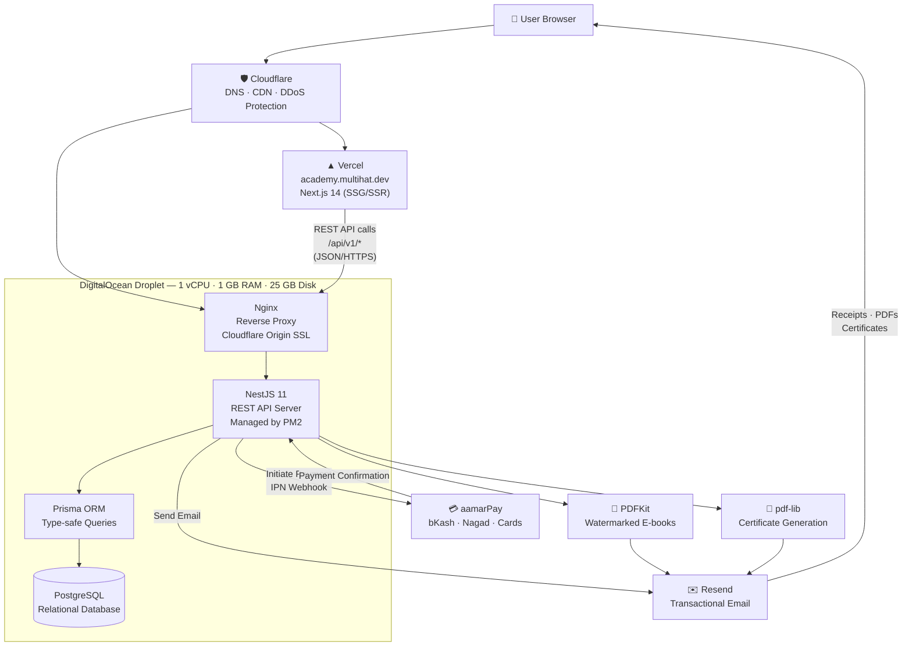

# Architecture Overview

High-level system architecture for MultiHAT Academy (`academy.multihat.dev`).

```mermaid
flowchart TB
    user["👤 User Browser"] --> cf["🛡️ Cloudflare\nDNS · CDN · DDoS Protection"]

    cf --> vercel["▲ Vercel\nacademy.multihat.dev\nNext.js 14 (SSG/SSR)"]
    cf --> nginx

    vercel -->|"REST API calls\n/api/v1/*\n(JSON/HTTPS)"| nginx

    subgraph droplet["DigitalOcean Droplet — 1 vCPU · 1 GB RAM · 25 GB Disk"]
        nginx["Nginx\nReverse Proxy\nCloudflare Origin SSL"]
        nestjs["NestJS 11\nREST API Server\nManaged by PM2"]
        prisma["Prisma ORM\nType-safe Queries"]
        pg[("PostgreSQL\nRelational Database")]
    end

    nginx --> nestjs
    nestjs --> prisma
    prisma --> pg

    nestjs -->|"Initiate Payment\nIPN Webhook"| pay["💳 aamarPay\nbKash · Nagad · Cards"]
    pay -->|"Payment Confirmation"| nestjs

    nestjs --> pdfkit["📄 PDFKit\nWatermarked E-books"]
    nestjs --> pdflib["📜 pdf-lib\nCertificate Generation"]

    nestjs -->|"Send Email"| email["✉️ Resend\nTransactional Email"]
    pdfkit --> email
    pdflib --> email

    email -->|"Receipts · PDFs\nCertificates"| user
```
