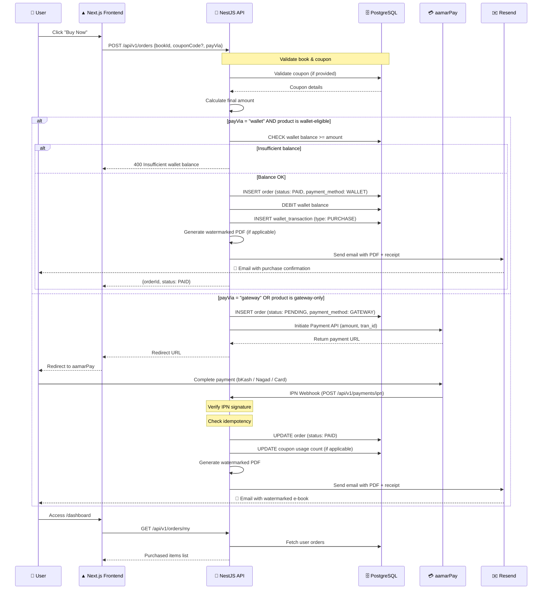

# Payment Flow

Complete payment lifecycle covering both aamarPay gateway and Wallet payment paths.

```mermaid
sequenceDiagram
    participant U as 👤 User
    participant F as ▲ Next.js Frontend
    participant A as 🔧 NestJS API
    participant DB as 🗄️ PostgreSQL
    participant P as 💳 aamarPay
    participant E as ✉️ Resend

    U->>F: Click "Buy Now"
    F->>A: POST /api/v1/orders {bookId, couponCode?, payVia}

    Note over A,DB: Validate book & coupon
    A->>DB: Validate coupon (if provided)
    DB-->>A: Coupon details
    A->>A: Calculate final amount

    alt payVia = "wallet" AND product is wallet-eligible
        A->>DB: CHECK wallet balance >= amount
        alt Insufficient balance
            A-->>F: 400 Insufficient wallet balance
        else Balance OK
            A->>DB: INSERT order (status: PAID, payment_method: WALLET)
            A->>DB: DEBIT wallet balance
            A->>DB: INSERT wallet_transaction (type: PURCHASE)
            A->>A: Generate watermarked PDF (if applicable)
            A->>E: Send email with PDF + receipt
            E-->>U: 📧 Email with purchase confirmation
            A-->>F: {orderId, status: PAID}
        end
    else payVia = "gateway" OR product is gateway-only
        A->>DB: INSERT order (status: PENDING, payment_method: GATEWAY)
        A->>P: Initiate Payment API (amount, tran_id)
        P-->>A: Return payment URL
        A-->>F: Redirect URL
        F-->>U: Redirect to aamarPay

        U->>P: Complete payment (bKash / Nagad / Card)

        P->>A: IPN Webhook (POST /api/v1/payments/ipn)
        Note over A: Verify IPN signature
        Note over A: Check idempotency
        A->>DB: UPDATE order (status: PAID)
        A->>DB: UPDATE coupon usage count (if applicable)

        A->>A: Generate watermarked PDF
        A->>E: Send email with PDF + receipt
        E-->>U: 📧 Email with watermarked e-book
    end

    U->>F: Access /dashboard
    F->>A: GET /api/v1/orders/my
    A->>DB: Fetch user orders
    A-->>F: Purchased items list
```
