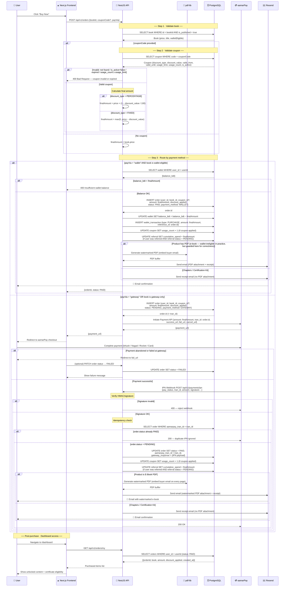

# Payment Flow

Complete payment lifecycle covering coupon validation, Wallet path, and aamarPay gateway path, including IPN handling, fulfillment, and post-order side-effects.

```mermaid
sequenceDiagram
    participant U as 👤 User
    participant F as ▲ Next.js Frontend
    participant A as 🔧 NestJS API
    participant PDF as 📄 pdf-lib
    participant DB as 🗄️ PostgreSQL
    participant P as 💳 aamarPay
    participant E as ✉️ Resend

    U->>F: Click "Buy Now"
    F->>A: POST /api/v1/orders {bookId, couponCode?, payVia}

    Note over A,DB: ── Step 1 · Validate book ──
    A->>DB: SELECT book WHERE id = bookId AND is_published = true
    DB-->>A: Book (price, title, walletEligible)

    alt couponCode provided
        Note over A,DB: ── Step 2 · Validate coupon ──
        A->>DB: SELECT coupon WHERE code = couponCode
        DB-->>A: Coupon (discount_type, discount_value, valid_from,<br/>valid_until, usage_limit, usage_count, is_active)

        alt Invalid: not found / is_active=false / expired / usage_count ≥ usage_limit
            A-->>F: 400 Bad Request — coupon invalid or expired
        else Valid coupon
            Note over A: Calculate final amount
            alt discount_type = PERCENTAGE
                A->>A: finalAmount = price × (1 − discount_value / 100)
            else discount_type = FIXED
                A->>A: finalAmount = max(0, price − discount_value)
            end
        end
    else No coupon
        A->>A: finalAmount = book.price
    end

    Note over A,DB: ── Step 3 · Route by payment method ──

    alt payVia = "wallet" AND book is wallet-eligible
        A->>DB: SELECT wallet WHERE user_id = userId
        DB-->>A: {balance_bdt}

        alt balance_bdt < finalAmount
            A-->>F: 400 Insufficient wallet balance
        else Balance OK
            A->>DB: INSERT order {user_id, book_id, coupon_id?,<br/>amount: finalAmount, discount_applied,<br/>status: PAID, payment_method: WALLET}
            DB-->>A: order.id
            A->>DB: UPDATE wallet SET balance_bdt = balance_bdt − finalAmount
            A->>DB: INSERT wallet_transaction {type: PURCHASE, amount: finalAmount,<br/>reference_id: order.id}
            A->>DB: UPDATE coupon SET usage_count + 1 (if coupon applied)
            A->>DB: UPDATE referral SET cumulative_spend + finalAmount<br/>(if user was referred AND referral status = PENDING)

            alt Product has PDF (e-book — wallet-ineligible in practice,<br/>but guarded here for correctness)
                A->>PDF: Generate watermarked PDF (embed buyer email)
                PDF-->>A: PDF buffer
                A->>E: Send email (PDF attachment + receipt)
            else Chapters / Certification Kit
                A->>E: Send receipt email (no PDF attachment)
            end

            E-->>U: 📧 Email confirmation
            A-->>F: {orderId, status: PAID}
        end

    else payVia = "gateway" OR book is gateway-only
        A->>DB: INSERT order {user_id, book_id, coupon_id?,<br/>amount: finalAmount, discount_applied,<br/>status: PENDING, payment_method: GATEWAY}
        DB-->>A: order.id (= tran_id)
        A->>P: Initiate Payment API {amount: finalAmount, tran_id: order.id,<br/>success_url, fail_url, cancel_url}
        P-->>A: {payment_url}
        A-->>F: {payment_url}
        F-->>U: Redirect to aamarPay checkout

        U->>P: Complete payment (bKash / Nagad / Rocket / Card)

        alt Payment abandoned or failed at gateway
            P-->>U: Redirect to fail_url
            F->>A: (optional) PATCH order status → FAILED
            A->>DB: UPDATE order SET status = FAILED
            A-->>F: Show failure message
        else Payment successful
            P->>A: IPN Webhook POST /api/v1/payments/ipn<br/>{pay_status, tran_id, amount, signature…}

            Note over A: Verify HMAC/signature
            alt Signature invalid
                A-->>P: 400 — reject webhook
            else Signature OK
                Note over A: Idempotency check
                A->>DB: SELECT order WHERE aamarpay_tran_id = tran_id
                alt order.status already PAID
                    A-->>P: 200 — duplicate IPN ignored
                else order.status = PENDING
                    A->>DB: UPDATE order SET status = PAID,<br/>aamarpay_tran_id = tran_id,<br/>gateway_response = {IPN payload}
                    A->>DB: UPDATE coupon SET usage_count + 1 (if coupon applied)
                    A->>DB: UPDATE referral SET cumulative_spend + finalAmount<br/>(if user was referred AND referral status = PENDING)

                    alt Product is E-Book PDF
                        A->>PDF: Generate watermarked PDF (embed buyer email on every page)
                        PDF-->>A: PDF buffer
                        A->>E: Send email (watermarked PDF attachment + receipt)
                        E-->>U: 📧 Email with watermarked e-book
                    else Chapters / Certification Kit
                        A->>E: Send receipt email (no PDF attachment)
                        E-->>U: 📧 Email confirmation
                    end

                    A-->>P: 200 OK
                end
            end
        end
    end

    Note over U,F: ── Post-purchase · Dashboard access ──
    U->>F: Navigate to /dashboard
    F->>A: GET /api/v1/orders/my
    A->>DB: SELECT orders WHERE user_id = userId (status: PAID)
    DB-->>A: [{orderId, book, amount, discount_applied, created_at}]
    A-->>F: Purchased items list
    F-->>U: Show unlocked content + certificate eligibility
```
