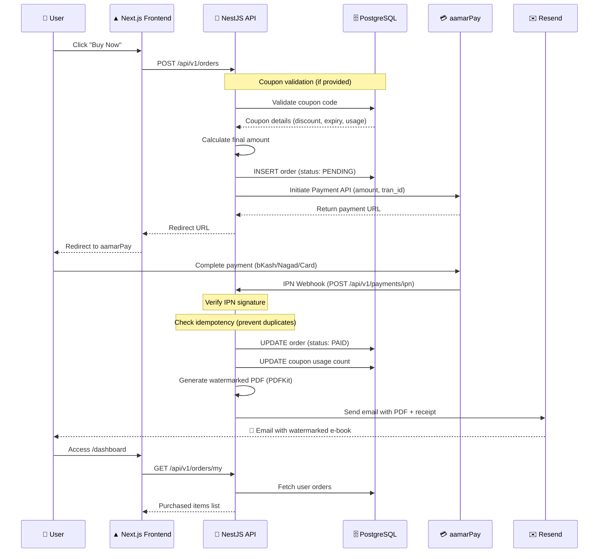

# Payment Flow

Complete payment lifecycle from purchase initiation through aamarPay to fulfillment.

```mermaid
sequenceDiagram
    participant U as 👤 User
    participant F as ▲ Next.js Frontend
    participant A as 🔧 NestJS API
    participant DB as 🗄️ PostgreSQL
    participant P as 💳 aamarPay
    participant E as ✉️ Resend

    U->>F: Click "Buy Now"
    F->>A: POST /api/v1/orders
    
    Note over A,DB: Coupon validation (if provided)
    A->>DB: Validate coupon code
    DB-->>A: Coupon details (discount, expiry, usage)
    A->>A: Calculate final amount

    A->>DB: INSERT order (status: PENDING)
    A->>P: Initiate Payment API (amount, tran_id)
    P-->>A: Return payment URL
    A-->>F: Redirect URL
    F-->>U: Redirect to aamarPay

    U->>P: Complete payment (bKash/Nagad/Card)

    P->>A: IPN Webhook (POST /api/v1/payments/ipn)
    Note over A: Verify IPN signature
    Note over A: Check idempotency (prevent duplicates)
    A->>DB: UPDATE order (status: PAID)
    A->>DB: UPDATE coupon usage count

    A->>A: Generate watermarked PDF (PDFKit)
    A->>E: Send email with PDF + receipt
    E-->>U: 📧 Email with watermarked e-book

    U->>F: Access /dashboard
    F->>A: GET /api/v1/orders/my
    A->>DB: Fetch user orders
    A-->>F: Purchased items list
```
