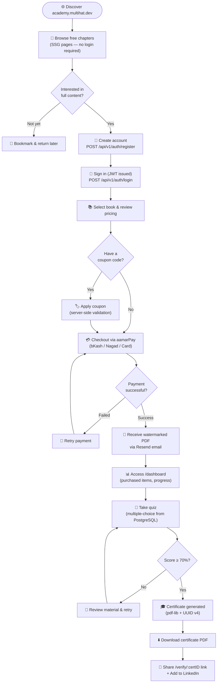

# User Journey

End-to-end learner experience from discovery to certification.

```mermaid
flowchart TD
    start(["🌐 Discover academy.multihat.dev"]) --> browse["📖 Browse free chapters\n(SSG pages — no login required)"]
    browse --> decide{"Interested in\nfull content?"}
    decide -- "Not yet" --> bookmark["🔖 Bookmark & return later"]
    decide -- "Yes" --> register["📝 Create account\nPOST /api/v1/auth/register"]
    register --> login["🔐 Sign in (JWT issued)\nPOST /api/v1/auth/login"]
    login --> choose["📚 Select book & review pricing"]
    choose --> coupon{"Have a\ncoupon code?"}
    coupon -- "Yes" --> apply["🏷️ Apply coupon\n(server-side validation)"]
    coupon -- "No" --> checkout
    apply --> checkout["💳 Checkout via aamarPay\n(bKash / Nagad / Card)"]
    checkout --> payment{"Payment\nsuccessful?"}
    payment -- "Failed" --> retry_pay["🔄 Retry payment"]
    retry_pay --> checkout
    payment -- "Success" --> email["📧 Receive watermarked PDF\nvia Resend email"]
    email --> dashboard["📊 Access /dashboard\n(purchased items, progress)"]
    dashboard --> quiz["📝 Take quiz\n(multiple-choice from PostgreSQL)"]
    quiz --> pass{"Score ≥ 70%?"}
    pass -- "No" --> review["📖 Review material & retry"]
    review --> quiz
    pass -- "Yes" --> cert["🎓 Certificate generated\n(pdf-lib + UUID v4)"]
    cert --> download["⬇️ Download certificate PDF"]
    download --> share["🔗 Share /verify/:certID link\n+ Add to LinkedIn"]
```
