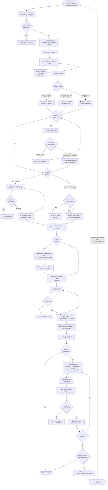

# User Journey

End-to-end learner experience from discovery through purchase (with coupon), certification, wallet, showcase, and referral growth loop.

```mermaid
flowchart TD
    start(["🌐 Discover academy.multihat.dev\n(organic / referral link)"]) --> browse["📖 Browse free chapters\n(SSG pages — no login)"]
    browse --> decide{"Interested in\nfull content?"}
    decide -- "Not yet" --> bookmark["🔖 Bookmark & return later"]
    decide -- "Yes" --> register["📝 Create account\n(referral code captured if present)"]
    register --> login["🔐 Sign in (JWT issued)"]
    login --> dashboard_home["📊 User Dashboard\n(wallet balance · purchases · certs)"]

    dashboard_home --> topup["💳 Top up Wallet\nvia aamarPay\n(Min ৳50)"]
    topup --> dashboard_home

    dashboard_home --> choose["📚 Select product"]
    choose --> product_type{"Product type?"}

    product_type -- "Paid Web Chapters\n৳50–৳200" --> paid_chapters["📖 Gated web chapters\n✅ Wallet or Gateway"]
    product_type -- "Premium E-Book PDF\n৳600–৳1,800" --> ebook["📕 Watermarked PDF\n⛔ Gateway only"]
    product_type -- "Certification Kit\n৳1,200" --> cert_kit["🎓 Quiz + Certificate\n✅ Wallet or Gateway"]

    paid_chapters --> coupon_prompt
    ebook --> coupon_prompt
    cert_kit --> coupon_prompt

    coupon_prompt{"Have a\ncoupon code?"} -- "No" --> pay_method
    coupon_prompt -- "Yes" --> enter_coupon["🏷️ Enter coupon code"]
    enter_coupon --> validate_coupon{"Code valid,\nactive & in-limit?"}
    validate_coupon -- "Invalid / expired" --> coupon_err["❌ Show error message"]
    coupon_err --> coupon_prompt
    validate_coupon -- "Valid\n(PERCENTAGE or FIXED)" --> show_discount["✅ Show discounted price\n(original − discount)"]
    show_discount --> pay_method

    pay_method{"Pay with\nWallet?"} -- "No / E-Book" --> gateway_pay["💳 Checkout via aamarPay\n(bKash · Nagad · Card)"]
    pay_method -- "Yes\n(Chapters or Cert Kit)" --> wallet_check{"Wallet balance\n≥ final amount?"}

    wallet_check -- "No" --> topup2["💳 Top up wallet\nthen return"]
    topup2 --> wallet_check
    wallet_check -- "Yes" --> wallet_pay["💰 Debit Wallet balance\n(coupon applied if any)"]

    wallet_pay --> fulfillment
    gateway_pay --> payment_ok{"Payment\nsuccessful?"}
    payment_ok -- "Failed" --> retry["🔄 Retry payment"]
    retry --> gateway_pay
    payment_ok -- "Success" --> coupon_usage["📊 Increment coupon\nusage count in DB"]
    coupon_usage --> fulfillment

    fulfillment["✅ Order fulfilled\n📧 Email confirmation via Resend"] --> ebook_or_content{"E-Book\npurchase?"}
    ebook_or_content -- "Yes" --> watermark["🔒 Generate watermarked PDF\n(buyer email on every page)"]
    watermark --> pdf_email["📧 Email watermarked PDF\n+ receipt via Resend"]
    ebook_or_content -- "No" --> dashboard_access

    pdf_email --> dashboard_access["📊 Access purchased content\nin /dashboard"]

    dashboard_access --> quiz["📝 Take quiz\n(multiple-choice)"]
    quiz --> pass{"Score ≥ 70%?"}
    pass -- "No" --> review["📖 Review material & retry"]
    review --> quiz
    pass -- "Yes" --> cert["🎓 Certificate generated\n(pdf-lib + UUID v4)\n📧 PDF emailed via Resend"]

    cert --> download["⬇️ Download certificate PDF\nfrom /dashboard"]
    download --> public_verify["🔗 Public verification at\n/verify/:certID"]

    public_verify --> showcase_q{"Share on\nsocial media?"}
    showcase_q -- "Skip" --> done(["✅ Journey complete"])
    showcase_q -- "Yes" --> pick_platform["Select platform\n(LinkedIn · X · Facebook · Instagram)\nEach earns ৳20–৳30 separately"]
    pick_platform --> submit_url["Submit post URL\nin /dashboard"]
    submit_url --> verify_wait["⏳ 10-day verification window\n(@nestjs/schedule cron)"]
    verify_wait --> verified{"Post still\nlive & public?"}
    verified -- "No" --> denied["❌ Reward denied\nStatus → REJECTED"]
    verified -- "Yes" --> reward["💰 Wallet credited\n(৳20–৳30 per platform)"]

    reward --> more_platforms{"Submit another\nplatform?"}
    more_platforms -- "Yes" --> pick_platform
    more_platforms -- "No" --> referral_q{"Wallet earned —\nshare referral link?"}

    referral_q -- "No" --> done
    referral_q -- "Yes" --> refer["🤝 Share referral link\nacademy.multihat.dev/ref/CODE"]
    refer --> new_user(["👤 New user discovers platform"])
    new_user -. "Referred user spends ≥ ৳500\n→ Referrer earns ৳100 wallet credit" .-> start
```
