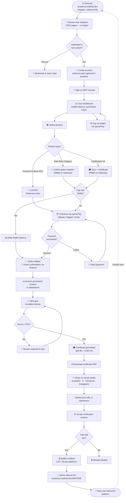

# User Journey

End-to-end learner experience from discovery through certification, wallet, referral, and showcase.

```mermaid
flowchart TD
    start(["🌐 Discover academy.multihat.dev\n(organic / referral link)"]) --> browse["📖 Browse free chapters\n(SSG pages — no login)"]
    browse --> decide{"Interested in\nfull content?"}
    decide -- "Not yet" --> bookmark["🔖 Bookmark & return later"]
    decide -- "Yes" --> register["📝 Create account\n(referral code captured if present)"]
    register --> login["🔐 Sign in (JWT issued)"]
    login --> dashboard_home["📊 User Dashboard\n(wallet balance, purchases, certs)"]

    dashboard_home --> choose["📚 Select product"]
    choose --> product_type{"Product type?"}

    product_type -- "Paid Web Chapters" --> paid_chapters["📖 Unlock gated chapters\n(Wallet or Gateway)"]
    product_type -- "Premium E-Book PDF" --> ebook["📕 Full PDF\n(Gateway only)"]
    product_type -- "Certification Kit" --> cert_kit["🎓 Quiz + Certificate\n(Wallet or Gateway)"]

    paid_chapters --> pay_method
    ebook --> gateway_pay
    cert_kit --> pay_method

    pay_method{"Pay with\nWallet?"} -- "Yes" --> wallet_pay["💰 Debit Wallet balance"]
    pay_method -- "No" --> gateway_pay["💳 Checkout via aamarPay\n(bKash / Nagad / Card)"]

    wallet_pay --> fulfillment
    gateway_pay --> payment_ok{"Payment\nsuccessful?"}
    payment_ok -- "Failed" --> retry["🔄 Retry payment"]
    retry --> gateway_pay
    payment_ok -- "Success" --> fulfillment

    fulfillment["✅ Order fulfilled\n📧 Email confirmation via Resend"] --> dashboard_access["📊 Access purchased content\nin /dashboard"]

    dashboard_access --> quiz["📝 Take quiz\n(multiple-choice)"]
    quiz --> pass{"Score ≥ 70%?"}
    pass -- "No" --> review["📖 Review material & retry"]
    review --> quiz
    pass -- "Yes" --> cert["🎓 Certificate generated\n(pdf-lib + UUID v4)"]

    cert --> download["⬇️ Download certificate PDF"]
    download --> showcase["📣 Share on social media\n(LinkedIn · X · Facebook · Instagram)"]
    showcase --> submit_url["Submit post URL in dashboard"]
    submit_url --> verify_wait["⏳ 10-day verification window"]
    verify_wait --> verified{"Post still\nlive?"}
    verified -- "Yes" --> reward["💰 Wallet credited\n(৳20–৳30 per platform)"]
    verified -- "No" --> denied["❌ Reward denied"]

    reward --> refer["🤝 Share referral link\nacademy.multihat.dev/ref/CODE"]
    refer --> new_user(["👤 New user discovers platform"])
    new_user -.->|"Growth loop"| start

    dashboard_home --> topup["💳 Top up Wallet\nvia aamarPay"]
    topup --> dashboard_home
```
