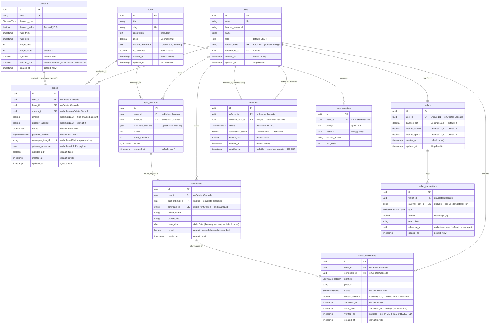

# Data Model

PostgreSQL schema managed by Prisma ORM. All primary keys are UUIDs (`@id @default(uuid()) @db.Uuid`). All timestamps are `DateTime` (`@default(now())` and `@updatedAt` where noted).

## Enums

| Enum | Values |
|:-----|:-------|
| `Role` | `USER` · `ADMIN` |
| `OrderStatus` | `PENDING` · `PAID` · `FAILED` · `REFUNDED` |
| `PaymentMethod` | `GATEWAY` · `WALLET` |
| `DiscountType` | `PERCENTAGE` · `FIXED` |
| `QuizResult` | `PASS` · `FAIL` |
| `ReferralStatus` | `PENDING` · `QUALIFIED` · `CREDITED` |
| `ShowcasePlatform` | `LINKEDIN` · `TWITTER` · `FACEBOOK` · `INSTAGRAM` |
| `ShowcaseStatus` | `PENDING` · `VERIFIED` · `REJECTED` |
| `WalletTransactionType` | `TOPUP` · `PURCHASE` · `REFERRAL_CREDIT` · `SHOWCASE_CREDIT` |

## Entity Relationship Diagram

## Constraints & Cascade Rules

| Table | Column / Index | Type | Behaviour |
|:------|:--------------|:-----|:----------|
| `orders` | `coupon_id` FK | `onDelete: SetNull` | Deleting a coupon nulls `coupon_id` — order history preserved |
| `orders` | `user_id` FK | `onDelete: Cascade` | Deleting a user cascades to their orders |
| `orders` | `book_id` FK | `onDelete: Cascade` | Deleting a book cascades to its orders |
| `orders` | `aamarpay_tran_id` | `@unique` | Prevents duplicate IPN processing |
| `quiz_questions` | `book_id` FK | `onDelete: Cascade` | Deleting a book cascades to its quiz questions |
| `quiz_attempts` | `user_id` FK | `onDelete: Cascade` | Deleting a user cascades to their attempts |
| `quiz_attempts` | `book_id` FK | `onDelete: Cascade` | Deleting a book cascades to its attempts |
| `certificates` | `quiz_attempt_id` | `@unique` | One certificate per quiz attempt maximum |
| `certificates` | `quiz_attempt_id` FK | `onDelete: Cascade` | Deleting the attempt cascades to the certificate |
| `certificates` | `user_id` FK | `onDelete: Cascade` | Deleting a user cascades to their certificates |
| `coupons` | *(no FK)* | — | No cascades — referenced via `orders.coupon_id` (SetNull) |
| `wallets` | `user_id` | `@unique` | Enforces 1:1 relationship with users |
| `wallets` | `user_id` FK | `onDelete: Cascade` | Deleting a user cascades to their wallet |
| `wallet_transactions` | `wallet_id` FK | `onDelete: Cascade` | Deleting a wallet cascades to its transactions |
| `wallet_transactions` | `gateway_tran_id` | `@unique nullable` | Idempotency guard for top-up IPN webhooks (P2002 silently ignored) |
| `referrals` | `referred_user_id` | `@unique` | A user can be referred at most once |
| `referrals` | `referrer_id` FK | `onDelete: Cascade` | Deleting referrer cascades to referral records |
| `referrals` | `referred_user_id` FK | `onDelete: Cascade` | Deleting referred user cascades to referral records |
| `social_showcases` | `(user_id, certificate_id, platform)` | `@@unique` | One reward per platform per certificate per user |
| `social_showcases` | `user_id` FK | `onDelete: Cascade` | Deleting a user cascades to their showcase submissions |
| `social_showcases` | `certificate_id` FK | `onDelete: Cascade` | Deleting a certificate cascades to its showcases |

## Key Design Notes

| Concern | Detail |
|:--------|:-------|
| **All PKs** | `@id @default(uuid()) @db.Uuid` — PostgreSQL native UUID |
| **Financial fields** | All monetary values use `Decimal(10,2)` — no floating point |
| **`certificate_id` vs `id`** | `certificates.id` = internal DB PK · `certificates.certificate_id` = public verify token (also a UUID, auto-generated separately) |
| **`referral_code`** | Every user gets a unique referral code at registration — `@default(uuid())` |
| **`issue_date`** | `@db.Date` — stored as a pure date with no time component |
| **`social_showcases.reward_amount`** | Baked in at INSERT time from `PLATFORM_REWARDS` constant — not recomputed by cron |
| **`social_showcases.verified_at`** | Set on BOTH `VERIFIED` and `REJECTED` terminal states |
| **`coupons` has no `updated_at`** | Intentional — no `@updatedAt` in schema |
| **`quiz_questions` has no timestamps** | Intentional — no `created_at` or `updated_at` in schema |
| **Wallet debit atomicity** | Uses raw SQL `UPDATE wallets SET balance_bdt = balance_bdt - :amt WHERE balance_bdt >= :amt` — eliminates TOCTOU race |
