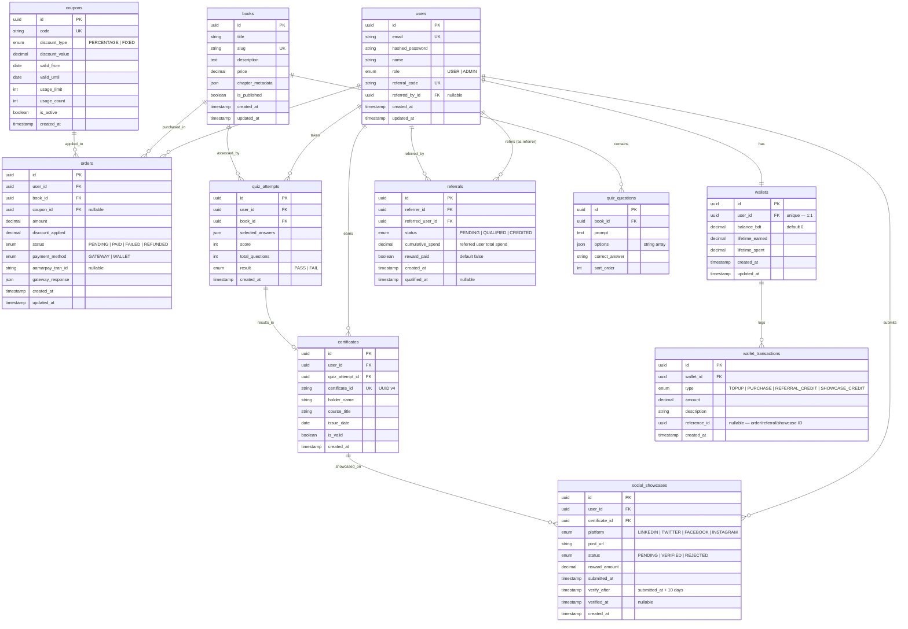

# Data Model

PostgreSQL schema managed by Prisma ORM. All tables use UUID primary keys and automatic timestamps.

```mermaid
erDiagram
    users ||--o{ orders : places
    users ||--o{ quiz_attempts : takes
    users ||--o{ certificates : earns
    users ||--|| wallets : has
    users ||--o{ referrals : "refers (as referrer)"
    users ||--o{ referrals : "referred_by"
    users ||--o{ social_showcases : submits

    books ||--o{ orders : purchased_in
    books ||--o{ quiz_questions : contains
    books ||--o{ quiz_attempts : assessed_by

    quiz_attempts ||--o| certificates : results_in
    certificates ||--o{ social_showcases : showcased_on
    coupons ||--o{ orders : applied_to

    wallets ||--o{ wallet_transactions : logs

    users {
        uuid id PK
        string email UK
        string hashed_password
        string name
        enum role "USER | ADMIN"
        string referral_code UK
        uuid referred_by_id FK "nullable"
        timestamp created_at
        timestamp updated_at
    }

    books {
        uuid id PK
        string title
        string slug UK
        text description
        decimal price
        json chapter_metadata
        boolean is_published
        timestamp created_at
        timestamp updated_at
    }

    orders {
        uuid id PK
        uuid user_id FK
        uuid book_id FK
        uuid coupon_id FK "nullable"
        decimal amount
        decimal discount_applied
        enum status "PENDING | PAID | FAILED | REFUNDED"
        enum payment_method "GATEWAY | WALLET"
        string aamarpay_tran_id "nullable"
        json gateway_response
        timestamp created_at
        timestamp updated_at
    }

    quiz_questions {
        uuid id PK
        uuid book_id FK
        text prompt
        json options "string array"
        string correct_answer
        int sort_order
    }

    quiz_attempts {
        uuid id PK
        uuid user_id FK
        uuid book_id FK
        json selected_answers
        int score
        int total_questions
        enum result "PASS | FAIL"
        timestamp created_at
    }

    certificates {
        uuid id PK
        uuid user_id FK
        uuid quiz_attempt_id FK
        string certificate_id UK "UUID v4"
        string holder_name
        string course_title
        date issue_date
        boolean is_valid
        timestamp created_at
    }

    coupons {
        uuid id PK
        string code UK
        enum discount_type "PERCENTAGE | FIXED"
        decimal discount_value
        date valid_from
        date valid_until
        int usage_limit
        int usage_count
        boolean is_active
        timestamp created_at
    }

    wallets {
        uuid id PK
        uuid user_id FK "unique — 1:1"
        decimal balance_bdt "default 0"
        decimal lifetime_earned
        decimal lifetime_spent
        timestamp created_at
        timestamp updated_at
    }

    wallet_transactions {
        uuid id PK
        uuid wallet_id FK
        enum type "TOPUP | PURCHASE | REFERRAL_CREDIT | SHOWCASE_CREDIT"
        decimal amount
        string description
        uuid reference_id "nullable — order/referral/showcase ID"
        timestamp created_at
    }

    referrals {
        uuid id PK
        uuid referrer_id FK
        uuid referred_user_id FK
        enum status "PENDING | QUALIFIED | CREDITED"
        decimal cumulative_spend "referred user total spend"
        boolean reward_paid "default false"
        timestamp created_at
        timestamp qualified_at "nullable"
    }

    social_showcases {
        uuid id PK
        uuid user_id FK
        uuid certificate_id FK
        enum platform "LINKEDIN | TWITTER | FACEBOOK | INSTAGRAM"
        string post_url
        enum status "PENDING | VERIFIED | REJECTED"
        decimal reward_amount
        timestamp submitted_at
        timestamp verify_after "submitted_at + 10 days"
        timestamp verified_at "nullable"
        timestamp created_at
    }
```
