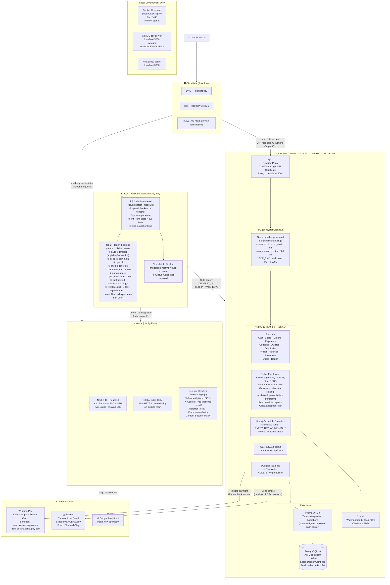

# Deployment Topology

Production infrastructure for `academy.multihat.dev` and `api.multihat.dev`.

```mermaid
flowchart TB
    user["👤 User Browser"] --> cloudflare

    subgraph cloudflare["🛡️ Cloudflare (Free Plan)"]
        cf_dns["DNS — multihat.dev"]
        cf_cdn["CDN · DDoS Protection"]
        cf_ssl["Public SSL/TLS (HTTPS termination)"]
    end

    cloudflare -->|"academy.multihat.dev\nFrontend requests"| vercel
    cloudflare -->|"api.multihat.dev\nAPI requests (Cloudflare Origin SSL)"| nginx_proxy

    subgraph vercel["▲ Vercel (Hobby Plan)"]
        nextjs["Next.js 15 · React 19\nApp Router — SSG + SSR\nTypeScript · Tailwind CSS"]
        vercel_edge["Global Edge CDN\nAuto-HTTPS · Auto-deploy on push to main"]
        nextjs_sec["Security Headers (next.config.mjs)\nX-Frame-Options: DENY\nX-Content-Type-Options: nosniff\nReferrer-Policy · Permissions-Policy\nContent-Security-Policy"]
    end

    subgraph droplet["DigitalOcean Droplet — 1 vCPU · 1 GB RAM · 25 GB Disk"]
        nginx_proxy["Nginx\nReverse Proxy\nCloudflare Origin SSL Certificate\nProxy → localhost:5001"]

        subgraph pm2_proc["PM2 (ecosystem.config.js)"]
            pm2_cfg["Name: academy-backend\nScript: dist/src/main.js\ninstances: 1 · exec_mode: fork\nmax_memory_restart: 800 MB\nNODE_ENV: production · PORT: 5001"]
        end

        subgraph nestjs["NestJS 11 Runtime — api/v1/*"]
            api_modules["12 Modules\nAuth · Books · Orders · Payments\nCoupons · Quizzes · Certificates\nWallet · Referrals · Showcases\nUsers · Health"]
            middleware["Global Middleware\nHelmet.js (security headers)\nStrict CORS (academy.multihat.dev)\n@nestjs/throttler (rate limiting)\nValidationPipe (whitelist + transform)\nResponseInterceptor · GlobalExceptionFilter"]
            cron_jobs["@nestjs/schedule Cron Jobs\nShowcase verify: EVERY_DAY_AT_MIDNIGHT\nReferral threshold check"]
            health["GET /api/v1/healthz\n→ { status: ok, uptime }"]
            swagger_note["Swagger /api/docs\n⚠️ Disabled in NODE_ENV=production"]
        end

        pdflib["📄 pdf-lib\nWatermarked E-Book PDFs\nCertificate PDFs"]

        subgraph db_layer["Data Layer"]
            prisma_orm["Prisma ORM 6\nType-safe queries · Migrations\n(prisma migrate deploy on each deploy)"]
            postgres[("PostgreSQL 16\nACID-compliant\n11 tables\nLocal: Docker Compose\nProd: native on Droplet")]
        end
    end

    nginx_proxy --> pm2_proc --> nestjs
    nestjs --> pdflib
    nestjs --> prisma_orm --> postgres

    subgraph external["External Services"]
        aamarpay["💳 aamarPay\nbKash · Nagad · Rocket · Cards\nSandbox: sandbox.aamarpay.com\nProd: secure.aamarpay.com"]
        resend["✉️ Resend\nTransactional Email\nacademy@multihat.dev\nFree: 100 emails/day"]
        ga4["📊 Google Analytics 4\nPage-view telemetry"]
    end

    nestjs -->|"Initiate payment\nIPN webhook inbound"| aamarpay
    nestjs -->|"Send emails\n(receipts · PDFs · rewards)"| resend
    nextjs -->|"Page-view events"| ga4

    subgraph cicd["CI/CD — GitHub Actions (deploy.yml)\nTrigger: push to main"]
        direction TB
        job1["Job 1 · build-and-test\n(ubuntu-latest · Node 20)\n① npm ci (backend + frontend)\n② prisma generate\n③ lint + unit tests + e2e tests\n④ next build (frontend)"]
        job2["Job 2 · deploy-backend\n(needs: build-and-test)\n① SSH to Droplet (appleboy/ssh-action)\n② git pull origin main\n③ npm ci\n④ prisma generate\n⑤ prisma migrate deploy\n⑥ npm run build\n⑦ npm prune --omit=dev\n⑧ pm2 restart ecosystem.config.js\n⑨ Health check → GET /api/v1/healthz\n   (wait 10s · fail pipeline on non-200)"]
        job3["Vercel Auto-Deploy\n(triggered directly by push to main)\nNo GitHub Actions job required"]

        job1 --> job2
        job1 --> job3
    end

    cicd -->|"SSH deploy\n(DROPLET_IP · SSH_PRIVATE_KEY)"| droplet
    cicd -->|"Vercel Git integration\n(auto on push)"| vercel

    subgraph local_dev["Local Development Only"]
        docker_compose["Docker Compose\npostgres:16-alpine\nPort 5432\nVolume: pgdata"]
        dev_backend["NestJS dev server\nlocalhost:5000\nSwagger: localhost:5000/api/docs"]
        dev_frontend["Next.js dev server\nlocalhost:3000"]
    end
```
