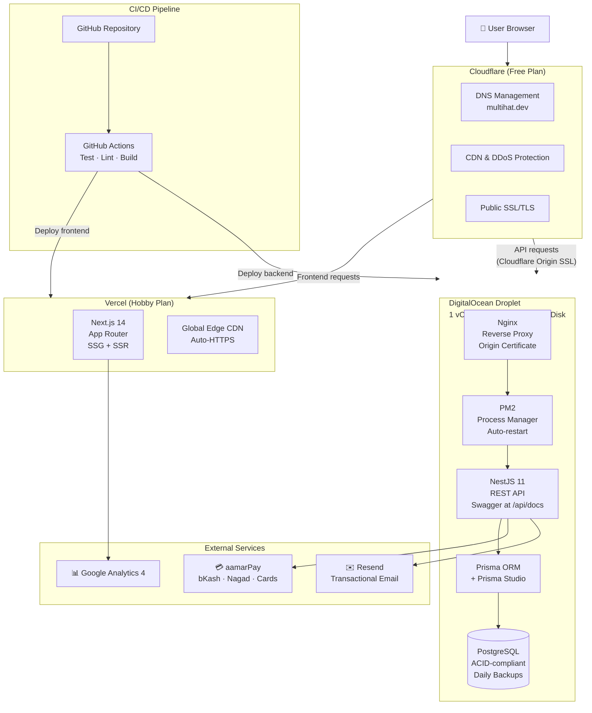

# Deployment Topology

Production infrastructure for `academy.multihat.dev`.

```mermaid
flowchart TB
    user["👤 User Browser"] --> cloudflare

    subgraph cloudflare["Cloudflare (Free Plan)"]
        dns["DNS Management\nmultihat.dev"]
        cdn["CDN & DDoS Protection"]
        ssl_pub["Public SSL/TLS"]
    end

    cloudflare -->|"Frontend requests"| vercel
    cloudflare -->|"API requests\n(Cloudflare Origin SSL)"| droplet

    subgraph vercel["Vercel (Hobby Plan)"]
        nextjs["Next.js 14\nApp Router\nSSG + SSR"]
        vercel_cdn["Global Edge CDN\nAuto-HTTPS"]
    end

    subgraph droplet["DigitalOcean Droplet\n1 vCPU · 1 GB RAM · 25 GB Disk"]
        nginx_proxy["Nginx\nReverse Proxy\nOrigin Certificate"]
        pm2["PM2\nProcess Manager\nAuto-restart"]
        nest_app["NestJS 11\nREST API\nSwagger at /api/docs"]
        prisma_orm["Prisma ORM\n+ Prisma Studio"]
        postgres[("PostgreSQL\nACID-compliant\nDaily Backups")]
    end

    nginx_proxy --> pm2
    pm2 --> nest_app
    nest_app --> prisma_orm
    prisma_orm --> postgres

    subgraph external["External Services"]
        aamarpay["💳 aamarPay\nbKash · Nagad · Cards"]
        resend["✉️ Resend\nTransactional Email"]
        ga4["📊 Google Analytics 4"]
    end

    nest_app --> aamarpay
    nest_app --> resend
    nextjs --> ga4

    subgraph cicd["CI/CD Pipeline"]
        github["GitHub Repository"]
        actions["GitHub Actions\nTest · Lint · Build"]
    end

    github --> actions
    actions -->|"Deploy frontend"| vercel
    actions -->|"Deploy backend"| droplet
```
