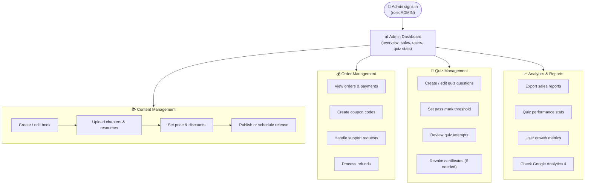

# Admin Workflow

Content management and platform administration lifecycle.

```mermaid
flowchart TD
    start(["🔐 Admin signs in\n(role: ADMIN)"]) --> dashboard["📊 Admin Dashboard\n(overview: sales, users, quiz stats)"]

    dashboard --> content_mgmt
    dashboard --> order_mgmt
    dashboard --> quiz_mgmt
    dashboard --> analytics

    subgraph content_mgmt["📚 Content Management"]
        create_book["Create / edit book"]
        upload_chapters["Upload chapters & resources"]
        set_pricing["Set price & discounts"]
        publish["Publish or schedule release"]
        create_book --> upload_chapters --> set_pricing --> publish
    end

    subgraph order_mgmt["💰 Order Management"]
        view_orders["View orders & payments"]
        create_coupon["Create coupon codes"]
        handle_support["Handle support requests"]
        manage_refunds["Process refunds"]
    end

    subgraph quiz_mgmt["📝 Quiz Management"]
        create_questions["Create / edit quiz questions"]
        set_pass_mark["Set pass mark threshold"]
        review_attempts["Review quiz attempts"]
        revoke_certs["Revoke certificates (if needed)"]
    end

    subgraph analytics["📈 Analytics & Reports"]
        sales_report["Export sales reports"]
        quiz_report["Quiz performance stats"]
        user_report["User growth metrics"]
        ga4_check["Check Google Analytics 4"]
    end
```
