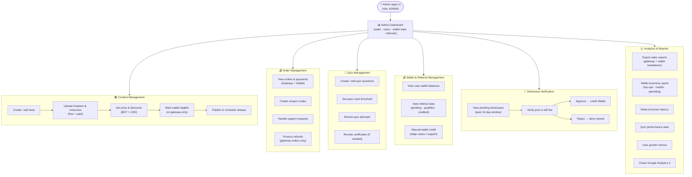

# Admin Workflow

Content management, platform administration, and growth management lifecycle.

```mermaid
flowchart TD
    start(["🔐 Admin signs in\n(role: ADMIN)"]) --> dashboard["📊 Admin Dashboard\n(sales · users · wallet stats · referrals)"]

    dashboard --> content_mgmt
    dashboard --> order_mgmt
    dashboard --> quiz_mgmt
    dashboard --> wallet_mgmt
    dashboard --> showcase_mgmt
    dashboard --> analytics

    subgraph content_mgmt["📚 Content Management"]
        create_book["Create / edit book"]
        upload_chapters["Upload chapters & resources\n(free + paid)"]
        set_pricing["Set price & discounts\n(BDT + USD)"]
        set_wallet["Mark wallet-eligible\n(or gateway-only)"]
        publish["Publish or schedule release"]
        create_book --> upload_chapters --> set_pricing --> set_wallet --> publish
    end

    subgraph order_mgmt["💰 Order Management"]
        view_orders["View orders & payments\n(Gateway + Wallet)"]
        create_coupon["Create coupon codes"]
        handle_support["Handle support requests"]
        manage_refunds["Process refunds\n(gateway orders only)"]
    end

    subgraph quiz_mgmt["📝 Quiz Management"]
        create_questions["Create / edit quiz questions"]
        set_pass_mark["Set pass mark threshold"]
        review_attempts["Review quiz attempts"]
        revoke_certs["Revoke certificates (if needed)"]
    end

    subgraph wallet_mgmt["💰 Wallet & Referral Management"]
        view_wallets["View user wallet balances"]
        view_referrals["View referral stats\n(pending · qualified · credited)"]
        manual_credit["Manual wallet credit\n(edge cases / support)"]
    end

    subgraph showcase_mgmt["📣 Showcase Verification"]
        pending_reviews["View pending showcases\n(past 10-day window)"]
        verify_post["Verify post is still live"]
        approve_reward["Approve → credit Wallet"]
        reject_reward["Reject → deny reward"]
        pending_reviews --> verify_post
        verify_post --> approve_reward
        verify_post --> reject_reward
    end

    subgraph analytics["📈 Analytics & Reports"]
        sales_report["Export sales reports\n(gateway + wallet breakdown)"]
        wallet_report["Wallet economy report\n(top-ups · credits · spending)"]
        referral_report["Referral funnel metrics"]
        quiz_report["Quiz performance stats"]
        user_report["User growth metrics"]
        ga4_check["Check Google Analytics 4"]
    end
```
