# Admin Workflow

All API endpoints, access guards, and the automated showcase verification cron. Endpoints are prefixed `api/v1/`.

```mermaid
flowchart TD
    start(["🔐 Admin signs in\nPOST /auth/login → JWT (role: ADMIN)"]) --> dashboard["📊 Admin Dashboard\n(sales · users · wallet stats · referrals)"]

    dashboard --> content_mgmt
    dashboard --> coupon_mgmt
    dashboard --> user_mgmt
    dashboard --> order_mgmt
    dashboard --> quiz_mgmt
    dashboard --> cert_mgmt
    dashboard --> analytics

    subgraph content_mgmt["📚 Content Management\n(AuthGuard + RolesGuard + Role.ADMIN)"]
        list_admin_books["GET /books/admin/all\nPaginated admin book list\n(default 50 · max 200 — includes unpublished)"]
        create_book["POST /books\nCreate book record\n{title, slug, description, price, chapterMetadata}"]
        edit_book["PATCH /books/:id\nEdit title · price · description\n· chapterMetadata · is_published"]
        set_published["Toggle is_published: false → true\n(draft → live on GET /books public list)"]
        wallet_note["⚠️ Wallet vs Gateway eligibility\nis determined by isPremiumPdfProduct(slug)\n— a code-level constant in premium-pdf.ts\n— NOT an API-settable field on the book"]
        list_admin_books --> create_book --> edit_book --> set_published
        edit_book -.-> wallet_note
    end

    subgraph coupon_mgmt["🏷️ Coupon Management\n(AuthGuard + RolesGuard + Role.ADMIN)"]
        list_coupons["GET /coupons\nList all coupons (ordered by created_at desc)"]
        get_coupon["GET /coupons/:id\nGet single coupon"]
        create_coupon["POST /coupons\nCreate coupon\n• code → normalised UPPER + trim\n• discount_type: PERCENTAGE | FIXED\n• discount_value · valid_from · valid_until\n• usage_limit · is_active · includes_pdf"]
        update_coupon["PATCH /coupons/:id\nPartial update — all fields optional\n• code re-normalised if changed\n• toggle is_active · extend dates\n• change discount · set includes_pdf\n• update usage_limit"]
        delete_coupon["DELETE /coupons/:id\n(coupon_id SetNull on existing orders\n— order history preserved)"]
        coupon_public["GET /coupons/verify/:code\n(public — no auth)\nLearner validates coupon before checkout\n→ 400 if inactive / expired / limit reached"]
        list_coupons --> get_coupon
        list_coupons --> create_coupon
        list_coupons --> update_coupon
        list_coupons --> delete_coupon
    end

    subgraph user_mgmt["👥 User Management"]
        list_users["GET /users\n(Admin only — RolesGuard)\nPaginated all users\n(default 50 · max 100)\n{id, email, name, role, created_at}"]
        promote_user["PATCH /users/:id/role\n(Admin only — RolesGuard)\n{role: USER | ADMIN}\nReturns {id, email, name, role}"]
        own_profile["GET /users/me (any auth user)\nReturns own profile\n{id, email, name, role, created_at}"]
        update_profile["PATCH /users/me (any auth user)\nUpdate own name: {name}"]
        list_users --> promote_user
    end

    subgraph order_mgmt["💰 Order Management"]
        create_order["POST /orders (any auth user)\n{bookId, paymentMethod, couponCode?,\nincludePrintablePdf?}\n→ PENDING order + payment URL or wallet debit"]
        view_my_orders["GET /orders/my (any auth user)\nUser's own order history"]
        download_pdf["GET /orders/:orderId/pdf (any auth user)\nStream watermarked e-book PDF\n(ownership verified + file cached to disk)"]
        view_all_orders["GET /orders (Admin only)\nAll orders paginated\n(default 50 · max 100)"]
        create_order --> view_my_orders
        view_my_orders --> download_pdf
    end

    subgraph quiz_mgmt["📝 Quiz Management"]
        direction TB
        learner_get["GET /quizzes/:bookSlug/questions\n(any auth user — PAID order required)\nReturns questions WITHOUT correct_answer"]
        learner_submit["POST /quizzes/:bookSlug/submit\n(any auth user — PAID order required)\n{selectedAnswers: {questionId: answer}}\n→ {score, total, outcome, certId?}"]
        admin_books["GET /quizzes/admin/books\n(Admin only)\nAll books for selector {id, title, slug, is_published}"]
        admin_list_q["GET /quizzes/admin/:bookSlug\n(Admin only)\nAll questions WITH correct_answer + sort_order"]
        admin_create_q["POST /quizzes/admin/questions\n(Admin only)\n{bookSlug, prompt, options[], correct_answer,\nsort_order?} — auto-assigned if omitted\ncorrect_answer must be in options[]"]
        admin_update_q["PATCH /quizzes/admin/questions/:id\n(Admin only)\nPartial update — validates correct_answer ∈ options"]
        admin_delete_q["DELETE /quizzes/admin/questions/:id\n(Admin only)\n→ {deleted: true}"]
        admin_books --> admin_list_q
        admin_list_q --> admin_create_q
        admin_list_q --> admin_update_q
        admin_list_q --> admin_delete_q
    end

    subgraph cert_mgmt["🎓 Certificate Management"]
        cert_my["GET /certificates/my (any auth user)\nUser's own certificates (ordered desc)"]
        cert_download["GET /certificates/:certId/pdf (public)\nRe-generate & stream certificate PDF\n→ 404 if cert.is_valid = false"]
        cert_verify["GET /certificates/verify/:certId (public)\n→ {valid, holderName, courseTitle,\n   issueDate, certificateId, certificatePdfUrl}"]
        cert_revoke["⚠️ Certificate revocation\nNo dedicated API endpoint\nAdmin sets is_valid = false\nvia DB / Prisma Studio directly\n→ verify returns {valid: false}"]
        cert_my --> cert_download
        cert_my --> cert_verify
        cert_verify --> cert_revoke
    end

    subgraph analytics["📈 Analytics & Reports"]
        sales_report["Sales breakdown\n(Gateway vs Wallet · coupon usage rates)"]
        wallet_report["Wallet economy\n(top-ups · REFERRAL_CREDIT · SHOWCASE_CREDIT)"]
        referral_report["Referral funnel\n(pending · qualified · credited · totalEarned)"]
        quiz_report["Quiz performance\n(scores · pass/fail · attempts per book)"]
        ga4_check["📊 Google Analytics 4\n(page views · acquisition · conversion)"]
    end

    subgraph showcase_cron["⏰ Automated Showcase Verification\n(@Cron — EVERY_DAY_AT_MIDNIGHT — no manual trigger)"]
        cron_start["00:00 UTC — NestJS cron fires\nSELECT social_showcases\nWHERE status = PENDING\n  AND verify_after <= now()\nINCLUDE user {email, name}\nINCLUDE certificate {certificateId}"]
        url_guard["Re-check SSRF allowlist per record\n(linkedin.com · twitter.com · x.com\nfacebook.com · fb.com · instagram.com)\n→ throw if not allowed"]
        head_req["axios.HEAD(postUrl,\n  {timeout: 10_000ms, maxRedirects: 3})"]
        live_check{"HTTP 200–399?"}
        credit_wallet["UPDATE showcase → VERIFIED\nverified_at = now()\ncreditReward(userId, rewardAmount,\n  type: SHOWCASE_CREDIT)\n→ wallet.balance_bdt += rewardAmount\n→ INSERT wallet_transaction\nLinkedIn / Twitter → ৳30\nFacebook / Instagram → ৳20\n📧 sendShowcaseRewardEmail (via Resend)"]
        reject_showcase["Logger.warn\nUPDATE showcase → REJECTED\nverified_at = now()\n⚠️ No rejection email sent"]

        cron_start --> url_guard --> head_req --> live_check
        live_check -- "Yes" --> credit_wallet
        live_check -- "No / timeout / SSRF blocked" --> reject_showcase
    end

    dashboard -.->|"Runs automatically\n(no manual trigger)"| showcase_cron
```

## Admin Endpoint Summary

| Module | Method | Path | Guard | Notes |
|:-------|:-------|:-----|:------|:------|
| Books | `GET` | `/books` | Public | Published only · paginated (default 20 · max 100) |
| Books | `GET` | `/books/admin/all` | Admin | All books incl. unpublished · paginated (default 50 · max 200) |
| Books | `GET` | `/books/:slug` | Optional JWT | Single book detail · `isOwned` · `ownsPdf` |
| Books | `GET` | `/books/:slug/chapters/:index` | Optional JWT | Chapter content — 403 if paid+no order |
| Books | `GET` | `/books/:slug/media/*` | Public | Image serving — SSRF + path-traversal guarded |
| Books | `POST` | `/books` | Admin | Create book |
| Books | `PATCH` | `/books/:id` | Admin | Update book fields |
| Coupons | `GET` | `/coupons/verify/:code` | Public | Learner coupon validation |
| Coupons | `GET` | `/coupons` | Admin | List all coupons |
| Coupons | `GET` | `/coupons/:id` | Admin | Single coupon |
| Coupons | `POST` | `/coupons` | Admin | Create — code UPPER-normalised |
| Coupons | `PATCH` | `/coupons/:id` | Admin | Partial update |
| Coupons | `DELETE` | `/coupons/:id` | Admin | Soft cascade — SetNull on orders |
| Users | `GET` | `/users/me` | JWT | Own profile |
| Users | `PATCH` | `/users/me` | JWT | Update own name |
| Users | `GET` | `/users` | Admin | All users paginated (default 50 · max 100) |
| Users | `PATCH` | `/users/:id/role` | Admin | Role promotion / demotion |
| Orders | `POST` | `/orders` | JWT | Create order (gateway or wallet) |
| Orders | `GET` | `/orders/my` | JWT | Own orders |
| Orders | `GET` | `/orders/:orderId/pdf` | JWT | Stream watermarked PDF |
| Orders | `GET` | `/orders` | Admin | All orders paginated (default 50 · max 100) |
| Quizzes | `GET` | `/quizzes/:bookSlug/questions` | JWT + PAID | Without correct answers |
| Quizzes | `POST` | `/quizzes/:bookSlug/submit` | JWT + PAID | Score + optional cert |
| Quizzes | `GET` | `/quizzes/admin/books` | Admin | Book selector |
| Quizzes | `GET` | `/quizzes/admin/:bookSlug` | Admin | Questions with correct answers |
| Quizzes | `POST` | `/quizzes/admin/questions` | Admin | Create question |
| Quizzes | `PATCH` | `/quizzes/admin/questions/:id` | Admin | Update question |
| Quizzes | `DELETE` | `/quizzes/admin/questions/:id` | Admin | Delete question |
| Certificates | `GET` | `/certificates/my` | JWT | Own certs |
| Certificates | `GET` | `/certificates/:certId/pdf` | Public | Re-generate PDF (404 if revoked) |
| Certificates | `GET` | `/certificates/verify/:certId` | Public | Public verification |
| Showcases | `POST` | `/showcases/submit` | JWT | Submit showcase (3 guards) |
| Showcases | `GET` | `/showcases/my` | JWT | Own submissions with status |
| Wallet | `GET` | `/wallet/balance` | JWT | `{balanceBdt, lifetimeEarned, lifetimeSpent}` |
| Wallet | `POST` | `/wallet/topup` | JWT | Initiate top-up → aamarPay URL |
| Wallet | `POST` | `/wallet/topup/confirm` | JWT | Confirm via aamarPay search API |
| Wallet | `GET` | `/wallet/transactions` | JWT | Paginated history (default 20 · max 100) |
| Referrals | `GET` | `/referrals/code` | JWT | `{referralCode, referralLink}` |
| Referrals | `GET` | `/referrals/stats` | JWT | `{total, pending, qualified, credited, totalEarned}` |
| Payments | `POST` | `/payments/ipn` | HMAC signature | aamarPay webhook — idempotent |
| Health | `GET` | `/healthz` | Public | `{status: ok, uptime}` |
