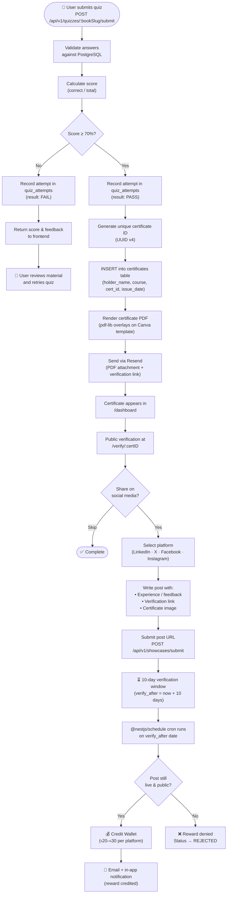

# Certificate Issuance Flow

End-to-end certificate generation triggered on quiz completion, followed by the optional Certification Showcase Rewards flow.

```mermaid
flowchart TD
    start(["📝 User submits quiz\nPOST /api/v1/quizzes/:bookSlug/submit"]) --> validate["Validate answers\nagainst PostgreSQL"]
    validate --> score["Calculate score\n(correct / total)"]
    score --> pass{"Score ≥ 70%?"}

    pass -- "No" --> fail_record["Record attempt in quiz_attempts\n(result: FAIL)"]
    fail_record --> feedback["Return score & feedback\nto frontend"]
    feedback --> retry["🔄 User reviews material\nand retries quiz"]

    pass -- "Yes" --> pass_record["Record attempt in quiz_attempts\n(result: PASS)"]
    pass_record --> gen_id["Generate unique certificate ID\n(UUID v4)"]
    gen_id --> create_row["INSERT into certificates table\n(holder_name, course, cert_id, issue_date)"]
    create_row --> render_pdf["Render certificate PDF\n(pdf-lib overlays on Canva template)"]
    render_pdf --> send_email["Send via Resend\n(PDF attachment + verification link)"]
    send_email --> dashboard["Certificate appears in\n/dashboard"]
    dashboard --> verify["Public verification at\n/verify/:certID"]

    verify --> showcase_prompt{"Share on\nsocial media?"}
    showcase_prompt -- "Skip" --> done(["✅ Complete"])
    showcase_prompt -- "Yes" --> pick_platform["Select platform\n(LinkedIn · X · Facebook · Instagram)"]
    pick_platform --> write_post["Write post with:\n• Experience / feedback\n• Verification link\n• Certificate image"]
    write_post --> submit_url["Submit post URL\nPOST /api/v1/showcases/submit"]
    submit_url --> timer["⏳ 10-day verification window\n(verify_after = now + 10 days)"]
    timer --> cron_check["@nestjs/schedule cron runs\non verify_after date"]
    cron_check --> check_live{"Post still\nlive & public?"}
    check_live -- "Yes" --> credit["💰 Credit Wallet\n(৳20–৳30 per platform)"]
    credit --> notify_user["📧 Email + in-app notification\n(reward credited)"]
    check_live -- "No" --> reject["❌ Reward denied\nStatus → REJECTED"]
```
