# Certificate Issuance Flow

End-to-end lifecycle: purchase guard → quiz submission → scoring → idempotent certificate issuance → PDF generation (best-effort) → email → on-demand re-download → public verification → optional Showcase Rewards.

```mermaid
flowchart TD
    start(["📝 POST /api/v1/quizzes/:bookSlug/submit\n{selectedAnswers: {questionId: answer}}"]) --> purchase_check{"PAID order exists\nfor this book?"}

    purchase_check -- "No" --> forbidden["❌ 403 Forbidden\n'Purchase required to take the quiz'"]
    purchase_check -- "Yes" --> fetch_q["Fetch quiz questions from DB\n(book.id, ordered by sort_order)"]

    fetch_q --> no_q{"Questions\nexist?"}
    no_q -- "No" --> no_quiz["❌ 400 Bad Request\n'Quiz not available yet'"]
    no_q -- "Yes" --> score["Score the quiz\n∑ selectedAnswer[q.id] === q.correctAnswer\nresult = score / total ≥ 0.7 ? PASS : FAIL"]

    score --> record_attempt["INSERT quiz_attempts\n{userId, bookId, selectedAnswers,\nscore, totalQuestions, result}"]

    record_attempt --> pass{"result = PASS?"}

    pass -- "No (FAIL)" --> return_fail["Return to frontend\n{score, total, outcome: FAIL, certId: undefined}\n📖 User reviews material and retries"]

    pass -- "Yes (PASS)" --> existing_cert{"Valid cert already\nexists for this\nuser + book?"}

    existing_cert -- "Yes\n(idempotent)" --> return_existing["Return existing certId\n(no duplicate issued)\n{score, total, outcome: PASS, certId}"]

    existing_cert -- "No" --> insert_cert["INSERT certificates\n{userId, quizAttemptId,\nholderName: user.name,\ncourseTitle: book.title,\ncertificate_id: UUID v4 (auto)\nissue_date: now}"]

    insert_cert --> gen_pdf["📄 generateCertificatePdf (pdf-lib)\nA4 landscape (842 × 595 pt)\nProgrammatically built — no external template\nContents:\n• MultiHAT brand logo (brandLogoLight.png)\n• Holder name (auto-scaled font)\n• Course title\n• Certificate ID\n• Issue date\n• Verification URL: /verify/:certId"]

    gen_pdf --> pdf_ok{"PDF generation\nsucceeded?"}

    pdf_ok -- "Yes" --> send_email["✉️ sendCertificateEmail via Resend\nFrom: academy@multihat.dev\nSubject: 🎓 Certificate Earned: {courseTitle}\nAttachment: certificate-{certId}.pdf\nBody includes /verify/:certId link"]

    pdf_ok -- "No\n(error caught — non-fatal)" --> log_err["⚠️ Logger.error (certificate still issued)\nPDF/email delivery failed — cert record persists"]

    send_email --> return_cert["Return to frontend\n{score, total, outcome: PASS, certId}"]
    log_err --> return_cert

    return_cert --> dashboard["Certificate visible in /dashboard\nGET /api/v1/certificates/my"]

    dashboard --> on_demand{"User requests\nPDF download?"}
    on_demand -- "Yes" --> check_valid{"cert.isValid = true?"}
    check_valid -- "No (revoked)" --> not_found["❌ 404 Not Found"]
    check_valid -- "Yes" --> regen_pdf["GET /api/v1/certificates/:certId/pdf\nRe-generate PDF on-demand (pdf-lib)\nSame layout as issuance-time\nStreamed as: multihat-certificate-{certId}.pdf"]

    dashboard --> verify_page["🔗 GET /api/v1/certificates/verify/:certId\n(public — no auth required)\nReturns:\n• valid: cert.isValid\n• holderName · courseTitle · issueDate\n• certificateId\n• certificatePdfUrl: api.multihat.dev/…/pdf"]

    verify_page --> revoked_check{"cert.isValid?"}
    revoked_check -- "false\n(admin revoked)" --> invalid_cert["Returns { valid: false }\nVerification page shows 'Certificate Revoked'"]
    revoked_check -- "true" --> valid_cert["Returns full cert metadata\nPublic verify page renders certificate details"]

    valid_cert --> showcase_q{"Share on\nsocial media?"}
    showcase_q -- "Skip" --> done(["✅ Journey complete"])
    showcase_q -- "Yes" --> ssrf_check["Validate post URL host\nAgainst allowlist:\nlinkedin.com · twitter.com · x.com\nfacebook.com · fb.com · instagram.com"]

    ssrf_check --> dup_check{"Already submitted\nfor this cert\n+ platform?"}
    dup_check -- "Yes" --> dup_err["❌ 400 — Duplicate submission"]
    dup_check -- "No" --> submit_showcase["POST /api/v1/showcases/submit\n{certId, platform, postUrl}\nINSERT social_showcase\n{status: PENDING,\nrewardAmount: ৳30 (LinkedIn/Twitter)\n          or ৳20 (Facebook/Instagram)\nverifyAfter: now + 10 days}"]

    submit_showcase --> cron["⏰ @Cron EVERY_DAY_AT_MIDNIGHT\nSELECT showcases WHERE\nstatus=PENDING AND verifyAfter ≤ now\n\nFor each: re-check SSRF allowlist\nHTTP HEAD request (timeout 10s · maxRedirects 3)"]

    cron --> live{"HTTP 200–399?"}
    live -- "Yes" --> verified["UPDATE showcase → VERIFIED\nverifiedAt = now\nCredit wallet (rewardAmount)\nINSERT wallet_transaction\n(type: SHOWCASE_CREDIT)\n📧 sendShowcaseRewardEmail"]
    live -- "No" --> rejected["UPDATE showcase → REJECTED\n(post removed / private / SSRF blocked)"]

    verified --> multi_platform{"Submit another\nplatform?"}
    multi_platform -- "Yes" --> ssrf_check
    multi_platform -- "No" --> done
```

