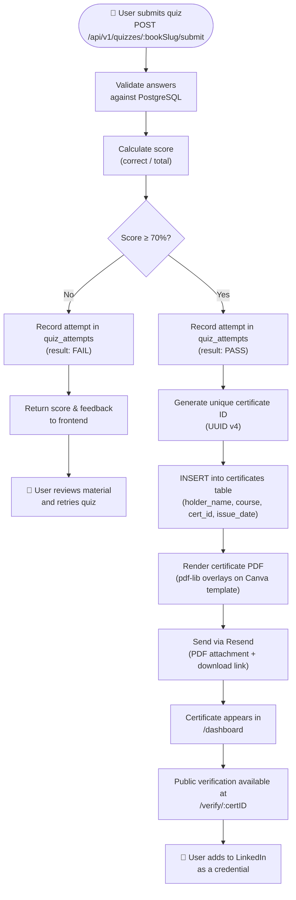

# Certificate Issuance Flow

End-to-end certificate generation triggered on quiz completion.

```mermaid
flowchart TD
    start(["📝 User submits quiz\nPOST /api/v1/quizzes/:bookSlug/submit"]) --> validate["Validate answers\nagainst PostgreSQL"]
    validate --> score["Calculate score\n(correct / total)"]
    score --> pass{"Score ≥ 70%?"}

    pass -- "No" --> fail_record["Record attempt in quiz_attempts\n(result: FAIL)"]
    fail_record --> feedback["Return score & feedback\nto frontend"]
    feedback --> retry["🔄 User reviews material\nand retries quiz"]

    pass -- "Yes" --> pass_record["Record attempt in quiz_attempts\n(result: PASS)"]
    pass_record --> gen_id["Generate unique certificate ID\n(UUID v4)"]
    gen_id --> create_row["INSERT into certificates table\n(holder_name, course, cert_id, issue_date)"]
    create_row --> render_pdf["Render certificate PDF\n(pdf-lib overlays on Canva template)"]
    render_pdf --> send_email["Send via Resend\n(PDF attachment + download link)"]
    send_email --> dashboard["Certificate appears in\n/dashboard"]
    dashboard --> verify["Public verification available at\n/verify/:certID"]
    verify --> linkedin["🔗 User adds to LinkedIn\nas a credential"]
```
