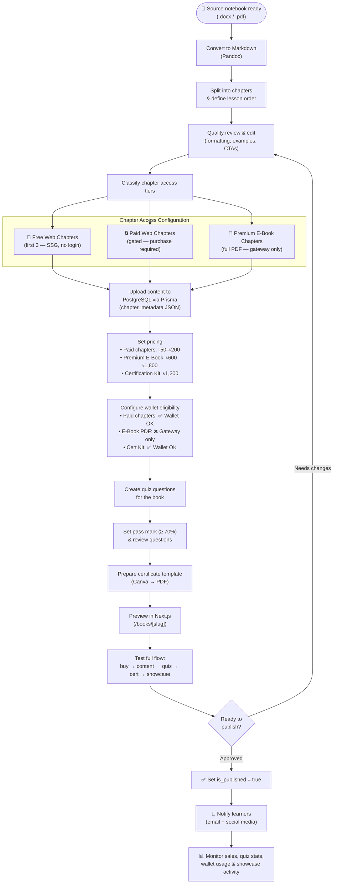

# Course and Lesson Management Flow

Content pipeline from source notebook to published course with free/paid chapters, quizzes, and wallet-eligibility configuration.

```mermaid
flowchart TD
    start(["📓 Source notebook ready\n(.docx / .pdf)"]) --> convert["Convert to Markdown\n(Pandoc)"]
    convert --> structure["Split into chapters\n& define lesson order"]
    structure --> edit["Quality review & edit\n(formatting, examples, CTAs)"]

    edit --> classify["Classify chapter access tiers"]

    subgraph tiers["Chapter Access Configuration"]
        free_ch["📖 Free Web Chapters\n(first 3 — SSG, no login)"]
        paid_ch["🔒 Paid Web Chapters\n(gated — purchase required)"]
        pdf_ch["📕 Premium E-Book Chapters\n(full PDF — gateway only)"]
    end

    classify --> free_ch
    classify --> paid_ch
    classify --> pdf_ch

    free_ch --> upload
    paid_ch --> upload
    pdf_ch --> upload

    upload["Upload content to\nPostgreSQL via Prisma\n(chapter_metadata JSON)"]

    upload --> pricing["Set pricing\n• Paid chapters: ৳50–৳200\n• Premium E-Book: ৳600–৳1,800\n• Certification Kit: ৳1,200"]

    pricing --> wallet_config["Configure wallet eligibility\n• Paid chapters: ✅ Wallet OK\n• E-Book PDF: ❌ Gateway only\n• Cert Kit: ✅ Wallet OK"]

    wallet_config --> quiz_create["Create quiz questions\nfor the book"]
    quiz_create --> quiz_review["Set pass mark (≥ 70%)\n& review questions"]
    quiz_review --> cert_template["Prepare certificate template\n(Canva → PDF)"]

    cert_template --> preview["Preview in Next.js\n(/books/[slug])"]
    preview --> test["Test full flow:\nbuy → content → quiz → cert → showcase"]
    test --> publish{"Ready to\npublish?"}
    publish -- "Needs changes" --> edit
    publish -- "Approved" --> go_live["✅ Set is_published = true"]
    go_live --> notify["📢 Notify learners\n(email + social media)"]
    notify --> monitor["📊 Monitor sales, quiz stats,\nwallet usage & showcase activity"]
```
