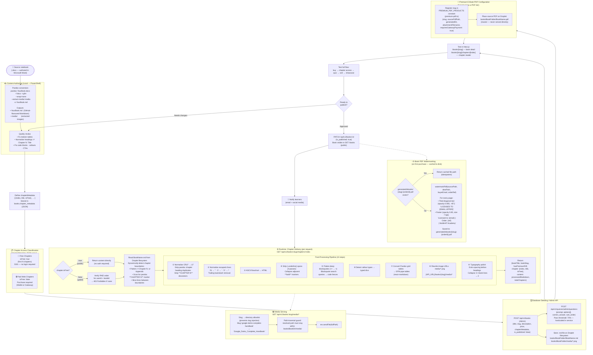

# Course and Lesson Management Flow

Content pipeline: from `.docx` source → Pandoc conversion → chapter metadata → DB seeding → runtime post-processing → access-gated delivery → PDF watermarking.

