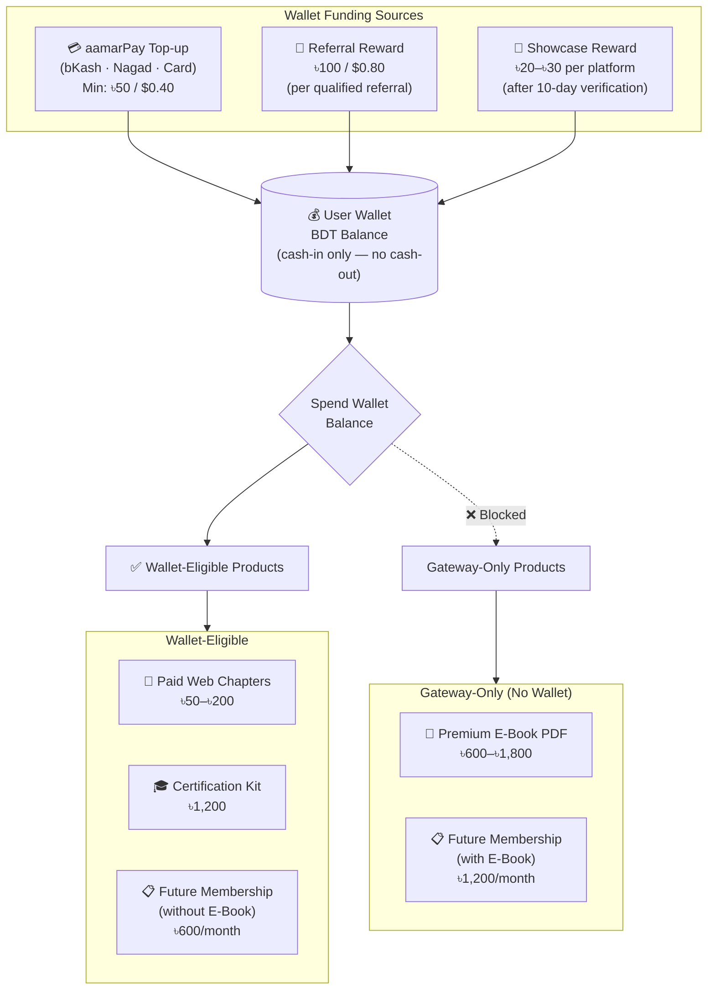
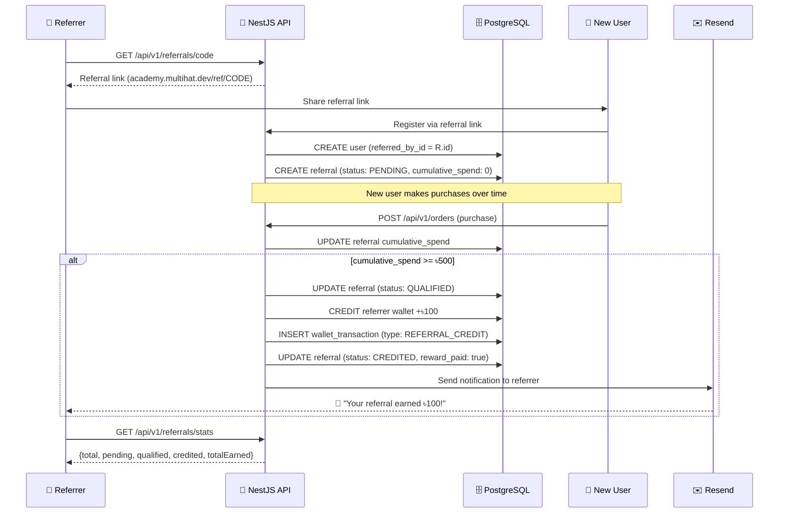

# Wallet & Referral Flow

Wallet lifecycle: top-up, earning credits (referral + showcase), spending, and the referral qualification pipeline.

```mermaid
flowchart TD
    subgraph wallet_sources["Wallet Funding Sources"]
        topup["💳 aamarPay Top-up\n(bKash · Nagad · Card)\nMin: ৳50 / $0.40"]
        referral_credit["🤝 Referral Reward\n৳100 / $0.80\n(per qualified referral)"]
        showcase_credit["📣 Showcase Reward\n৳20–৳30 per platform\n(after 10-day verification)"]
    end

    topup --> wallet[("💰 User Wallet\nBDT Balance\n(cash-in only — no cash-out)")]
    referral_credit --> wallet
    showcase_credit --> wallet

    wallet --> spend{"Spend Wallet\nBalance"}

    spend --> eligible["✅ Wallet-Eligible Products"]
    spend -.->|"❌ Blocked"| ineligible["Gateway-Only Products"]

    subgraph eligible_products["Wallet-Eligible"]
        paid_ch["📖 Paid Web Chapters\n৳50–৳200"]
        cert_kit["🎓 Certification Kit\n৳1,200"]
        membership_no_pdf["📋 Future Membership\n(without E-Book)\n৳600/month"]
    end

    subgraph gateway_products["Gateway-Only (No Wallet)"]
        ebook_pdf["📕 Premium E-Book PDF\n৳600–৳1,800"]
        membership_pdf["📋 Future Membership\n(with E-Book)\n৳1,200/month"]
    end

    eligible --> eligible_products
    ineligible --> gateway_products
```

---

```mermaid
sequenceDiagram
    participant R as 🤝 Referrer
    participant A as 🔧 NestJS API
    participant DB as 🗄️ PostgreSQL
    participant N as 👤 New User
    participant E as ✉️ Resend

    R->>A: GET /api/v1/referrals/code
    A-->>R: Referral link (academy.multihat.dev/ref/CODE)

    R->>N: Share referral link

    N->>A: Register via referral link
    A->>DB: CREATE user (referred_by_id = R.id)
    A->>DB: CREATE referral (status: PENDING, cumulative_spend: 0)

    Note over N,A: New user makes purchases over time

    N->>A: POST /api/v1/orders (purchase)
    A->>DB: UPDATE referral cumulative_spend

    alt cumulative_spend >= ৳500
        A->>DB: UPDATE referral (status: QUALIFIED)
        A->>DB: CREDIT referrer wallet +৳100
        A->>DB: INSERT wallet_transaction (type: REFERRAL_CREDIT)
        A->>DB: UPDATE referral (status: CREDITED, reward_paid: true)
        A->>E: Send notification to referrer
        E-->>R: 📧 "Your referral earned ৳100!"
    end

    R->>A: GET /api/v1/referrals/stats
    A-->>R: {total, pending, qualified, credited, totalEarned}
```
