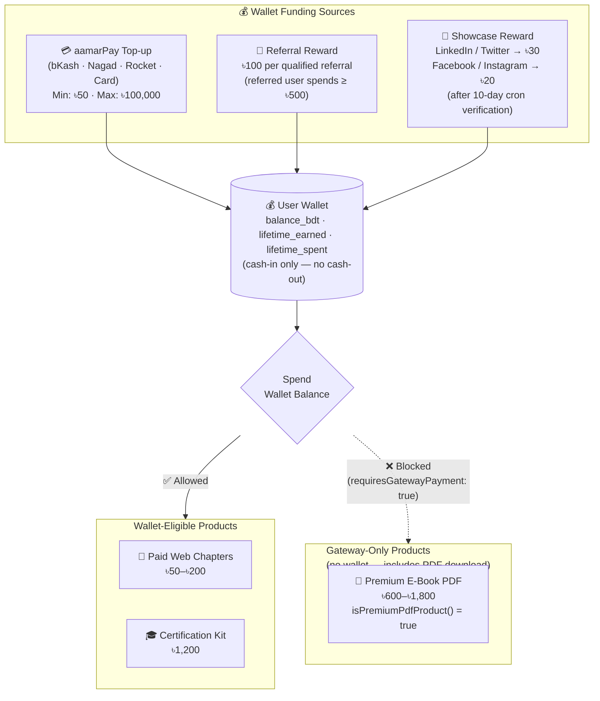
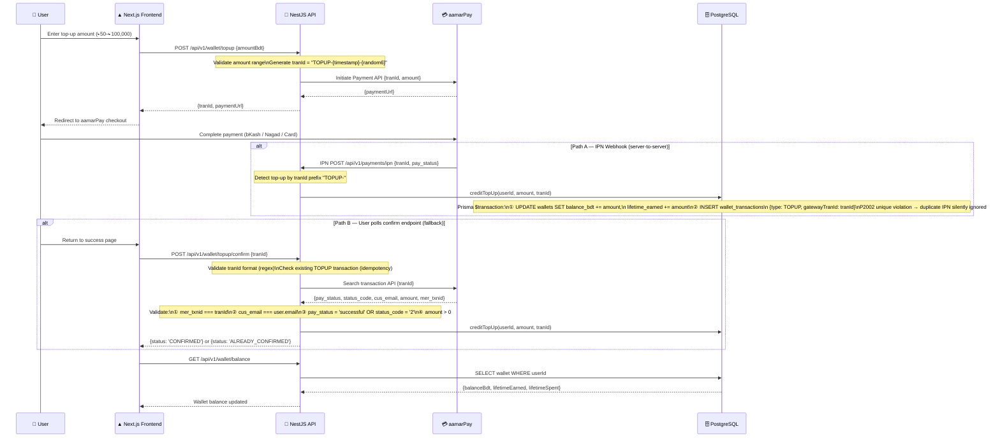
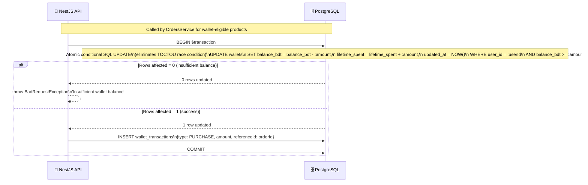
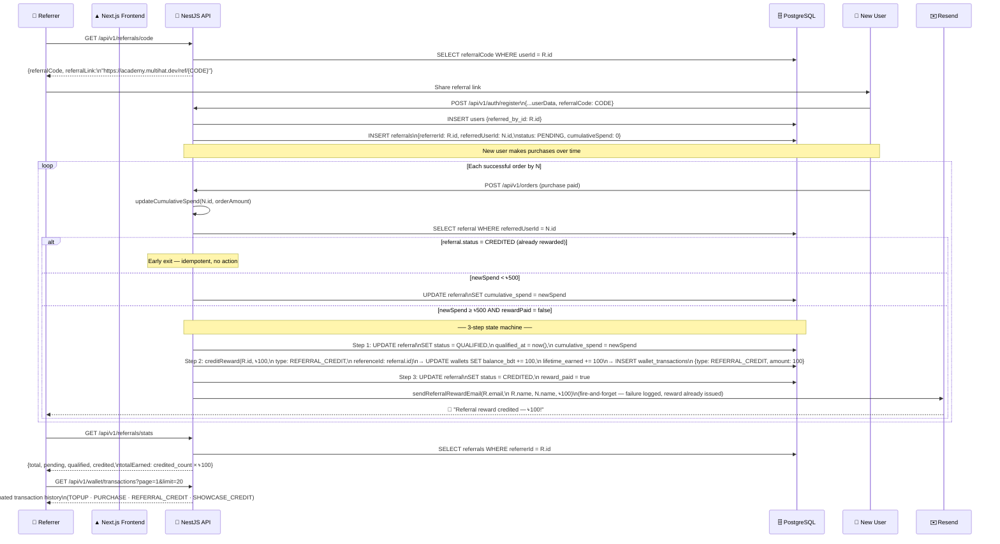

# Wallet & Referral Flow

Wallet lifecycle: funding sources, spend eligibility, top-up two-step flow, atomic debit guard, and referral qualification state machine.

---

## Part 1 — Wallet: Funding Sources & Spend Eligibility

---

## Part 2 — Wallet Top-Up: Two-Step Flow

---

## Part 3 — Wallet Debit: Atomic Double-Spend Prevention

---

## Part 4 — Referral Qualification State Machine

