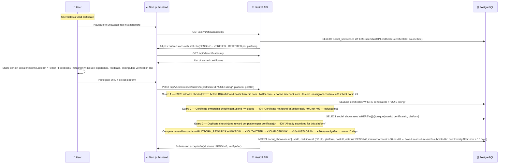
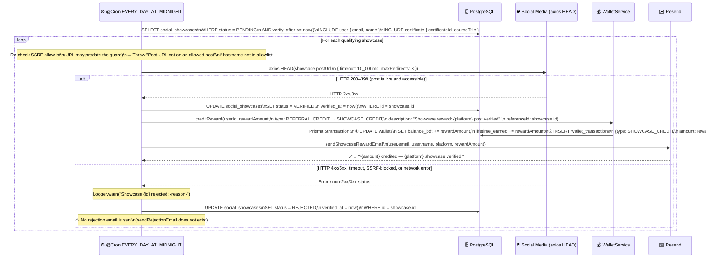
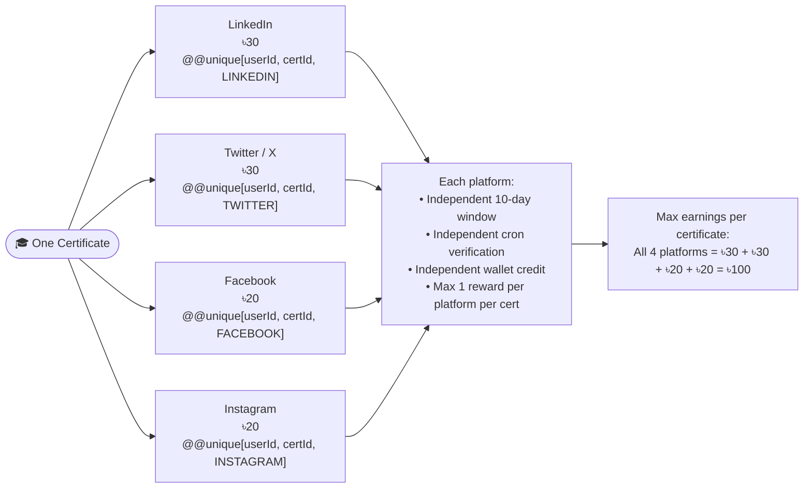

# Certification Showcase Verification Flow

Submission guards → DB insertion → automated nightly cron verification → platform-specific wallet credits.

---

## Part 1 — Submission Flow (User-Triggered)

---

## Part 2 — Automated Cron Verification (Nightly)

---

## Part 3 — Platform Rewards & Multi-Platform Eligibility

