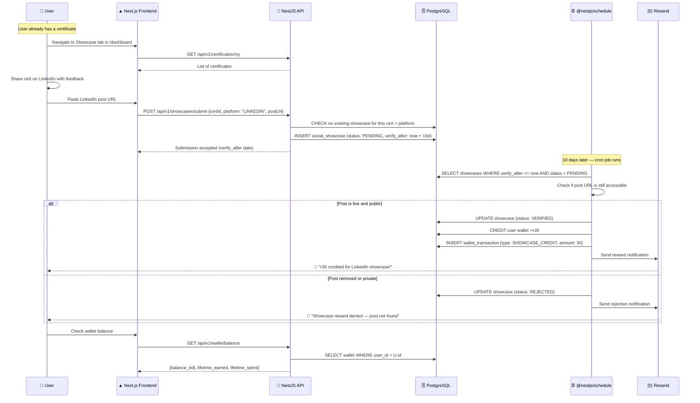

# Certification Showcase Verification Flow

Scheduled verification of social media posts for Certification Showcase Rewards.

```mermaid
sequenceDiagram
    participant U as 👤 User
    participant F as ▲ Next.js Frontend
    participant A as 🔧 NestJS API
    participant DB as 🗄️ PostgreSQL
    participant C as ⏰ @nestjs/schedule
    participant E as ✉️ Resend

    Note over U: User already has a certificate

    U->>F: Navigate to Showcase tab in /dashboard
    F->>A: GET /api/v1/certificates/my
    A-->>F: List of certificates

    U->>U: Share cert on LinkedIn with feedback
    U->>F: Paste LinkedIn post URL
    F->>A: POST /api/v1/showcases/submit {certId, platform: "LINKEDIN", postUrl}

    A->>DB: CHECK no existing showcase for this cert + platform
    A->>DB: INSERT social_showcase (status: PENDING, verify_after: now + 10d)
    A-->>F: Submission accepted (verify_after date)

    Note over C: 10 days later — cron job runs

    C->>DB: SELECT showcases WHERE verify_after <= now AND status = PENDING
    C->>C: Check if post URL is still accessible

    alt Post is live and public
        C->>DB: UPDATE showcase (status: VERIFIED)
        C->>DB: CREDIT user wallet +৳30
        C->>DB: INSERT wallet_transaction (type: SHOWCASE_CREDIT, amount: 30)
        C->>E: Send reward notification
        E-->>U: 📧 "৳30 credited for LinkedIn showcase!"
    else Post removed or private
        C->>DB: UPDATE showcase (status: REJECTED)
        C->>E: Send rejection notification
        E-->>U: 📧 "Showcase reward denied — post not found"
    end

    U->>F: Check wallet balance
    F->>A: GET /api/v1/wallet/balance
    A->>DB: SELECT wallet WHERE user_id = U.id
    A-->>F: {balance_bdt, lifetime_earned, lifetime_spent}
```
